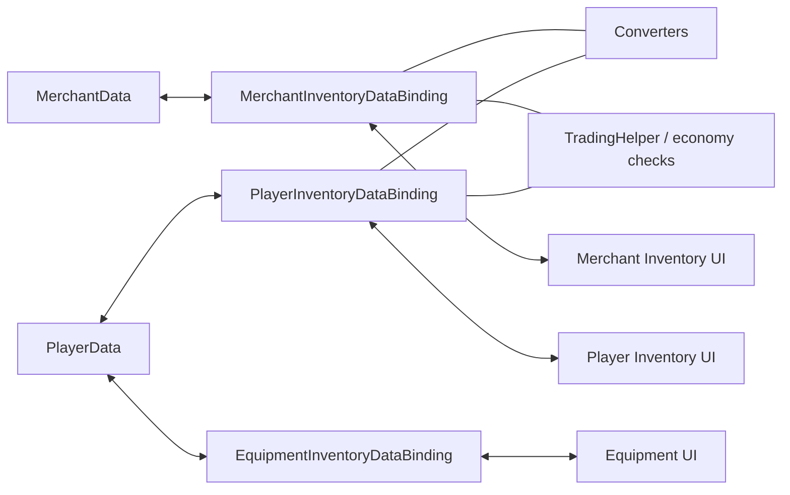

# Demo4 Trading

    <iframe
    src="https://www.youtube.com/embed/vaQK6jWpT2g"
    title="Project showcase video"
    allow="accelerometer; autoplay; clipboard-write; encrypted-media; gyroscope; picture-in-picture; web-share"
    allowfullscreen>
    </iframe>

`Examples/Demo4 Trading/TradingDemo.unity`

This is the most feature-rich demo in the package. It combines cross-model transfers, economy rules, and fixed-slot equipment in one scene.

## What the demo shows

- player inventory, merchant inventory, and equipment slots
- converters between different item models
- price and gold validation at commit time
- separation of mechanical validation and domain side effects
- `MappedSlotInventoryDataBinding` for equipment
- cross-inventory swap with bidirectional conversion

## How it is structured

Data and economy:

- `Data/PlayerData.cs`
- `Data/MerchantData.cs`
- `Data/TradingEconomyManager.cs`

Adapters and conversion:

- `Adapters/TradableSoAdapter.cs`
- `Adapters/TradableItemAdapterModelAdapter.cs`
- `Converters/ModelItemAdapterConverter.cs`
- `Converters/MerchantItemAdapterConverter.cs`

Bindings:

- `PlayerInventoryDataBinding.cs`
- `MerchantInventoryDataBinding.cs`
- `EquipmentInventoryDataBinding.cs`

## How it works

Buying from a merchant:

1. Drag starts from the merchant inventory.
2. Target-side preview and a converter prepare the item representation for the player inventory.
3. Mechanical validation checks placement.
4. Domain validation checks gold and trade constraints.
5. After a successful commit the bindings update player and merchant data.
6. Side effects update gold and related values.

Swap between merchant and equipment/player inventory:

1. The planner detects that normal placement is impossible and marks the entry as `RequiresSwap`.
2. The executor validates both directions on target-side converted preview stacks.
3. It then captures copies of both stacks and converts them in both directions.
4. The opposite slots receive already converted stacks, not raw adapters.
5. Because of that, the next drag from those slots does not fail with `Wrong item type`.

Equipment:

1. An item is dropped onto a fixed slot.
2. `EquipmentInventoryDataBinding` checks `PrimaryAdapter` and slot-specific `canAccept`.
3. On success the matching field in `PlayerData` is synchronized with that slot.

## Files to inspect

| File | Role |
|---|---|
| `Data/TradingEconomyManager.cs` | central economy |
| `DataBindings/PlayerInventoryDataBinding.cs` | player inventory binding |
| `DataBindings/MerchantInventoryDataBinding.cs` | merchant inventory binding |
| `DataBindings/EquipmentInventoryDataBinding.cs` | fixed-slot equipment |
| `DataBindings/TradingHelper.cs` | domain checks and side effects |
| `Converters/*` | model conversion |

## When to use this as a starting point

- you need different data models on different sides of a transfer boundary
- you need item conversion during transfer
- you need correct cross-inventory swap between different adapter models
- you need prices, gold, and commit-time validation
- you need fixed slots on top of a regular inventory

Related pages:

- [Cookbook: Item Conversion](../architecture/item-conversion-cookbook.md)
- [Troubleshooting](../reference/troubleshooting.md)
