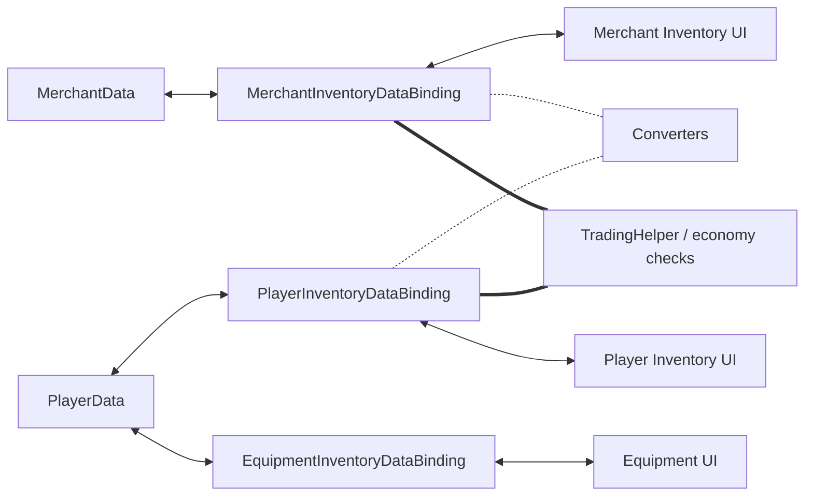

# Demo4 Trading

    <iframe
    src="https://www.youtube.com/embed/YNmNO-akjXk"
    title="Project showcase video"
    allow="accelerometer; autoplay; clipboard-write; encrypted-media; gyroscope; picture-in-picture; web-share"
    allowfullscreen>
    </iframe>

`Examples/Demo4 Trading/TradingDemo.unity`

This demo shows transfer between different models, economy, and equipment with fixed
slots in one scene.

## What The Demo Shows

- player inventory, merchant inventory, and equipment slots
- conversion between different item models
- price and money checks during transfer
- `MappedSlotInventoryDataBinding` for equipment

## How It Is Structured

Data and economy:

- `Data/PlayerData.cs`
- `Data/MerchantData.cs`
- `Data/TradingEconomyManager.cs`

Adapters and conversion:

- `Adapters/TradableSoAdapter.cs`
- `Adapters/TradableItemAdapterModelAdapter.cs`
- `Converters/ModelItemAdapterConverter.cs`
- `Converters/MerchantItemAdapterConverter.cs`

Bindings:

- `PlayerInventoryDataBinding.cs`
- `MerchantInventoryDataBinding.cs`
- `EquipmentInventoryDataBinding.cs`

## How It Works

Buying from a merchant:

1. Drag starts from the merchant inventory.
2. On drop, the converter prepares the item representation for the player inventory.
3. Validation checks money and trade restrictions.
4. After a successful transfer, bindings update player and merchant data.
5. Side effects change gold and related values.

Equipment:

1. The item is dragged into a fixed slot.
2. `EquipmentInventoryDataBinding` checks `PrimaryAdapter` and slot-specific `canDrop`.
3. On success, the concrete field in `PlayerData` synchronizes with the target slot.

## When To Use This Example

- you need different data models on different sides of a transfer
- you need item conversion during transfer
- you need correct exchange between inventories with different adapter models
- you need prices, money, and transfer-time checks
- you need fixed slots on top of a regular inventory

Related pages:

- [Cookbook: Item Conversion](../architecture/item-conversion-cookbook.md)
- [Troubleshooting](../reference/troubleshooting.md)
