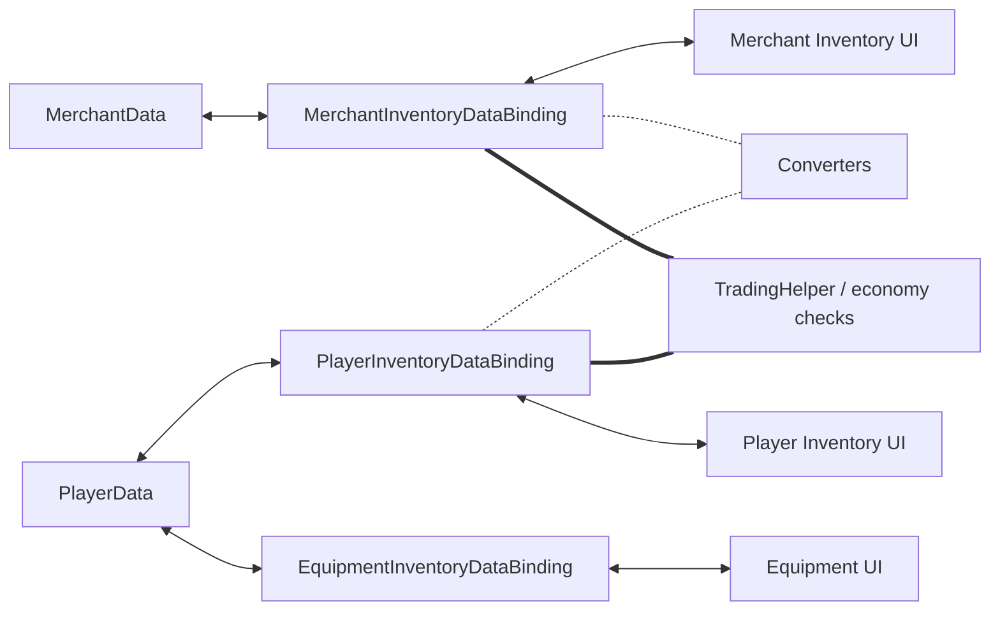

# Demo4 Trading

    <iframe
    src="https://www.youtube.com/embed/YNmNO-akjXk"
    title="Project showcase video"
    allow="accelerometer; autoplay; clipboard-write; encrypted-media; gyroscope; picture-in-picture; web-share"
    allowfullscreen>
    </iframe>

`Examples/Demo4 Trading/TradingDemo.unity`

Esta es la demo más rica en funcionalidades del paquete. Combina transferencias entre modelos distintos, reglas de economía y equipamiento con slots fijos en una sola escena.

## Qué muestra la demo

- inventario del jugador, inventario del comerciante y slots de equipamiento
- converters entre distintos modelos de item
- validación de precio y oro en tiempo de commit
- separación entre validación mecánica y side effects de dominio
- `MappedSlotInventoryDataBinding` para equipamiento
- swap entre inventarios con conversión bidireccional

## Cómo está estructurada

Datos y economía:

- `Data/PlayerData.cs`
- `Data/MerchantData.cs`
- `Data/TradingEconomyManager.cs`

Adapters y conversión:

- `Adapters/TradableSoAdapter.cs`
- `Adapters/TradableItemAdapterModelAdapter.cs`
- `Converters/ModelItemAdapterConverter.cs`
- `Converters/MerchantItemAdapterConverter.cs`

Bindings:

- `PlayerInventoryDataBinding.cs`
- `MerchantInventoryDataBinding.cs`
- `EquipmentInventoryDataBinding.cs`

## Cómo funciona

Comprar a un comerciante:

1. El drag empieza en el inventario del comerciante.
2. El preview del lado objetivo y un converter preparan la representación del item para el inventario del jugador.
3. La validación mecánica comprueba la colocación.
4. La validación de dominio comprueba el oro y las restricciones de comercio.
5. Tras un commit exitoso, los bindings actualizan los datos del jugador y del comerciante.
6. Los side effects actualizan el oro y valores relacionados.

Swap entre inventario del comerciante y equipo/inventario del jugador:

1. Con la política `Swap` para destino bloqueado, el motor toma el camino de swap de una sola entry para el destino ocupado.
2. El motor valida ambas direcciones usando preview stacks convertidos al lado objetivo.
3. Luego captura copias de ambos stacks y los convierte en ambas direcciones.
4. Los slots opuestos reciben stacks ya convertidos, no raw adapters.
5. Gracias a eso, el siguiente drag desde esos slots no falla con `Wrong item type`.

Equipamiento:

1. Un item se suelta sobre un slot fijo.
2. `EquipmentInventoryDataBinding` comprueba `PrimaryAdapter` y el `canDrop` específico del slot.
3. Si tiene éxito, el campo correspondiente en `PlayerData` se sincroniza con ese slot.

## Archivos para inspeccionar

| Archivo | Rol |
|---|---|
| `Data/TradingEconomyManager.cs` | economía central |
| `DataBindings/PlayerInventoryDataBinding.cs` | binding del inventario del jugador |
| `DataBindings/MerchantInventoryDataBinding.cs` | binding del inventario del comerciante |
| `DataBindings/EquipmentInventoryDataBinding.cs` | equipamiento con slots fijos |
| `DataBindings/TradingHelper.cs` | comprobaciones de dominio y side effects |
| `Converters/*` | conversión de modelos |

## Cuándo usar esto como punto de partida

- necesitas distintos modelos de datos a ambos lados de un límite de transferencia
- necesitas conversión de items durante la transferencia
- necesitas swap correcto entre inventarios con distintos modelos de adapter
- necesitas precios, oro y validación en tiempo de commit
- necesitas slots fijos encima de un inventario normal

Páginas relacionadas:

- [Cookbook: Item Conversion](../architecture/item-conversion-cookbook.md)
- [Troubleshooting](../reference/troubleshooting.md)

