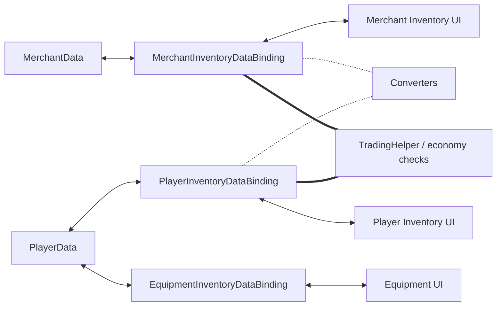

# Demo4 Trading

    <iframe
    src="https://www.youtube.com/embed/YNmNO-akjXk"
    title="Project showcase video"
    allow="accelerometer; autoplay; clipboard-write; encrypted-media; gyroscope; picture-in-picture; web-share"
    allowfullscreen>
    </iframe>

`Examples/Demo4 Trading/TradingDemo.unity`

Esta demo muestra transferencia entre distintos modelos, economía y equipamiento con
slots fijos en una sola escena.

## Qué muestra la demo

- inventario del jugador, inventario del comerciante y slots de equipamiento
- conversión entre distintos modelos de item
- comprobación de precios y dinero durante la transferencia
- `MappedSlotInventoryDataBinding` para equipamiento

## Cómo está estructurada

Datos y economía:

- `Data/PlayerData.cs`
- `Data/MerchantData.cs`
- `Data/TradingEconomyManager.cs`

Adapters y conversión:

- `Adapters/TradableSoAdapter.cs`
- `Adapters/TradableItemAdapterModelAdapter.cs`
- `Converters/ModelItemAdapterConverter.cs`
- `Converters/MerchantItemAdapterConverter.cs`

Bindings:

- `PlayerInventoryDataBinding.cs`
- `MerchantInventoryDataBinding.cs`
- `EquipmentInventoryDataBinding.cs`

## Cómo funciona

Compra a un comerciante:

1. El drag empieza desde el inventario del comerciante.
2. Al soltar, el converter prepara la representación del item para el inventario del jugador.
3. La validación comprueba dinero y restricciones de la operación.
4. Tras una transferencia exitosa, los bindings actualizan datos del jugador y del comerciante.
5. Los efectos secundarios cambian el oro y otros valores relacionados.

Equipamiento:

1. El item se arrastra a un slot fijo.
2. `EquipmentInventoryDataBinding` comprueba `PrimaryAdapter` y el `canDrop` específico de cada slot.
3. Si tiene éxito, el campo concreto de `PlayerData` se sincroniza con el slot objetivo.

## Cuándo usar este ejemplo como base

- necesitas modelos de datos distintos en los lados de una transferencia
- necesitas conversión de items durante la transferencia
- necesitas intercambio correcto entre inventarios con distintos modelos de adapter
- necesitas precios, dinero y comprobaciones durante la transferencia
- necesitas slots fijos encima de un inventario normal

Páginas relacionadas:

- [Recetario: conversión de objetos](../architecture/item-conversion-cookbook.md)
- [Troubleshooting](../reference/troubleshooting.md)
