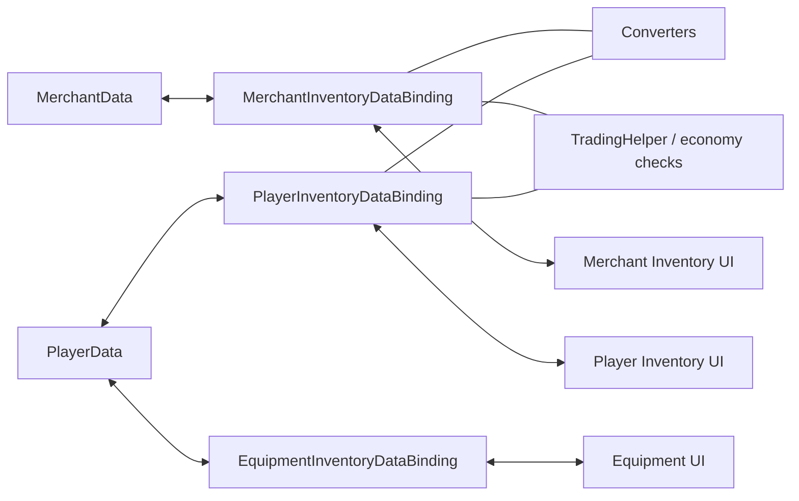

# Demo4 Trading

`Examples/Demo4 Trading/TradingDemo.unity`

Это самое насыщенное демо в пакете. Оно показывает перенос между разными доменными моделями, экономику и fixed-slot экипировку в одной сцене.

## Что показывает демо

- player inventory, merchant inventory и equipment slots
- converters между разными item models
- проверку цен и денег на commit-этапе
- разделение mechanical validation и domain side effects
- `MappedSlotInventoryDataBinding` для экипировки
- cross-inventory swap с двусторонней конвертацией

## Как устроено

Данные и экономика:

- `Data/PlayerData.cs`
- `Data/MerchantData.cs`
- `Data/TradingEconomyManager.cs`

Адаптеры и конвертация:

- `Adapters/TradableSoAdapter.cs`
- `Adapters/TradableItemAdapterModelAdapter.cs`
- `Converters/ModelItemAdapterConverter.cs`
- `Converters/MerchantItemAdapterConverter.cs`

Bindings:

- `PlayerInventoryDataBinding.cs`
- `MerchantInventoryDataBinding.cs`
- `EquipmentInventoryDataBinding.cs`

## Как работает

Покупка у торговца:

1. Drag начинается из merchant inventory.
2. Target-side preview и converter готовят представление предмета для инвентаря игрока.
3. Mechanical validation проверяет placement.
4. Domain validation проверяет деньги и ограничения сделки.
5. После успешного commit bindings обновляют данные игрока и торговца.
6. Side effects меняют золото и другие связанные значения.

Swap между merchant и equipment/player inventory:

1. Planner решает, что обычное размещение невозможно, и помечает entry как `RequiresSwap`.
2. Executor валидирует оба направления на target-side converted preview stacks.
3. Затем он снимает копии обоих стеков и выполняет конвертацию в обе стороны.
4. В противоположные слоты коммитятся уже сконвертированные стеки, а не raw adapters.
5. Благодаря этому следующий drag из этих слотов не падает на `Неверный тип предмета`.

Экипировка:

1. Предмет перетаскивается на fixed slot.
2. `EquipmentInventoryDataBinding` проверяет `PrimaryAdapter` и slot-specific `canAccept`.
3. При успехе конкретное поле в `PlayerData` синхронизируется с нужным слотом.

## Что смотреть в коде

| Файл | Роль |
|---|---|
| `Examples/Demo4 Trading/Data/TradingEconomyManager.cs` | центральная экономика |
| `Examples/Demo4 Trading/DataBindings/PlayerInventoryDataBinding.cs` | binding инвентаря игрока |
| `Examples/Demo4 Trading/DataBindings/MerchantInventoryDataBinding.cs` | binding инвентаря торговца |
| `Examples/Demo4 Trading/DataBindings/EquipmentInventoryDataBinding.cs` | fixed-slot экипировка |
| `Examples/Demo4 Trading/DataBindings/TradingHelper.cs` | доменные проверки и side effects |
| `Examples/Demo4 Trading/Converters/*` | конвертация между моделями |

## Когда брать этот пример за основу

- нужны разные модели данных по разные стороны transfer boundary
- нужна конвертация предметов при переносе
- нужен корректный cross-inventory swap между разными adapter-моделями
- нужны цены, деньги и commit-time проверки
- нужны fixed slots поверх обычного inventory

Связанные страницы:

- [Cookbook: конвертация предметов](../architecture/item-conversion-cookbook.md)
- [Troubleshooting](../reference/troubleshooting.md)
