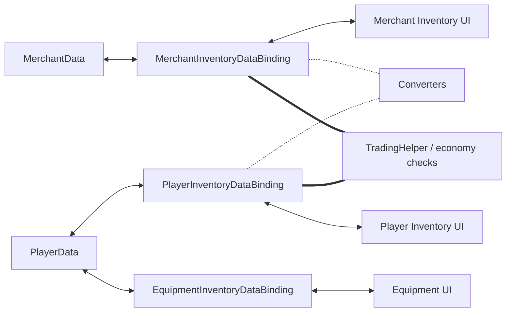

# Demo4 Trading

    <iframe
    src="https://www.youtube.com/embed/YNmNO-akjXk"
    title="Project showcase video"
    allow="accelerometer; autoplay; clipboard-write; encrypted-media; gyroscope; picture-in-picture; web-share"
    allowfullscreen>
    </iframe>

`Examples/Demo4 Trading/TradingDemo.unity`

Это самое насыщенное демо в пакете. Оно показывает перенос между разными доменными моделями, экономику и экипировку с фиксированными слотами в одной сцене.

## Что показывает демо

- инвентарь игрока, инвентарь торговца и слоты экипировки
- конвертеры между разными моделями предметов
- проверку цен и денег на commit-этапе
- разделение механической валидации и доменных побочных эффектов
- `MappedSlotInventoryDataBinding` для экипировки
- обмен между инвентарями с двусторонней конвертацией

## Как устроено

Данные и экономика:

- `Data/PlayerData.cs`
- `Data/MerchantData.cs`
- `Data/TradingEconomyManager.cs`

Адаптеры и конвертация:

- `Adapters/TradableSoAdapter.cs`
- `Adapters/TradableItemAdapterModelAdapter.cs`
- `Converters/ModelItemAdapterConverter.cs`
- `Converters/MerchantItemAdapterConverter.cs`

Bindings:

- `PlayerInventoryDataBinding.cs`
- `MerchantInventoryDataBinding.cs`
- `EquipmentInventoryDataBinding.cs`

## Как работает

Покупка у торговца:

1. Перетаскивание начинается из инвентаря торговца.
2. Предпросмотр на стороне цели и конвертер готовят представление предмета для инвентаря игрока.
3. Механическая валидация проверяет размещение.
4. Доменная валидация проверяет деньги и ограничения сделки.
5. После успешного commit bindings обновляют данные игрока и торговца.
6. Побочные эффекты меняют золото и другие связанные значения.

Обмен между инвентарём торговца и инвентарём игрока или экипировкой:

1. При политике `Swap` для заблокированной цели движок идёт по пути single-entry swap для занятой цели.
2. Движок валидирует оба направления на предварительно сконвертированных стеках со стороны цели.
3. Затем он снимает копии обоих стеков и выполняет конвертацию в обе стороны.
4. В противоположные слоты коммитятся уже сконвертированные стеки, а не исходные адаптеры.
5. Благодаря этому следующий drag из этих слотов не падает на `Неверный тип предмета`.

Экипировка:

1. Предмет перетаскивается в фиксированный слот.
2. `EquipmentInventoryDataBinding` проверяет `PrimaryAdapter` и slot-specific `canDrop`.
3. При успехе конкретное поле в `PlayerData` синхронизируется с нужным слотом.

## Что смотреть в коде

| Файл | Роль |
|---|---|
| `Data/TradingEconomyManager.cs` | центральная экономика |
| `DataBindings/PlayerInventoryDataBinding.cs` | binding инвентаря игрока |
| `DataBindings/MerchantInventoryDataBinding.cs` | binding инвентаря торговца |
| `DataBindings/EquipmentInventoryDataBinding.cs` | fixed-slot экипировка |
| `DataBindings/TradingHelper.cs` | доменные проверки и side effects |
| `Converters/*` | конвертация между моделями |

## Когда брать этот пример за основу

- нужны разные модели данных по разные стороны границы переноса
- нужна конвертация предметов при переносе
- нужен корректный обмен между инвентарями с разными adapter-моделями
- нужны цены, деньги и commit-time проверки
- нужны фиксированные слоты поверх обычного инвентаря

Связанные страницы:

- [Cookbook: конвертация предметов](../architecture/item-conversion-cookbook.md)
- [Troubleshooting](../reference/troubleshooting.md)
