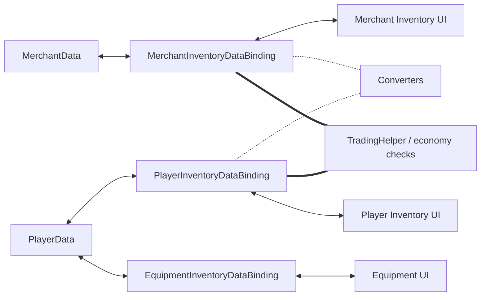

# Demo4 Trading

    <iframe
    src="https://www.youtube.com/embed/YNmNO-akjXk"
    title="Project showcase video"
    allow="accelerometer; autoplay; clipboard-write; encrypted-media; gyroscope; picture-in-picture; web-share"
    allowfullscreen>
    </iframe>

`Examples/Demo4 Trading/TradingDemo.unity`

Это демо показывает перенос между разными моделями, экономику и экипировку с фиксированными слотами в одной сцене.

## Что показывает демо

- инвентарь игрока, инвентарь торговца и слоты экипировки
- конвертация между разными моделями предметов
- проверку цен и денег на этапе переноса
- `MappedSlotInventoryDataBinding` для экипировки

## Как устроено

Данные и экономика:

- `Data/PlayerData.cs`
- `Data/MerchantData.cs`
- `Data/TradingEconomyManager.cs`

Адаптеры и конвертация:

- `Adapters/TradableSoAdapter.cs`
- `Adapters/TradableItemAdapterModelAdapter.cs`
- `Converters/ModelItemAdapterConverter.cs`
- `Converters/MerchantItemAdapterConverter.cs`

Bindings:

- `PlayerInventoryDataBinding.cs`
- `MerchantInventoryDataBinding.cs`
- `EquipmentInventoryDataBinding.cs`

## Как работает

Покупка у торговца:

1. Перетаскивание начинается из инвентаря торговца.
2. В момент отпускания конвертер готовят представление предмета для инвентаря игрока.
3. Валидация проверяет деньги и ограничения сделки.
4. После успешного переноса bindings обновляют данные игрока и торговца.
5. Побочные эффекты меняют золото и другие связанные значения.

Экипировка:

1. Предмет перетаскивается в фиксированный слот.
2. `EquipmentInventoryDataBinding` проверяет `PrimaryAdapter` и специфичный для каждого слота `canDrop`.
3. При успехе конкретное поле в `PlayerData` синхронизируется с нужным слотом.

## Когда брать этот пример за основу

- нужны разные модели данных по разные стороны границы переноса
- нужна конвертация предметов при переносе
- нужен корректный обмен между инвентарями с разными adapter-моделями
- нужны цены, деньги и commit-time проверки
- нужны фиксированные слоты поверх обычного инвентаря

Связанные страницы:

- [Cookbook: конвертация предметов](../architecture/item-conversion-cookbook.md)
- [Troubleshooting](../reference/troubleshooting.md)
