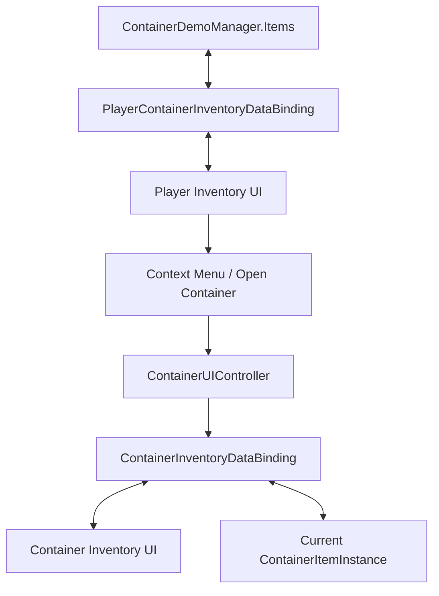

# Demo5 Containers

    <iframe
    src="https://www.youtube.com/embed/ZYOjIkwxcdU"
    title="Project showcase video"
    allow="accelerometer; autoplay; clipboard-write; encrypted-media; gyroscope; picture-in-picture; web-share"
    allowfullscreen>
    </iframe>

`Examples/Demo5 Containers/Containers Demo.unity`

This sample demonstrates inventory items that contain their own nested inventory.

## What the demo shows

- item instances instead of simple list rows
- a container as a regular item inside the player inventory
- a separate UI panel for the currently opened container
- a context menu action that opens a container
- cycle prevention for nested containers

## How it is structured

Data:

- `Scripts/Data/ItemInstance.cs`
- `Scripts/Data/ContainerItemInstance.cs`
- `Scripts/Data/IContainerizeItemInstance.cs`
- `Scripts/ContainerDemoManager.cs`

Bindings and UI:

- `Scripts/Bindings/PlayerContainerInventoryDataBinding.cs`
- `Scripts/Bindings/ContainerInventoryDataBinding.cs`
- `Scripts/UI/ContainerUIController.cs`
- `Scripts/ContextMenu/OpenContainerMenuEntrySO.cs`

Main shape:

## How it works

Opening a container:

1. The player inventory contains a `ContainerItemInstance`.
2. A context menu action triggers `OpenContainerMenuEntrySO`.
3. Through `Events.OnOpenClick` the selected container is passed to `ContainerUIController`.
4. The controller sets the active container and calls `SetContainer(...)`.
5. `ContainerInventoryDataBinding` resizes the inventory and loads that container's content.

Moving items:

1. Regular drag/drop operations work between the player inventory and the container inventory.
2. The bindings sync the move back into the player list or into `ContainerItemInstance.Items`.
3. On drops to an occupied slot, `PlayerContainerInventoryDataBinding` can run custom occupied-slot behavior.
4. Before placing one container into another, `WouldCreateCycle(...)` prevents invalid nesting.

## Files to inspect

| File | Role |
|---|---|
| `Scripts/ContainerDemoManager.cs` | root list of player items |
| `Scripts/Bindings/PlayerContainerInventoryDataBinding.cs` | player inventory binding |
| `Scripts/Bindings/ContainerInventoryDataBinding.cs` | active container binding |
| `Scripts/UI/ContainerUIController.cs` | active-container and panel switching |
| `Scripts/ContextMenu/OpenContainerMenuEntrySO.cs` | context menu entry |
| `Scripts/Data/ContainerItemInstance.cs` | container as an item instance |

## When to use this as a starting point

- an item must contain a nested inventory
- you need a context menu for item actions
- you need custom drop rules on top of the standard pipeline
