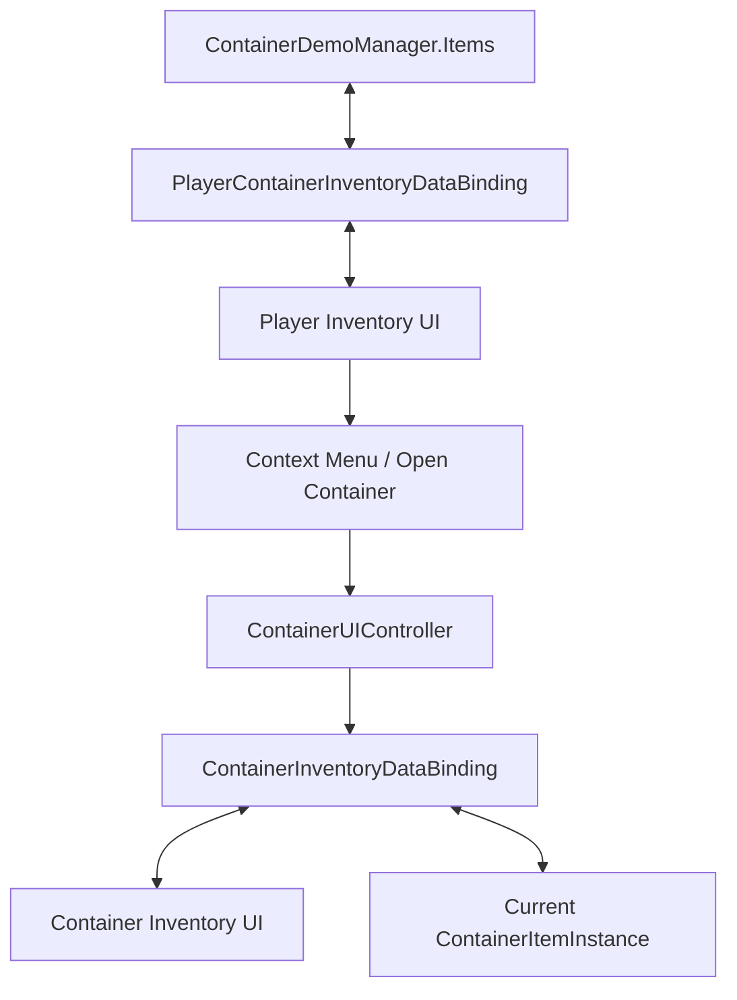

# Demo5 Containers

    <iframe
    src="https://www.youtube.com/embed/3BFn4jt9xhM"
    title="Project showcase video"
    allow="accelerometer; autoplay; clipboard-write; encrypted-media; gyroscope; picture-in-picture; web-share"
    allowfullscreen>
    </iframe>

`Examples/Demo5 Containers/Containers Demo.unity`

Esta muestra demuestra items de inventario que contienen su propio inventario anidado.

## Qué muestra la demo

- item instances en lugar de simples filas de lista
- un contenedor como item normal dentro del inventario del jugador
- un panel de UI separado para el contenedor actualmente abierto
- una acción de menú contextual que abre un contenedor
- prevención de ciclos en contenedores anidados

## Cómo está estructurada

Datos:

- `Scripts/Data/ItemInstance.cs`
- `Scripts/Data/ContainerItemInstance.cs`
- `Scripts/Data/IContainerizeItemInstance.cs`
- `Scripts/ContainerDemoManager.cs`

Bindings y UI:

- `Scripts/Bindings/PlayerContainerInventoryDataBinding.cs`
- `Scripts/Bindings/ContainerInventoryDataBinding.cs`
- `Scripts/UI/ContainerUIController.cs`
- `Scripts/ContextMenu/OpenContainerMenuEntrySO.cs`

Forma principal:

## Cómo funciona

Apertura de un contenedor:

1. El inventario del jugador contiene un `ContainerItemInstance`.
2. Una acción del menú contextual dispara `OpenContainerMenuEntrySO`.
3. A través de `Events.OnOpenClick`, el contenedor seleccionado se pasa a `ContainerUIController`.
4. El controlador establece el contenedor activo y llama a `SetContainer(...)`.
5. `ContainerInventoryDataBinding` redimensiona el inventario y carga el contenido de ese contenedor.

Mover items:

1. Las operaciones normales de drag/drop funcionan entre el inventario del jugador y el inventario del contenedor.
2. Los bindings sincronizan el movimiento de vuelta a la lista del jugador o a `ContainerItemInstance.Items`.
3. En drops sobre un slot ocupado, `PlayerContainerInventoryDataBinding` puede ejecutar un comportamiento personalizado para slot ocupado.
4. Antes de colocar un contenedor dentro de otro, `WouldCreateCycle(...)` evita anidamientos inválidos.

## Archivos para inspeccionar

| Archivo | Rol |
|---|---|
| `Scripts/ContainerDemoManager.cs` | lista raíz de items del jugador |
| `Scripts/Bindings/PlayerContainerInventoryDataBinding.cs` | binding del inventario del jugador |
| `Scripts/Bindings/ContainerInventoryDataBinding.cs` | binding del contenedor activo |
| `Scripts/UI/ContainerUIController.cs` | contenedor activo y cambio de paneles |
| `Scripts/ContextMenu/OpenContainerMenuEntrySO.cs` | entrada de menú contextual |
| `Scripts/Data/ContainerItemInstance.cs` | contenedor como item instance |

## Cuándo usar esto como punto de partida

- un item debe contener un inventario anidado
- necesitas un menú contextual para acciones sobre items
- necesitas reglas de drop personalizadas sobre el pipeline estándar

