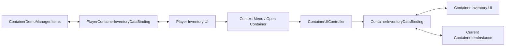

# Demo5 Containers

    <iframe
    src="https://www.youtube.com/embed/ZYOjIkwxcdU"
    title="Project showcase video"
    allow="accelerometer; autoplay; clipboard-write; encrypted-media; gyroscope; picture-in-picture; web-share"
    allowfullscreen>
    </iframe>

`Examples/Demo5 Containers/Containers Demo.unity`

Это пример inventory-предметов, которые сами содержат вложенный inventory.

## Что показывает демо

- item instances вместо простых записей списка
- контейнер как обычный предмет в inventory игрока
- отдельную UI-панель для содержимого активного контейнера
- context menu action для открытия контейнера
- защиту от циклов при вложении контейнеров

## Как устроено

Данные:

- `Scripts/Data/ItemInstance.cs`
- `Scripts/Data/ContainerItemInstance.cs`
- `Scripts/Data/IContainerizeItemInstance.cs`
- `Scripts/ContainerDemoManager.cs`

Bindings и UI:

- `Scripts/Bindings/PlayerContainerInventoryDataBinding.cs`
- `Scripts/Bindings/ContainerInventoryDataBinding.cs`
- `Scripts/UI/ContainerUIController.cs`
- `Scripts/ContextMenu/OpenContainerMenuEntrySO.cs`

Главная схема:

## Как работает

Открытие контейнера:

1. В inventory игрока лежит `ContainerItemInstance`.
2. Контекстное меню вызывает `OpenContainerMenuEntrySO`.
3. Через `Events.OnOpenClick` выбранный контейнер передаётся в `ContainerUIController`.
4. Контроллер выставляет active container и вызывает `SetContainer(...)`.
5. `ContainerInventoryDataBinding` перестраивает размер inventory и загружает содержимое контейнера.

Перенос предметов:

1. Между player inventory и container inventory работают обычные drag/drop операции.
2. Binding-и синхронизируют перенос обратно в player list или в `ContainerItemInstance.Items`.
3. При drop в занятый слот `PlayerContainerInventoryDataBinding` может выполнить custom occupied-slot поведение.
4. Перед помещением контейнера внутрь другого контейнера проверяется `WouldCreateCycle(...)`.

## Что смотреть в коде

| Файл | Роль |
|---|---|
| `Examples/Demo5 Containers/Scripts/ContainerDemoManager.cs` | корневой список предметов игрока |
| `Examples/Demo5 Containers/Scripts/Bindings/PlayerContainerInventoryDataBinding.cs` | binding инвентаря игрока |
| `Examples/Demo5 Containers/Scripts/Bindings/ContainerInventoryDataBinding.cs` | binding активного контейнера |
| `Examples/Demo5 Containers/Scripts/UI/ContainerUIController.cs` | переключение активного контейнера и панели |
| `Examples/Demo5 Containers/Scripts/ContextMenu/OpenContainerMenuEntrySO.cs` | пункт контекстного меню |
| `Examples/Demo5 Containers/Scripts/Data/ContainerItemInstance.cs` | контейнер как item instance |

## Когда брать этот пример за основу

- предмет должен содержать вложенный inventory
- нужен context menu для операций над предметом
- нужны custom drop-правила поверх стандартного pipeline
