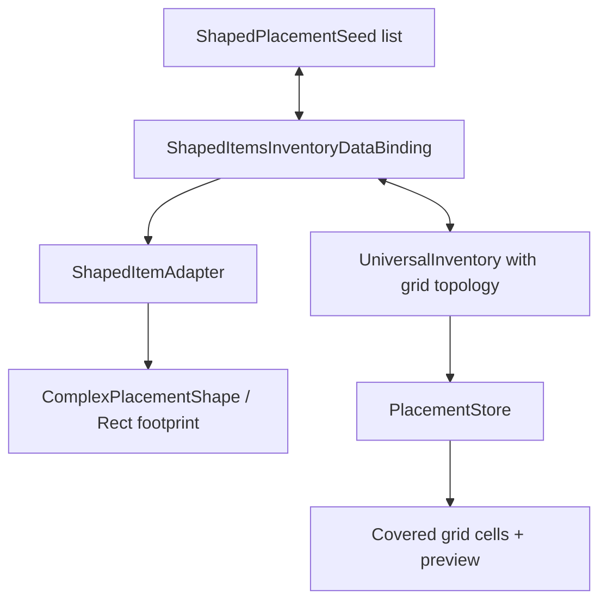

# Demo6 Shaped Items

    <iframe
    src="https://www.youtube.com/embed/r6hML-y5wLg"
    title="Project showcase video"
    allow="accelerometer; autoplay; clipboard-write; encrypted-media; gyroscope; picture-in-picture; web-share"
    allowfullscreen>
    </iframe>

`Examples/Demo6 Shaped Items/Shaped Items.unity`

This sample demonstrates items that occupy a multi-cell footprint in a grid inventory instead of a single slot.

## What the demo shows

- rectangular items such as a sword, shield, and metal
- complex non-rectangular shapes through an occupied-cell mask
- `PlacementInventoryDataBinding` for item + anchor + orientation data
- `IItemPlacementShapeProvider` on the item adapter
- rotating an item during drag through `RotateDragAction`
- covered-cell preview and placement validation against grid topology

## How it is structured

Item data:

- `ShapedItemExampleSO.cs`
- `ComplexShapedItemExampleSO.cs`
- `SO/RectShapes/*`
- `SO/ComplexShapes/*`

Binding and adapter:

- `Adapters/ShapedItemAdapter.cs`
- `DataBindings/ShapedItemsInventoryDataBinding.cs`

Editor tooling:

- `Editor/ComplexShapedItemExampleSOEditor.cs`

Main shape:

## How it works

Loading initial items:

1. `ShapedItemsInventoryDataBinding` reads the `ShapedPlacementSeed` list.
2. It creates a `ShapedItemAdapter` for each seed.
3. The adapter implements `IItemPlacementShapeProvider` and returns a `ComplexPlacementShape`.
4. The binding creates `PlacementData` with `anchorIndex` and `orientation`.
5. `PlacementInventoryDataBinding` calls `TryPlace(...)` on `IPlacementInventory`.
6. `PlacementStore` checks that every footprint cell is inside the grid and unoccupied.

Moving and rotating:

1. During drag, the system keeps shape, anchor, and orientation in `DragEntry`.
2. The demo profile maps `Q` and `E` to `RotateDragAction` with steps `-1` and `1`.
3. `RectGridTopology` normalizes orientation to 4 steps and recomputes covered cells.
4. Drop preview shows the in-bounds part of the footprint even when the final drop is rejected.
5. After a successful drop, the binding writes item, anchor, and orientation back to `_placements`.

## Rectangular and complex shapes

`ShapedItemExampleSO` describes a rectangle through `Width` and `Height`. Its `GetOccupiedCells()` returns every cell inside the bounding box.

`ComplexShapedItemExampleSO` adds the `_cells` bool mask. It supports L, T, cross, and other shapes where part of the bounding box is empty. If the mask becomes empty, the item falls back to the base rectangle so it never has a footprint-less shape.

The custom inspector `ComplexShapedItemExampleSOEditor` draws a clickable grid over the icon sprite: enabled cells are occupied, disabled cells are empty.

## Files to inspect

| File | Role |
|---|---|
| `ShapedItemExampleSO.cs` | base SO for rectangular shaped items |
| `ComplexShapedItemExampleSO.cs` | SO with a complex occupied-cell mask |
| `Adapters/ShapedItemAdapter.cs` | adapter with `IItemPlacementShapeProvider` |
| `DataBindings/ShapedItemsInventoryDataBinding.cs` | placement-aware binding with anchor/orientation persistence |
| `Editor/ComplexShapedItemExampleSOEditor.cs` | inspector for editing the footprint |
| `SO/DefaultInteractionBindingsProfile 1.asset` | bindings for drag/drop and rotate keys |

## When to use this as a starting point

- items must occupy multiple cells in an inventory grid
- you need to store item position and orientation in your own data
- you need item rotation during drag
- you need non-rectangular shapes, not only rectangles
