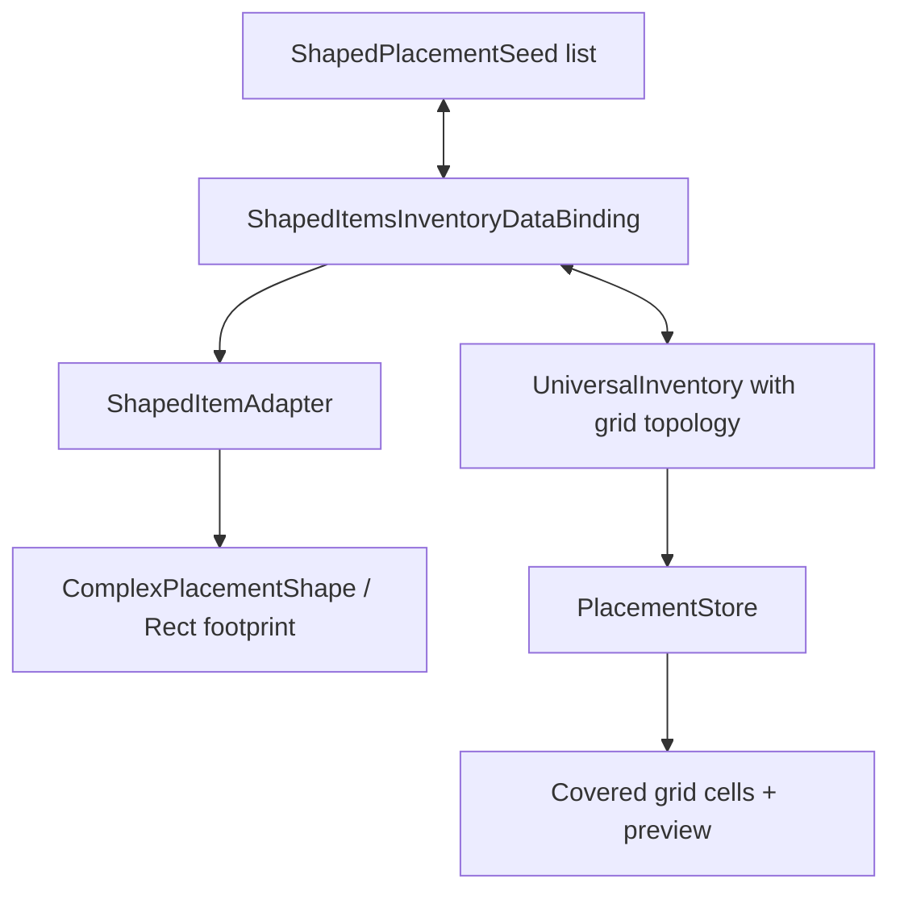

# Demo6 Shaped Items

    <iframe
    src="https://www.youtube.com/embed/r6hML-y5wLg"
    title="Project showcase video"
    allow="accelerometer; autoplay; clipboard-write; encrypted-media; gyroscope; picture-in-picture; web-share"
    allowfullscreen>
    </iframe>

`Examples/Demo6 Shaped Items/Shaped Items.unity`

Esta muestra demuestra items que ocupan un footprint de varias celdas en un inventario de grid, en lugar de un solo slot.

## Qué muestra la demo

- items rectangulares como espada, escudo y metal
- formas complejas no rectangulares mediante una máscara de celdas ocupadas
- `PlacementInventoryDataBinding` para datos item + anchor + orientation
- `IItemPlacementShapeProvider` en el adapter del item
- rotación del item durante el drag mediante `RotateDragAction`
- preview de celdas cubiertas y validación de placement contra grid topology

## Cómo está estructurada

Datos de item:

- `ShapedItemExampleSO.cs`
- `ComplexShapedItemExampleSO.cs`
- `SO/RectShapes/*`
- `SO/ComplexShapes/*`

Binding y adapter:

- `Adapters/ShapedItemAdapter.cs`
- `DataBindings/ShapedItemsInventoryDataBinding.cs`

Herramientas de editor:

- `Editor/ComplexShapedItemExampleSOEditor.cs`

Forma principal:

## Cómo funciona

Carga de items iniciales:

1. `ShapedItemsInventoryDataBinding` lee la lista `ShapedPlacementSeed`.
2. Crea un `ShapedItemAdapter` para cada seed.
3. El adapter implementa `IItemPlacementShapeProvider` y devuelve un `ComplexPlacementShape`.
4. El binding crea `PlacementData` con `anchorIndex` y `orientation`.
5. `PlacementInventoryDataBinding` llama a `TryPlace(...)` en `IPlacementInventory`.
6. `PlacementStore` comprueba que todas las celdas del footprint estén dentro del grid y libres.

Movimiento y rotación:

1. Durante el drag, el sistema guarda shape, anchor y orientation en `DragEntry`.
2. El perfil de la demo mapea `Q` y `E` a `RotateDragAction` con steps `-1` y `1`.
3. `RectGridTopology` normaliza la orientation a 4 pasos y recalcula las celdas cubiertas.
4. El drop preview muestra la parte in-bounds del footprint incluso cuando el drop final se rechaza.
5. Tras un drop correcto, el binding escribe item, anchor y orientation de vuelta en `_placements`.

## Formas rectangulares y complejas

`ShapedItemExampleSO` describe un rectángulo mediante `Width` y `Height`. Su `GetOccupiedCells()` devuelve todas las celdas dentro del bounding box.

`ComplexShapedItemExampleSO` añade la máscara bool `_cells`. Permite formas L, T, cross y otras donde parte del bounding box está vacía. Si la máscara queda vacía, el item vuelve al rectángulo base para no tener una forma sin footprint.

El inspector personalizado `ComplexShapedItemExampleSOEditor` dibuja un grid clickable sobre el icon sprite: las celdas activadas están ocupadas y las desactivadas quedan vacías.

## Archivos para inspeccionar

| Archivo | Rol |
|---|---|
| `ShapedItemExampleSO.cs` | SO base para shaped items rectangulares |
| `ComplexShapedItemExampleSO.cs` | SO con máscara compleja de celdas ocupadas |
| `Adapters/ShapedItemAdapter.cs` | adapter con `IItemPlacementShapeProvider` |
| `DataBindings/ShapedItemsInventoryDataBinding.cs` | binding placement-aware con persistencia de anchor/orientation |
| `Editor/ComplexShapedItemExampleSOEditor.cs` | inspector para editar el footprint |
| `SO/DefaultInteractionBindingsProfile 1.asset` | bindings de drag/drop y teclas de rotación |

## Cuándo usar esto como punto de partida

- los items deben ocupar varias celdas en un inventory grid
- necesitas guardar posición y orientación del item en tus propios datos
- necesitas rotación de items durante drag
- necesitas formas no rectangulares, no solo rectángulos
