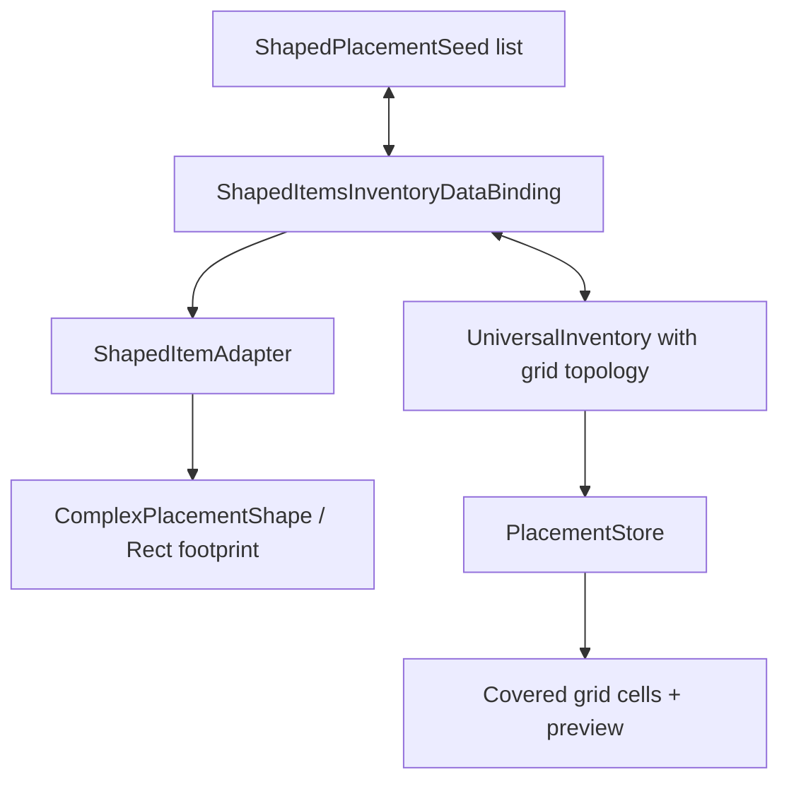

# Demo6 Shaped Items

    <iframe
    src="https://www.youtube.com/embed/r6hML-y5wLg"
    title="Project showcase video"
    allow="accelerometer; autoplay; clipboard-write; encrypted-media; gyroscope; picture-in-picture; web-share"
    allowfullscreen>
    </iframe>

`Examples/Demo6 Shaped Items/Shaped Items.unity`

Этот пример показывает предметы, которые занимают не один слот, а footprint из нескольких клеток grid-инвентаря.

## Что показывает демо

- прямоугольные предметы вроде меча, щита и металла
- сложные non-rectangular формы через маску занятых клеток
- `PlacementInventoryDataBinding` для данных вида item + anchor + orientation
- `IItemPlacementShapeProvider` на adapter-е предмета
- поворот предмета во время drag через `RotateDragAction`
- preview занятых клеток и проверку размещения по grid topology

## Как устроено

Данные предметов:

- `ShapedItemExampleSO.cs`
- `ComplexShapedItemExampleSO.cs`
- `SO/RectShapes/*`
- `SO/ComplexShapes/*`

Binding и adapter:

- `Adapters/ShapedItemAdapter.cs`
- `DataBindings/ShapedItemsInventoryDataBinding.cs`

Editor tooling:

- `Editor/ComplexShapedItemExampleSOEditor.cs`

Главная схема:

## Как работает

Загрузка начальных предметов:

1. `ShapedItemsInventoryDataBinding` читает список `ShapedPlacementSeed`.
2. Для каждого seed создаётся `ShapedItemAdapter`.
3. Adapter реализует `IItemPlacementShapeProvider` и возвращает `ComplexPlacementShape`.
4. Binding создаёт `PlacementData` с `anchorIndex` и `orientation`.
5. `PlacementInventoryDataBinding` вызывает `TryPlace(...)` на `IPlacementInventory`.
6. `PlacementStore` проверяет, что все клетки footprint-а входят в grid и не заняты.

Перенос и поворот:

1. Во время drag система хранит shape, anchor и orientation в `DragEntry`.
2. Клавиши `Q` и `E` в demo-профиле вызывают `RotateDragAction` со steps `-1` и `1`.
3. `RectGridTopology` нормализует orientation в 4 шага и пересчитывает covered cells.
4. Drop preview показывает in-bounds часть footprint-а, даже если итоговый drop будет запрещён.
5. После успешного drop binding записывает обратно item, anchor и orientation в `_placements`.

## Прямоугольные и сложные формы

`ShapedItemExampleSO` описывает обычный прямоугольник через `Width` и `Height`. Его `GetOccupiedCells()` возвращает все клетки внутри bounding box.

`ComplexShapedItemExampleSO` добавляет bool-маску `_cells`. Она позволяет сделать L-, T-, cross- и другие формы, где часть клеток bounding box пустая. Если маска случайно стала пустой, предмет fallback-ится к базовому прямоугольнику, чтобы не получить предмет без footprint-а.

Custom inspector `ComplexShapedItemExampleSOEditor` рисует clickable grid поверх icon sprite: включённые клетки считаются занятыми, выключенные становятся пустыми.

## Что смотреть в коде

| Файл | Роль |
|---|---|
| `ShapedItemExampleSO.cs` | базовый SO для rectangular shaped item |
| `ComplexShapedItemExampleSO.cs` | SO со сложной маской занятых клеток |
| `Adapters/ShapedItemAdapter.cs` | adapter с `IItemPlacementShapeProvider` |
| `DataBindings/ShapedItemsInventoryDataBinding.cs` | placement-aware binding с anchor/orientation persistence |
| `Editor/ComplexShapedItemExampleSOEditor.cs` | inspector для редактирования footprint-а |
| `SO/DefaultInteractionBindingsProfile 1.asset` | bindings для drag/drop и rotate keys |

## Когда брать этот пример за основу

- предметы должны занимать несколько клеток в inventory grid
- нужно хранить позицию и ориентацию предмета в своих данных
- нужен поворот предметов во время drag
- нужны нестандартные формы, а не только прямоугольники
