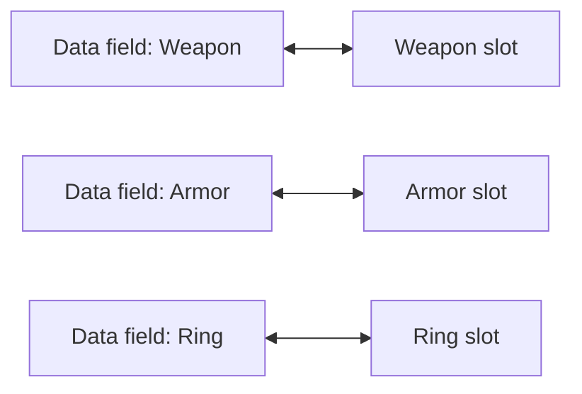
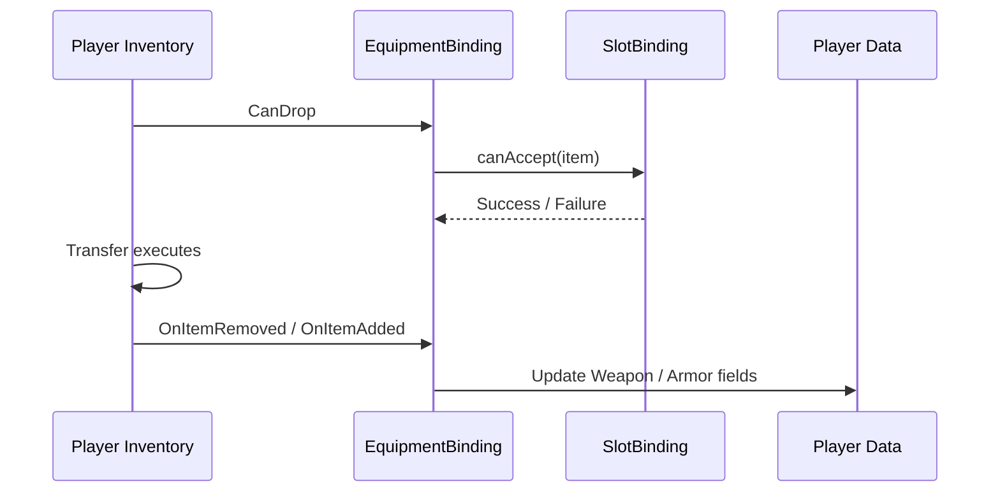

# Equipment

Use this pattern when you have fixed-purpose slots such as weapon, armor, accessories, or a quickbar.

---

## When to use it

Choose `MappedSlotInventoryDataBinding` when:

- each slot maps to a specific data field
- slots accept only specific item types
- slot identity matters and should not be reordered automatically

If you only need a regular item list, use `ListInventoryDataBinding` from the [Quick Start](../getting-started/quick-start.md).

---

## Visual model



---

## Basic template

```csharp
using DragAndDropSystem.Core;
using DragAndDropSystem.DataBinding;
using DragAndDropSystem.Rules;
using DragAndDropSystem.Slots;

public class EquipmentBinding : MappedSlotInventoryDataBinding<ItemSO, ItemSOAdapter>
{
    [SerializeField] private UniversalSlot _weaponSlot;
    [SerializeField] private UniversalSlot _armorSlot;

    private ItemSO _equippedWeapon;
    private ItemSO _equippedArmor;

    protected override Dictionary<ISlot, SlotBinding<ItemSO>> CreateBindingMap() => new()
    {
        [_weaponSlot] = new(
            get:   () => _equippedWeapon,
            set:   item => _equippedWeapon = item,
            clear: () => _equippedWeapon = null,
            canAccept: item => item.ItemType == "Weapon"
                ? RuleResult.Success()
                : RuleResult.Failure("Weapon only")),

        [_armorSlot] = new(
            get:   () => _equippedArmor,
            set:   item => _equippedArmor = item,
            clear: () => _equippedArmor = null,
            canAccept: item => item.ItemType == "Armor"
                ? RuleResult.Success()
                : RuleResult.Failure("Armor only")),
    };

    protected override ItemSOAdapter CreateAdapter(ItemSO item) => new(item);
    protected override ItemSO ExtractData(ItemSOAdapter a) => a.Data;
}
```

---

## What matters here

- `get` reads from your model
- `set` writes into the matching field
- `clear` resets that field when the slot is emptied
- `canAccept` is for slot compatibility only

Use `canAccept` for rules like:

- only weapons in a weapon slot
- only armor in an armor slot
- only artifacts in special artifact slots

Do not put transfer-wide business logic there. For pricing, server checks, or domain-specific commit checks, use the transfer-level hooks described in [Data Binding Lifecycle](../architecture/data-binding.md).

---

## Typical flow


