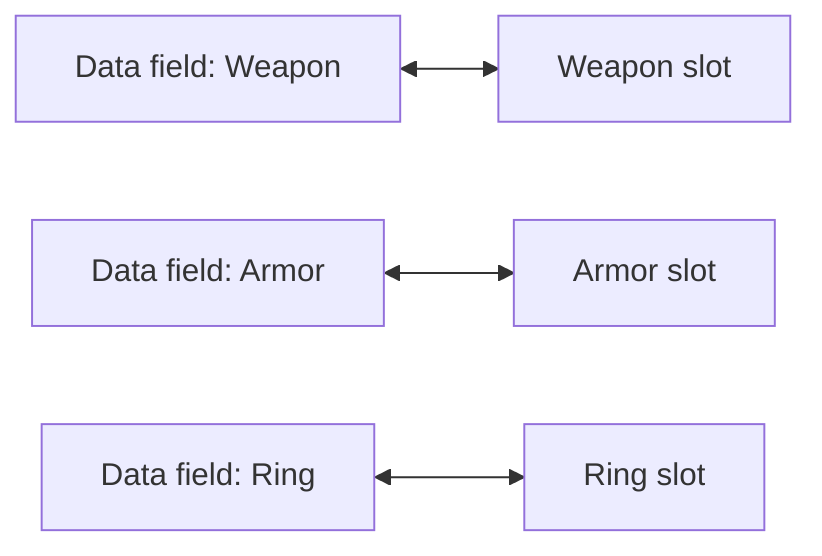
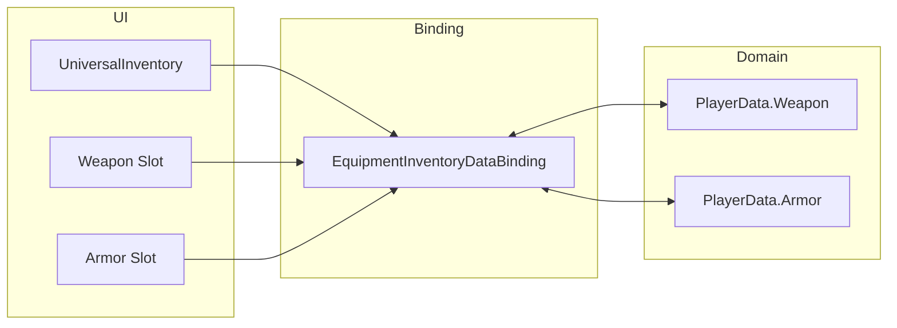
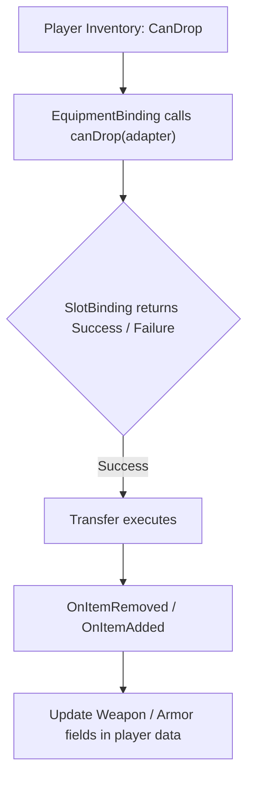

# Equipment

Use this pattern when you have fixed-purpose slots such as weapon, armor, accessories, or a quickbar.

In this project, the pattern is demonstrated on top of the trading demo:
- `Examples/Demo4 Trading/DataBindings/EquipmentInventoryDataBinding.cs`

Core idea:
- one UI slot maps to one concrete domain field
- the slot itself knows which items are mechanically valid
- the drag/drop pipeline stays generic while the binding synchronizes fixed fields

---

## When to use it

Choose `MappedSlotInventoryDataBinding` when:

- each slot maps to a specific data field
- slots accept only specific item types
- slot identity matters and should not be reordered automatically

If you only need a regular item list, use `ListInventoryDataBinding` from the [Quick Start](../getting-started/quick-start.md).

---

## Visual model



---

## How the example is structured

Three layers participate:

1. `UniversalInventory` and slot UI
2. `MappedSlotInventoryDataBinding`
3. the player's equipment domain model



How it works:
- the UI stores real `ItemStack` instances and runs normal drag/drop
- the binding knows how each slot maps to a concrete field
- the domain model knows nothing about UI components or drag mechanics

---

## Basic template

```csharp
using UniversalDragAndDrop.Core;
using UniversalDragAndDrop.DataBinding;
using UniversalDragAndDrop.Rules;
using UniversalDragAndDrop.Slots;

public class EquipmentBinding : MappedSlotInventoryDataBinding<ItemSO, ItemSOAdapter>
{
    [SerializeField] private UniversalSlot _weaponSlot;
    [SerializeField] private UniversalSlot _armorSlot;

    private ItemSO _equippedWeapon;
    private ItemSO _equippedArmor;

    protected override Dictionary<BaseSlot, SlotBinding<ItemSO, ItemSOAdapter>> CreateBindingMap() => new()
    {
        [_weaponSlot] = new(
            get:   () => _equippedWeapon,
            set:   adapter => EquipWeapon(adapter),
            clear: () => _equippedWeapon = null,
            canDrop: adapter => ValidateWeapon(adapter)),

        [_armorSlot] = new(
            get:   () => _equippedArmor,
            set:   adapter => EquipArmor(adapter),
            clear: () => _equippedArmor = null,
            canDrop: adapter => ValidateArmor(adapter)),
    };

    protected override ItemSOAdapter CreateAdapter(ItemSO item) => new(item);

    private void EquipWeapon(ItemSOAdapter adapter) { /* write into your data model */ }
    private void EquipArmor(ItemSOAdapter adapter) { /* write into your data model */ }

    private RuleResult ValidateWeapon(ItemSOAdapter adapter)
        => /* check type */ RuleResult.Success();

    private RuleResult ValidateArmor(ItemSOAdapter adapter)
        => /* check type */ RuleResult.Success();
}
```

---

## What matters here

- `get` reads from your model
- `set` writes into the matching field
- `clear` resets that field when the slot is emptied
- `canDrop` is for slot compatibility only

Use `canDrop` for rules like:

- only weapons in a weapon slot
- only armor in an armor slot
- only artifacts in special artifact slots

Do not put transfer-wide business logic there. For pricing, server checks, or domain-specific commit checks, use the transfer-level hooks described in [Data Binding Lifecycle](../architecture/data-binding.md).

---

## Typical flow



---

## What to inspect in code

| File | Role |
|---|---|
| `Examples/Demo4 Trading/DataBindings/EquipmentInventoryDataBinding.cs` | fixed-slot binding |
| `Scripts/DataBinding/MappedSlotInventoryDataBinding.cs` | base template for slot-mapped bindings |
| `Scripts/DataBinding/InventoryDataBindingBase.cs` | common lifecycle hooks |
| `Scripts/Inventories/InventoryDropProcessor.cs` | UI-to-transfer boundary |
| `Scripts/Inventories/TransferPlanner.cs` | planning phase |
| `Scripts/Inventories/TransferPlanExecutor.cs` | execution + rollback + events |

---

## Where to go next

- [Data Binding](../architecture/data-binding.md) — full lifecycle and hooks
- [Trading](trading.md) — when items also convert between different data models
- [Examples Overview](index.md) — to compare other scenarios
