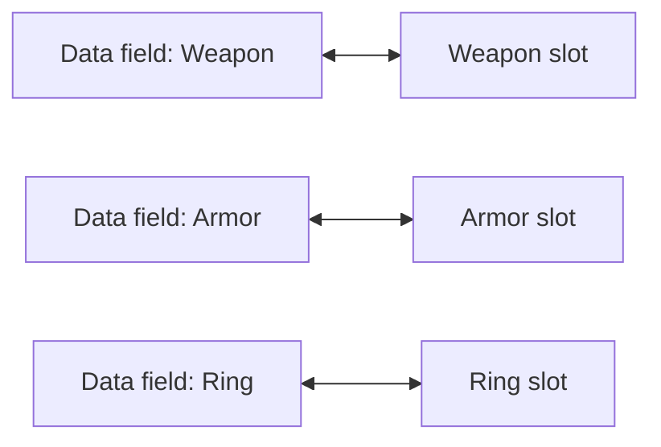
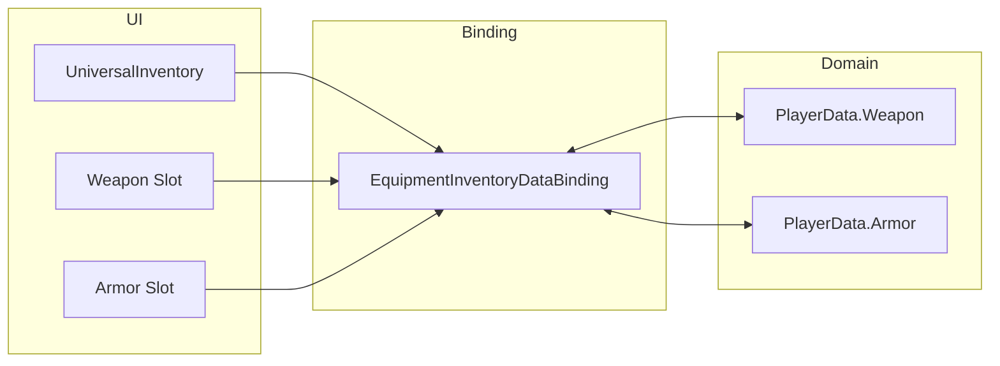
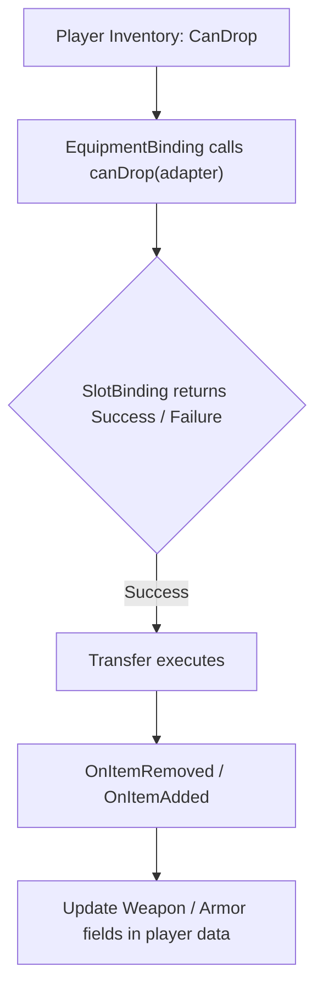

# Equipment

Usa este patrón cuando tengas slots de propósito fijo como arma, armadura, accesorios o quickbar.

En este proyecto, el patrón se demuestra sobre la trading demo:
- `Examples/Demo4 Trading/DataBindings/EquipmentInventoryDataBinding.cs`

Idea principal:
- un slot de UI se corresponde con un campo concreto del dominio
- el propio slot sabe qué items son mecánicamente válidos
- el drag/drop pipeline sigue siendo genérico mientras el binding sincroniza campos fijos

---

## Cuándo usarlo

Elige `MappedSlotInventoryDataBinding` cuando:

- cada slot se corresponda con un campo de datos específico
- los slots acepten solo ciertos tipos de item
- la identidad del slot importe y no deba reordenarse automáticamente

Si solo necesitas una lista normal de items, usa `ListInventoryDataBinding` del [Quick Start](../getting-started/quick-start.md).

---

## Modelo visual



---

## Cómo está estructurado el ejemplo

Participan tres capas:

1. `UniversalInventory` y la UI de los slots
2. `MappedSlotInventoryDataBinding`
3. el modelo de dominio de equipamiento del jugador



Cómo funciona:
- la UI almacena instancias reales de `ItemStack` y ejecuta el drag/drop normal
- el binding sabe cómo se mapea cada slot a un campo concreto
- el modelo de dominio no sabe nada de componentes de UI ni de mecánicas de drag

---

## Plantilla básica

```csharp
using DragAndDropSystem.Core;
using DragAndDropSystem.DataBinding;
using DragAndDropSystem.Rules;
using DragAndDropSystem.Slots;

public class EquipmentBinding : MappedSlotInventoryDataBinding<ItemSO, ItemSOAdapter>
{
    [SerializeField] private UniversalSlot _weaponSlot;
    [SerializeField] private UniversalSlot _armorSlot;

    private ItemSO _equippedWeapon;
    private ItemSO _equippedArmor;

    protected override Dictionary<BaseSlot, SlotBinding<ItemSO, ItemSOAdapter>> CreateBindingMap() => new()
    {
        [_weaponSlot] = new(
            get:   () => _equippedWeapon,
            set:   adapter => EquipWeapon(adapter),
            clear: () => _equippedWeapon = null,
            canDrop: adapter => ValidateWeapon(adapter)),

        [_armorSlot] = new(
            get:   () => _equippedArmor,
            set:   adapter => EquipArmor(adapter),
            clear: () => _equippedArmor = null,
            canDrop: adapter => ValidateArmor(adapter)),
    };

    protected override ItemSOAdapter CreateAdapter(ItemSO item) => new(item);

    private void EquipWeapon(ItemSOAdapter adapter) { /* write into your data model */ }
    private void EquipArmor(ItemSOAdapter adapter) { /* write into your data model */ }

    private RuleResult ValidateWeapon(ItemSOAdapter adapter)
        => /* check type */ RuleResult.Success();

    private RuleResult ValidateArmor(ItemSOAdapter adapter)
        => /* check type */ RuleResult.Success();
}
```

---

## Qué importa aquí

- `get` lee desde tu modelo
- `set` escribe en el campo correspondiente
- `clear` resetea ese campo cuando el slot queda vacío
- `canDrop` es solo para compatibilidad de slot

Usa `canDrop` para rules como:

- solo armas en un slot de arma
- solo armaduras en un slot de armadura
- solo artefactos en slots especiales de artefacto

No pongas ahí lógica de negocio a nivel de transferencia. Para precio, comprobaciones de servidor o validaciones de commit específicas del dominio, usa los transfer-level hooks descritos en [Data Binding Lifecycle](../architecture/data-binding.md).

---

## Flujo típico



---

## Qué inspeccionar en código

| Archivo | Rol |
|---|---|
| `Examples/Demo4 Trading/DataBindings/EquipmentInventoryDataBinding.cs` | binding de slots fijos |
| `Scripts/DataBinding/MappedSlotInventoryDataBinding.cs` | plantilla base para bindings mapeados a slots |
| `Scripts/DataBinding/InventoryDataBindingBase.cs` | lifecycle hooks comunes |
| `Scripts/Inventories/InventoryDropProcessor.cs` | límite entre UI y transferencia |
| `Scripts/Inventories/TransferPlanner.cs` | fase de planning |
| `Scripts/Inventories/TransferPlanExecutor.cs` | execution + rollback + eventos |

---

## Dónde continuar

- [Data Binding](../architecture/data-binding.md) — lifecycle completo y hooks
- [Trading](trading.md) — cuando los items también se convierten entre distintos modelos de datos
- [Examples Overview](index.md) — para comparar otros escenarios

