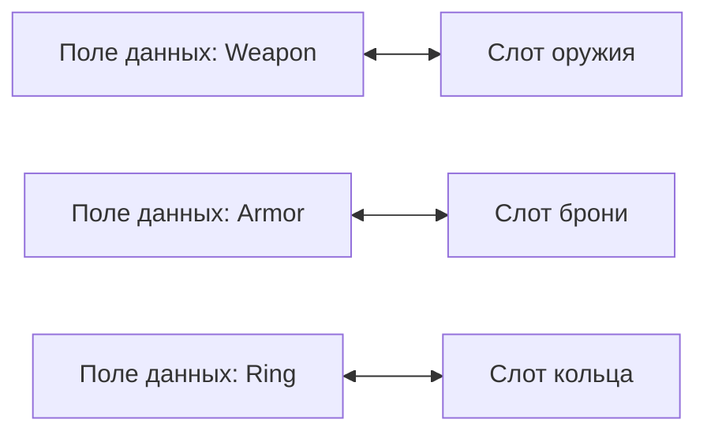
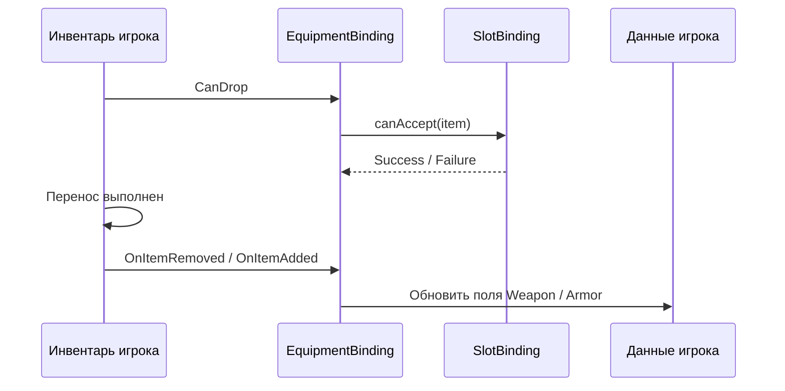

# Экипировка

Этот сценарий нужен, когда у вас есть фиксированные слоты с назначением: оружие, броня, аксессуары, quickbar.

---

## Когда использовать

Используйте `MappedSlotInventoryDataBinding`, если:

- каждый слот соответствует конкретному полю данных
- слот может принимать только определённый тип предметов
- порядок слотов важен и не должен меняться автоматически

Если вам нужен обычный список предметов без жёсткого назначения слотов, используйте `ListInventoryDataBinding` из [быстрого старта](../getting-started/quick-start.md).

---

## Как это выглядит



---

## Базовый шаблон

```csharp
using DragAndDropSystem.Core;
using DragAndDropSystem.DataBinding;
using DragAndDropSystem.Rules;
using DragAndDropSystem.Slots;

public class EquipmentBinding : MappedSlotInventoryDataBinding<ItemSO, ItemSOAdapter>
{
    [SerializeField] private UniversalSlot _weaponSlot;
    [SerializeField] private UniversalSlot _armorSlot;

    private ItemSO _equippedWeapon;
    private ItemSO _equippedArmor;

    protected override Dictionary<ISlot, SlotBinding<ItemSO>> CreateBindingMap() => new()
    {
        [_weaponSlot] = new(
            get:   () => _equippedWeapon,
            set:   item => _equippedWeapon = item,
            clear: () => _equippedWeapon = null,
            canAccept: item => item.ItemType == "Weapon"
                ? RuleResult.Success()
                : RuleResult.Failure("Только оружие")),

        [_armorSlot] = new(
            get:   () => _equippedArmor,
            set:   item => _equippedArmor = item,
            clear: () => _equippedArmor = null,
            canAccept: item => item.ItemType == "Armor"
                ? RuleResult.Success()
                : RuleResult.Failure("Только броня")),
    };

    protected override ItemSOAdapter CreateAdapter(ItemSO item) => new(item);
    protected override ItemSO ExtractData(ItemSOAdapter a) => a.Data;
}
```

---

## Что здесь важно

- `get` читает текущее значение из вашей модели данных
- `set` записывает предмет в конкретное поле
- `clear` очищает поле, когда слот освобождается
- `canAccept` отвечает только за механическую совместимость слота

`canAccept` подходит для правил вроде:

- только оружие в слот оружия
- только броня в слот брони
- только артефакты в два специальных слота

Если вам нужна бизнес-логика уровня всей операции, например цена экипировки, серверная проверка или особые доменные ограничения, не помещайте её в `canAccept` или `CanDrop`. Для этого используйте transfer-level hooks, описанные в [Data Binding Lifecycle](../architecture/data-binding.md).

---

## Типичный поток



---

## Когда идти дальше

- [Привязка данных](../architecture/data-binding.md) — полный lifecycle и hooks
- [Торговля](trading.md) — если предметы ещё и конвертируются между разными моделями
