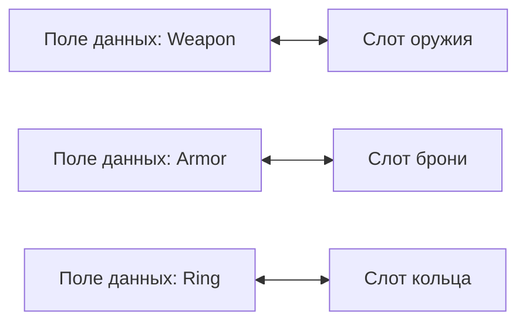
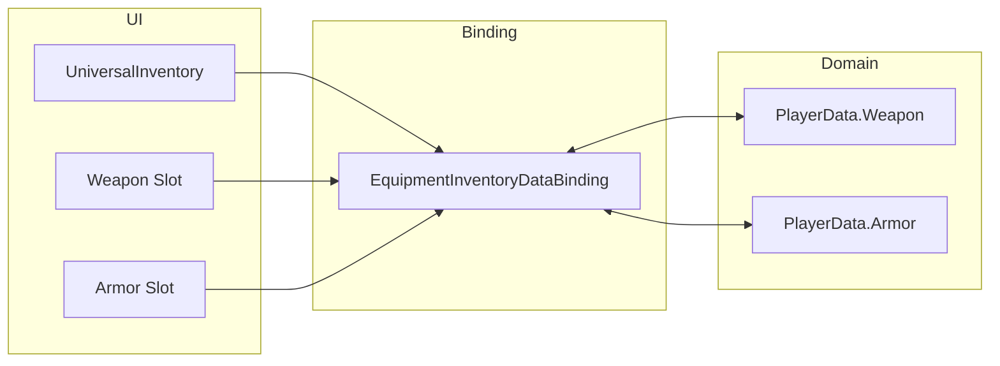
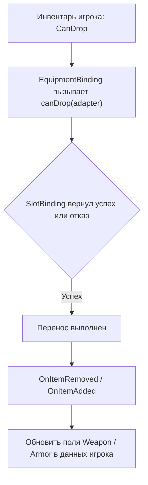

# Экипировка

Этот сценарий нужен, когда у вас есть фиксированные слоты с назначением: оружие, броня, аксессуары, quickbar.

В проекте этот паттерн показан на базе торгового демо:
- `Examples/Demo4 Trading/DataBindings/EquipmentInventoryDataBinding.cs`

Главная идея примера:
- один UI-слот соответствует одному конкретному полю доменных данных
- слот сам знает, какие предметы механически допустимы
- drag/drop pipeline остаётся общим, а binding только синхронизирует fixed fields

---

## Когда использовать

Используйте `MappedSlotInventoryDataBinding`, если:

- каждый слот соответствует конкретному полю данных
- слот может принимать только определённый тип предметов
- порядок слотов важен и не должен меняться автоматически

Если вам нужен обычный список предметов без жёсткого назначения слотов, используйте `ListInventoryDataBinding` из [быстрого старта](../getting-started/quick-start.md).

---

## Как это выглядит



---

## Как пример устроен

В этом сценарии участвуют три слоя:

1. `UniversalInventory` и slot UI
2. `MappedSlotInventoryDataBinding`
3. доменная модель экипировки игрока



Как это работает:
- UI хранит реальные `ItemStack` и даёт обычный drag/drop
- binding знает, как сопоставить каждый слот конкретному полю
- доменная модель не знает о UI-компонентах и не содержит логики drag/drop

---

## Базовый шаблон

```csharp
using UniversalDragAndDrop.Core;
using UniversalDragAndDrop.DataBinding;
using UniversalDragAndDrop.Rules;
using UniversalDragAndDrop.Slots;

public class EquipmentBinding : MappedSlotInventoryDataBinding<ItemSO, ItemSOAdapter>
{
    [SerializeField] private UniversalSlot _weaponSlot;
    [SerializeField] private UniversalSlot _armorSlot;

    private ItemSO _equippedWeapon;
    private ItemSO _equippedArmor;

    protected override Dictionary<BaseSlot, SlotBinding<ItemSO, ItemSOAdapter>> CreateBindingMap() => new()
    {
        [_weaponSlot] = new(
            get:   () => _equippedWeapon,
            set:   adapter => EquipWeapon(adapter),
            clear: () => _equippedWeapon = null,
            canDrop: adapter => ValidateWeapon(adapter)),

        [_armorSlot] = new(
            get:   () => _equippedArmor,
            set:   adapter => EquipArmor(adapter),
            clear: () => _equippedArmor = null,
            canDrop: adapter => ValidateArmor(adapter)),
    };

    protected override ItemSOAdapter CreateAdapter(ItemSO item) => new(item);

    private void EquipWeapon(ItemSOAdapter adapter) { /* записать в модель данных */ }
    private void EquipArmor(ItemSOAdapter adapter) { /* записать в модель данных */ }

    private RuleResult ValidateWeapon(ItemSOAdapter adapter)
        => /* проверить тип */ RuleResult.Success();

    private RuleResult ValidateArmor(ItemSOAdapter adapter)
        => /* проверить тип */ RuleResult.Success();
}
```

---

## Что здесь важно

- `get` читает текущее значение из вашей модели данных
- `set` записывает предмет в конкретное поле
- `clear` очищает поле, когда слот освобождается
- `canDrop` отвечает только за механическую совместимость слота

`canDrop` подходит для правил вроде:

- только оружие в слот оружия
- только броня в слот брони
- только артефакты в два специальных слота

Если вам нужна бизнес-логика уровня всей операции, например цена экипировки, серверная проверка или особые доменные ограничения, не помещайте её в `canDrop` или `CanDrop`. Для этого используйте transfer-level hooks, описанные в [Data Binding Lifecycle](../architecture/data-binding.md).

---

## Как проходит перенос

1. Игрок перетаскивает предмет в фиксированный слот.
2. `MappedSlotInventoryDataBinding.CanDrop(...)` берёт representative adapter (`PrimaryAdapter`) из стека.
3. Binding находит `SlotBinding` для целевого слота.
4. `canDrop` проверяет механическую совместимость.
5. Если перенос успешен, `OnItemRemovedFromUI` и `OnItemAddedToUI` обновляют конкретные поля доменной модели.

---

## Типичный поток



---

## Что смотреть в коде

| Файл | Роль |
|---|---|
| `Examples/Demo4 Trading/DataBindings/EquipmentInventoryDataBinding.cs` | fixed-slot binding |
| `Scripts/DataBinding/MappedSlotInventoryDataBinding.cs` | базовый шаблон slot-mapped binding |
| `Scripts/DataBinding/InventoryDataBindingBase.cs` | общий lifecycle hooks |
| `Scripts/Inventories/InventoryDropProcessor.cs` | drop boundary между UI и transfer core |
| `Scripts/Inventories/TransferPlanner.cs` | planner фаза |
| `Scripts/Inventories/TransferPlanExecutor.cs` | execution + rollback + events |

---

## Когда идти дальше

- [Привязка данных](../architecture/data-binding.md) — полный lifecycle и hooks
- [Торговля](trading.md) — если предметы ещё и конвертируются между разными моделями
- [Обзор раздела примеров](index.md) — если хотите выбрать другой сценарий
