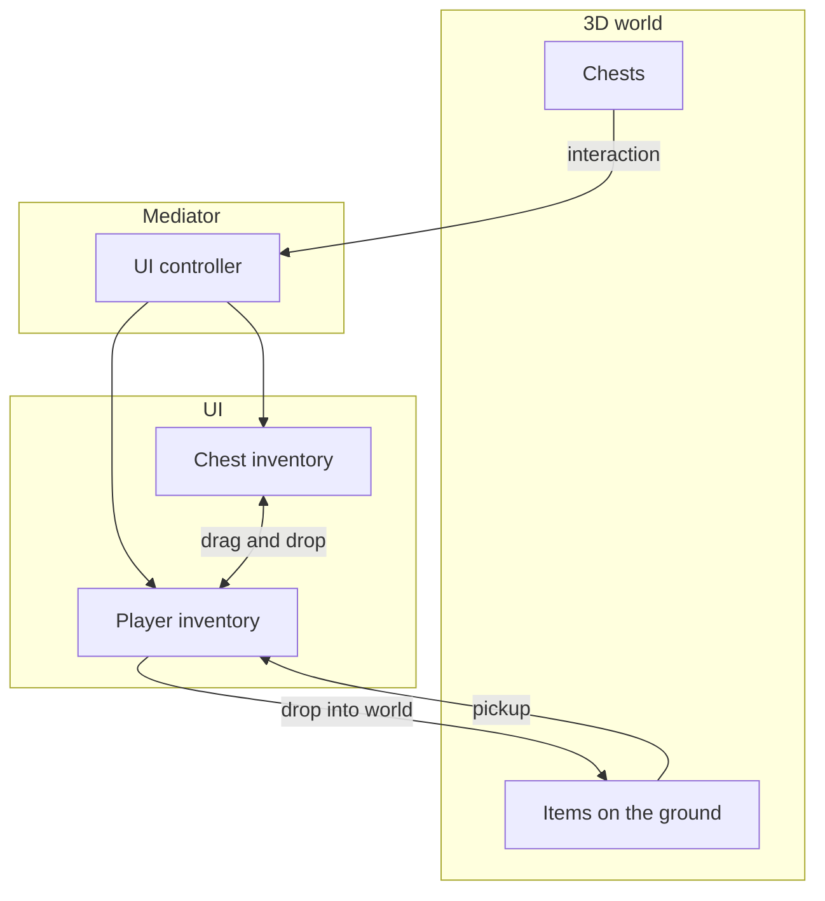
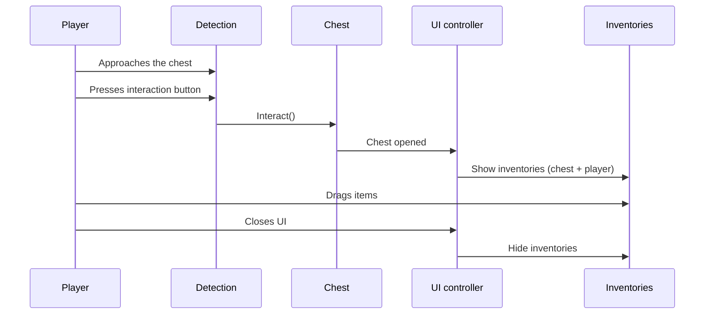
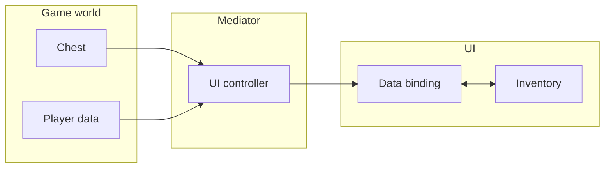
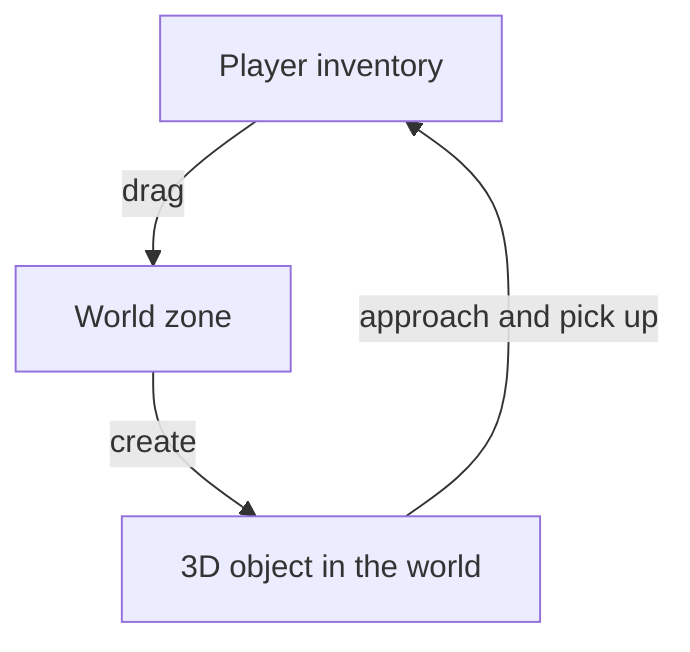

# Loot and 3D World

A full-featured loot system: chests in a 3D world, player interaction, picking up and dropping items.

Real project location:
- `Examples/Demo2 Loot/*`

This example is not mainly about a special inventory type. It is about integrating the inventory pipeline with the game world, UI, and 3D objects.

---

## Overview

---

## Chest Interaction

Sequence of actions:

1. The player approaches a chest --- the detection system identifies the nearest interactive object.
2. On pressing the interaction button, the chest toggles its state (open/closed).
3. The UI controller (mediator) reacts to the open event and shows the inventory panel.
4. The player drags items between inventories using standard drag & drop.
5. On closing (button or leaving the zone), the UI is hidden and control returns to the player.

---

## Architecture: Separation of Concerns

- **Game world** manages chest contents and player data. Knows nothing about the UI.
- **Mediator** (UI controller) --- the only component aware of both layers. Opens and closes the UI, connects data to bindings.
- **UI** works only with `UniversalInventory` and data bindings. Knows nothing about game logic.

This separation allows changing the UI or game logic independently of each other.

---

## How the example is structured

There are four separate responsibility zones in this scenario:

1. **World**: chests, 3D items, interactive objects
2. **Mediator**: the UI controller that connects world and UI
3. **UI and inventories**: `UniversalInventory`, drag/drop, world drop zone
4. **Bindings and data**: chest content and player content

This matters because:
- the chest should not know specific UI components
- the UI should not know about raycasts, chest opening, or player interaction logic
- world pickup/drop logic should plug in through adapters and boundary components

---

## Dropping Items into the World

Process:

1. The player drags an item from the inventory onto the world zone (WorldDropZone).
2. The system checks whether the item has a 3D representation (whether it implements IWorld3DAdapter).
3. If it does --- the item is removed from the inventory and appears as a 3D object in the world.
4. This object can be picked back up by approaching it and pressing the interaction button.

At code level this usually looks like:
- UI sends an `ItemStack` into `WorldDropZone`
- `WorldDropZone` checks the representative adapter for `IWorld3DAdapter`
- on success, a world object is spawned and the source stack is reduced
- on pickup, the world object adds the item back into inventory data/UI

---

## Comparison with Other Examples

| Aspect | Basic setup | Trading | Loot and 3D world |
|--------|----------------|-------------------|---------------|
| Data source | Simple list | Economy + adapters | World objects |
| Transfer type | Direct drag and drop | Buy/sell with gold | Loot + pickup |
| When UI is shown | Always visible | Always visible | Opens on event |
| 3D integration | No | No | Yes |

---

## Files

| File | Role |
|------|------|
| `Chest.cs` | Chest --- stores items, fires open/close events |
| `IInteractable.cs` | Interface for interactive objects |
| `ItemController.cs` | 3D item controller on the ground (pickup) |
| `PlayerController.cs` | Player control (movement, input locking) |
| `PlayerInteraction.cs` | Interactive object detection (raycast) |
| `PlayerInventoryData.cs` | Player inventory data (game layer) |
| `LootUIController.cs` | Mediator between the world and UI |
| `ChestInventoryDataBinding.cs` | Chest data binding to UI |
| `PlayerInventoryDataBinding.cs` | Player data binding to UI (preserves slot positions) |
| `ItemExampleWith3DSO.cs` | ScriptableObject item with a reference to a 3D prefab |
| `ItemSOWith3DAdapter.cs` | Adapter linking the item to IWorld3DAdapter |

---

## How to read this example

If you only want one part of the scenario:

- for event-driven chest UI: inspect `LootUIController` and the bindings
- for dropping inventory items into the world: inspect `WorldDropZone` and `IWorld3DAdapter`
- for pickup from the ground: inspect `ItemController`, `PlayerInteraction`, and player data sync

---

## Where to go next

- [World 3D](../systems/world-3d.md) — for a focused look at world integration
- [Transfer Pipeline](../architecture/transfer-pipeline.md) — to see how world drop plugs into normal transfer flow
- [Examples Overview](index.md) — to compare other scenarios
