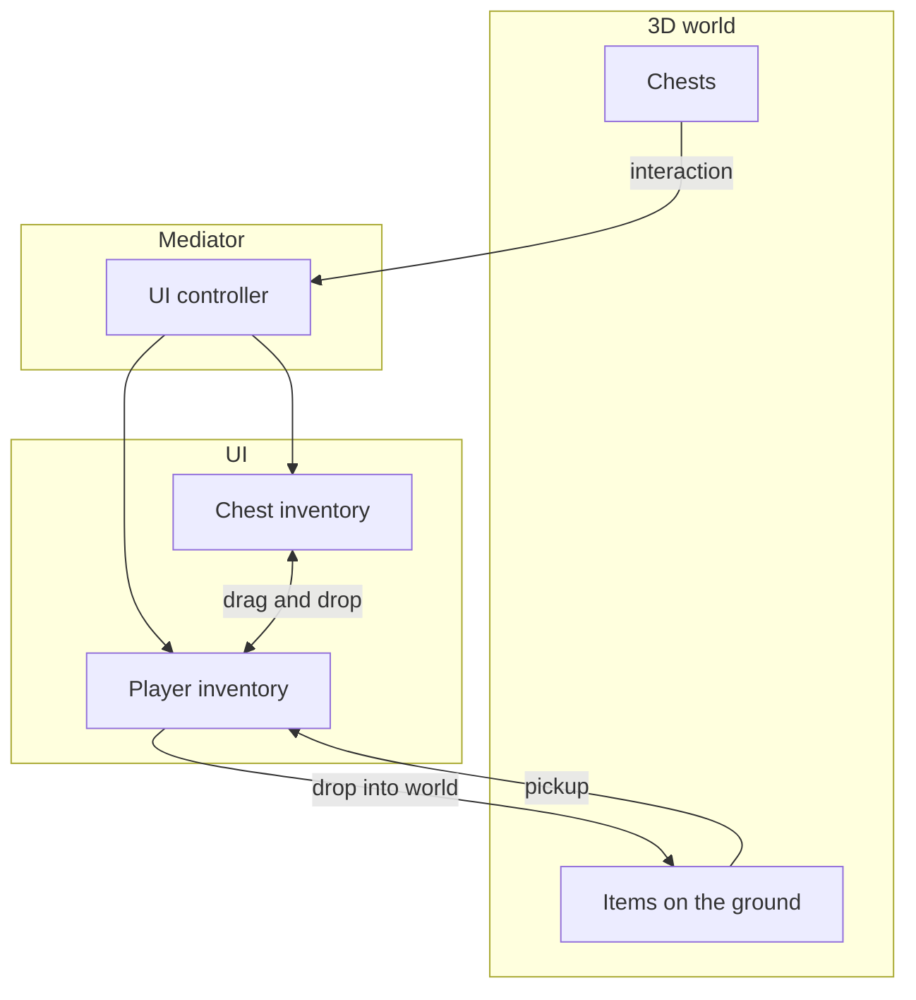
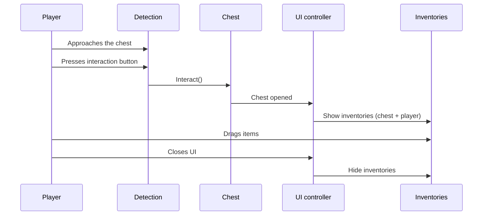
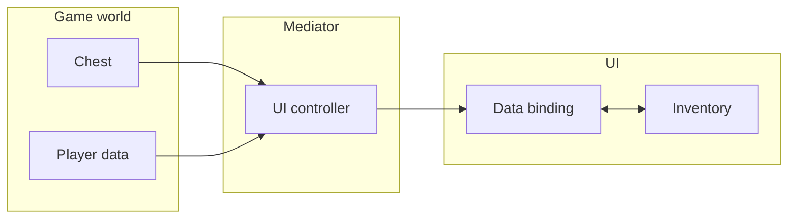
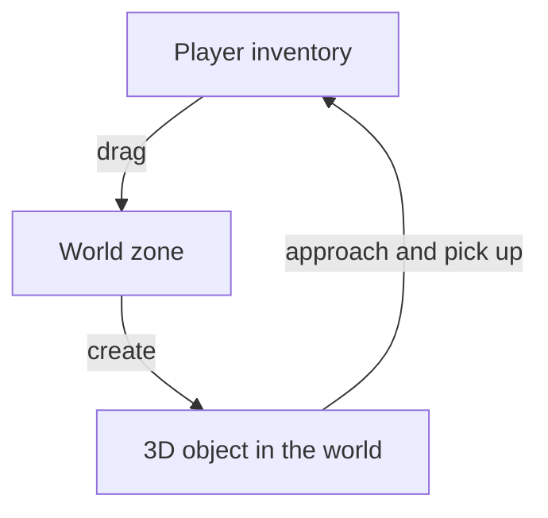

# Loot System (Demo 3)

A full-featured loot system: chests in a 3D world, player interaction, picking up and dropping items.

---

## Overview

---

## Chest Interaction

Sequence of actions:

1. The player approaches a chest --- the detection system identifies the nearest interactive object.
2. On pressing the interaction button, the chest toggles its state (open/closed).
3. The UI controller (mediator) reacts to the open event and shows the inventory panel.
4. The player drags items between inventories using standard drag & drop.
5. On closing (button or leaving the zone), the UI is hidden and control returns to the player.

---

## Architecture: Separation of Concerns

- **Game world** manages chest contents and player data. Knows nothing about the UI.
- **Mediator** (UI controller) --- the only component aware of both layers. Opens and closes the UI, connects data to bindings.
- **UI** works only with `UniversalInventory` and data bindings. Knows nothing about game logic.

This separation allows changing the UI or game logic independently of each other.

---

## Dropping Items into the World

Process:

1. The player drags an item from the inventory onto the world zone (WorldDropZone).
2. The system checks whether the item has a 3D representation (whether it implements IWorld3DAdapter).
3. If it does --- the item is removed from the inventory and appears as a 3D object in the world.
4. This object can be picked back up by approaching it and pressing the interaction button.

---

## Comparison with Other Demos

| Aspect | Demo 1 (Basic) | Demo 2 (Trading) | Demo 3 (Loot) |
|--------|----------------|-------------------|---------------|
| Data source | Simple list | Economy + adapters | World objects |
| Transfer type | Direct drag and drop | Buy/sell with gold | Loot + pickup |
| When UI is shown | Always visible | Always visible | Opens on event |
| 3D integration | No | No | Yes |

---

## Files

| File | Role |
|------|------|
| `Chest.cs` | Chest --- stores items, fires open/close events |
| `IInteractable.cs` | Interface for interactive objects |
| `ItemController.cs` | 3D item controller on the ground (pickup) |
| `PlayerController.cs` | Player control (movement, input locking) |
| `PlayerInteraction.cs` | Interactive object detection (raycast) |
| `PlayerInventoryData.cs` | Player inventory data (game layer) |
| `LootUIController.cs` | Mediator between the world and UI |
| `ChestInventoryDataBinding.cs` | Chest data binding to UI |
| `PlayerInventoryDataBinding.cs` | Player data binding to UI (preserves slot positions) |
| `ItemExampleWith3DSO.cs` | ScriptableObject item with a reference to a 3D prefab |
| `ItemSOWith3DAdapter.cs` | Adapter linking the item to IWorld3DAdapter |
