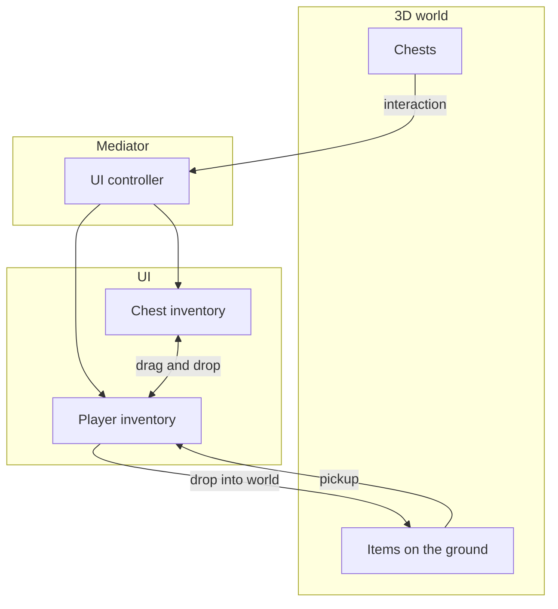
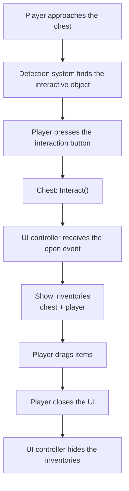
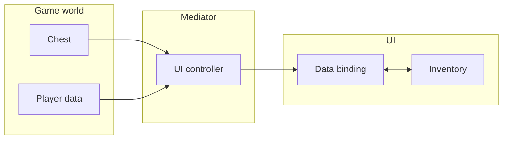
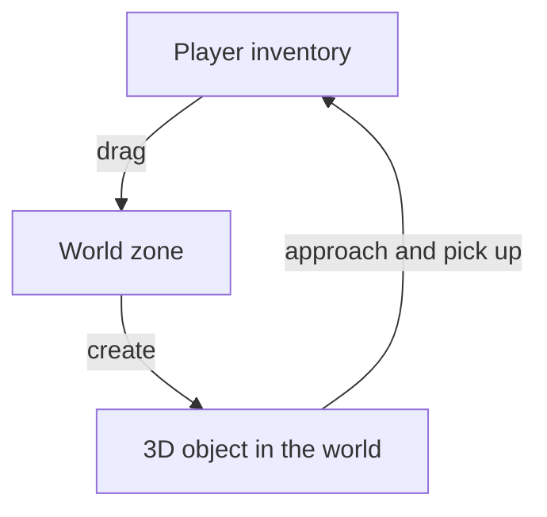

# Loot and 3D World

Un sistema de loot completo: cofres en un mundo 3D, interacción del jugador, recoger y soltar items.

Ubicación en el proyecto real:
- `Examples/Demo2 Loot/*`

Este ejemplo no trata principalmente de un tipo especial de inventario. Trata de integrar el inventory pipeline con el mundo del juego, la UI y los objetos 3D.

---

## Visión general

---

## Interacción con cofres

Secuencia de acciones:

1. El jugador se acerca a un cofre: el sistema de detección identifica el objeto interactivo más cercano.
2. Al pulsar el botón de interacción, el cofre cambia de estado (abierto/cerrado).
3. El UI controller (mediador) reacciona al evento de apertura y muestra el panel del inventario.
4. El jugador arrastra items entre inventarios usando drag & drop estándar.
5. Al cerrar (botón o salir de la zona), la UI se oculta y el control vuelve al jugador.

---

## Arquitectura: separación de responsabilidades

- **Game world** gestiona el contenido del cofre y los datos del jugador. No sabe nada de la UI.
- **Mediator** (UI controller) es el único componente que conoce ambas capas. Abre y cierra la UI, y conecta los datos con los bindings.
- **UI** trabaja solo con `UniversalInventory` y data bindings. No sabe nada de la lógica del juego.

Esta separación permite cambiar la UI o la lógica del juego de forma independiente.

---

## Cómo está estructurado el ejemplo

Hay cuatro zonas de responsabilidad separadas en este escenario:

1. **World**: cofres, items 3D, objetos interactivos
2. **Mediator**: el UI controller que conecta mundo y UI
3. **UI and inventories**: `UniversalInventory`, drag/drop, world drop zone
4. **Bindings and data**: contenido del cofre y contenido del jugador

Esto importa porque:
- el cofre no debería conocer componentes concretos de UI
- la UI no debería saber nada de raycasts, apertura de cofres o lógica de interacción del jugador
- la lógica de pickup/drop del mundo debería conectarse mediante adapters y boundary components

---

## Soltar items al mundo

Proceso:

1. El jugador arrastra un item del inventario a la zona del mundo (`WorldDropZone`).
2. El sistema comprueba si el adapter del item es aceptado por `WorldDropZone` y si tiene `WorldPrefab`.
3. Si es así, el item se elimina del inventario y aparece como objeto 3D en el mundo.
4. Ese objeto puede volver a recogerse al acercarse y pulsar el botón de interacción.

A nivel de código esto suele ser:
- la UI envía un `ItemStack` a `WorldDropZone`
- `WorldDropZone` comprueba `ItemAdapterSoWith3DAdapter` y su `WorldPrefab`
- si tiene éxito, se crea un objeto del mundo y se reduce el source stack
- al recogerlo, el objeto del mundo vuelve a añadir el item a los datos/UI del inventario

---

## Comparación con otros ejemplos

| Aspecto | Configuración básica | Trading | Loot and 3D world |
|--------|----------------|-------------------|---------------|
| Fuente de datos | Lista simple | Economía + adapters | Objetos del mundo |
| Tipo de transferencia | Drag and drop directo | Comprar/vender con oro | Loot + pickup |
| Cuándo se muestra la UI | Siempre visible | Siempre visible | Se abre por evento |
| Integración 3D | No | No | Sí |

---

## Archivos

| Archivo | Rol |
|------|------|
| `Chest.cs` | Chest: almacena items y lanza eventos de open/close |
| `IInteractable.cs` | Interface para objetos interactivos |
| `ItemController.cs` | Controlador del item 3D en el suelo (pickup) |
| `PlayerController.cs` | Control del jugador (movimiento, bloqueo de input) |
| `PlayerInteraction.cs` | Detección de objetos interactivos (raycast) |
| `PlayerInventoryData.cs` | Datos del inventario del jugador (capa de juego) |
| `LootUIController.cs` | Mediador entre mundo y UI |
| `ChestInventoryDataBinding.cs` | Binding de datos del cofre hacia la UI |
| `PlayerInventoryDataBinding.cs` | Binding de datos del jugador hacia la UI (preserva posición de slots) |
| `ItemExampleWith3DSO.cs` | ScriptableObject item con referencia a prefab 3D |
| `ItemAdapterSoWith3DAdapter.cs` | Adapter que enlaza el item con un prefab 3D |

---

## Cómo leer este ejemplo

Si solo quieres una parte del escenario:

- para una UI de cofre orientada a eventos: inspecciona `LootUIController` y los bindings
- para soltar items del inventario al mundo: inspecciona `WorldDropZone` y `ItemAdapterSoWith3DAdapter`
- para recoger items del suelo: inspecciona `ItemController`, `PlayerInteraction` y la sync de datos del jugador

---

## Dónde continuar

- [World 3D](../systems/world-3d.md) — para una mirada centrada en la integración con el mundo
- [Transfer Pipeline](../architecture/transfer-pipeline.md) — para ver cómo world drop encaja en el flujo normal de transferencia
- [Examples Overview](index.md) — para comparar otros escenarios

