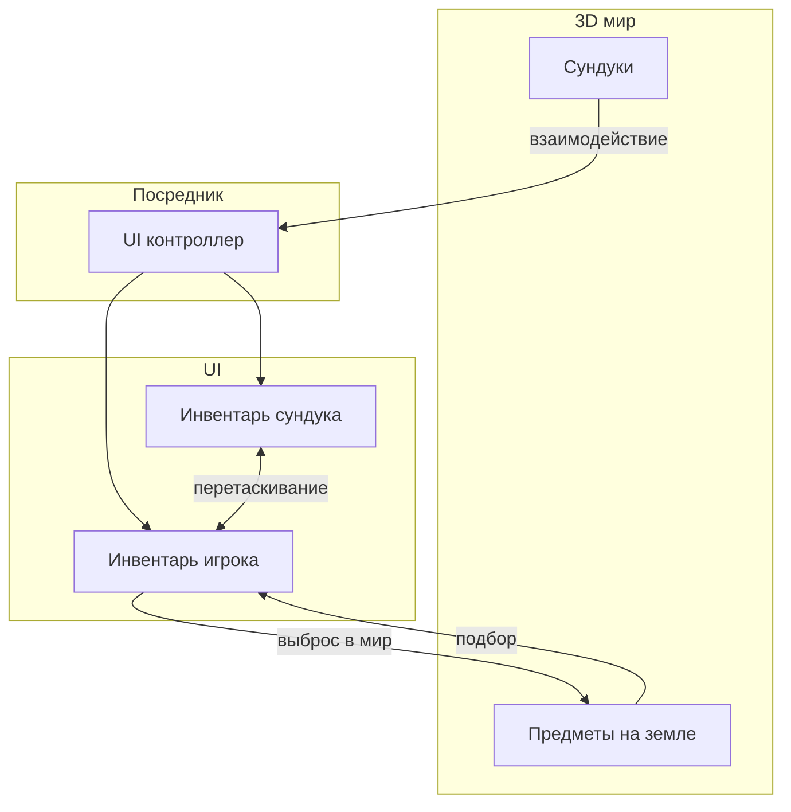
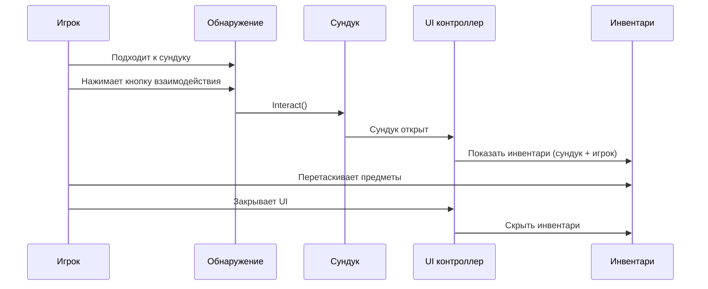
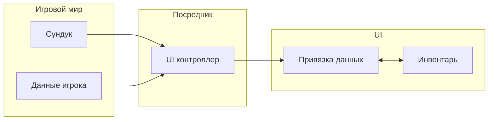
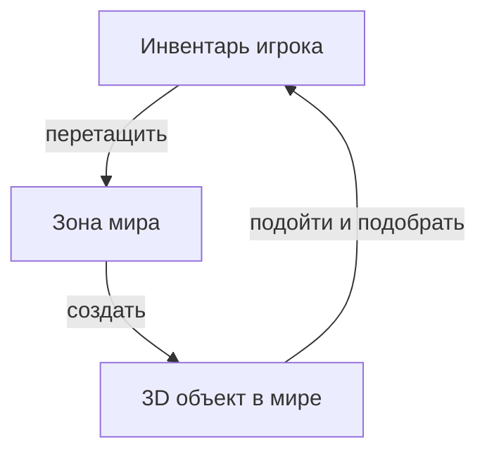

# Система лута (Demo 3)

Полноценная система лута: сундуки в 3D-мире, взаимодействие игрока, подбор и выброс предметов.

---

## Общая схема

---

## Взаимодействие с сундуком

Последовательность действий:

1. Игрок подходит к сундуку --- система обнаружения определяет ближайший интерактивный объект.
2. По нажатию кнопки взаимодействия сундук переключает состояние (открыт/закрыт).
3. UI контроллер (посредник) реагирует на событие открытия и показывает панель инвентарей.
4. Игрок перетаскивает предметы между инвентарями обычным drag & drop.
5. При закрытии (кнопка или выход из зоны) UI скрывается, управление возвращается игроку.

---

## Архитектура: разделение ответственности

- **Игровой мир** управляет содержимым сундуков и данными игрока. Ничего не знает о UI.
- **Посредник** (UI контроллер) --- единственный компонент, который знает об обоих слоях. Открывает и закрывает UI, связывает данные с привязками.
- **UI** работает только с `UniversalInventory` и привязками данных. Ничего не знает об игровой логике.

Такое разделение позволяет менять UI или игровую логику независимо друг от друга.

---

## Сброс предметов в мир

Процесс:

1. Игрок перетаскивает предмет из инвентаря на зону мира (WorldDropZone).
2. Система проверяет, есть ли у предмета 3D-представление (реализует ли он IWorld3DAdapter).
3. Если есть --- предмет удаляется из инвентаря и появляется как 3D-объект в мире.
4. Этот объект можно подобрать обратно, подойдя к нему и нажав кнопку взаимодействия.

---

## Сравнение с другими демо

| Аспект | Demo 1 (Базовый) | Demo 2 (Торговля) | Demo 3 (Лут) |
|--------|-------------------|-------------------|---------------|
| Источник данных | Простой список | Экономика + адаптеры | Объекты мира |
| Тип переноса | Прямое перетаскивание | Покупка/продажа с золотом | Лут + подбор |
| Когда показывается UI | Всегда виден | Всегда виден | Открывается по событию |
| 3D интеграция | Нет | Нет | Да |

---

## Файлы

| Файл | Роль |
|------|------|
| `Chest.cs` | Сундук --- хранит предметы, вызывает события открытия/закрытия |
| `IInteractable.cs` | Интерфейс интерактивных объектов |
| `ItemController.cs` | Контроллер 3D-предмета на земле (подбор) |
| `PlayerController.cs` | Управление игроком (движение, блокировка ввода) |
| `PlayerInteraction.cs` | Обнаружение интерактивных объектов (raycast) |
| `PlayerInventoryData.cs` | Данные инвентаря игрока (игровой слой) |
| `LootUIController.cs` | Посредник между миром и UI |
| `ChestInventoryDataBinding.cs` | Привязка данных сундука к UI |
| `PlayerInventoryDataBinding.cs` | Привязка данных игрока к UI (сохраняет позиции в слотах) |
| `ItemExampleWith3DSO.cs` | ScriptableObject предмета с ссылкой на 3D-префаб |
| `ItemSOWith3DAdapter.cs` | Адаптер, связывающий предмет с IWorld3DAdapter |
