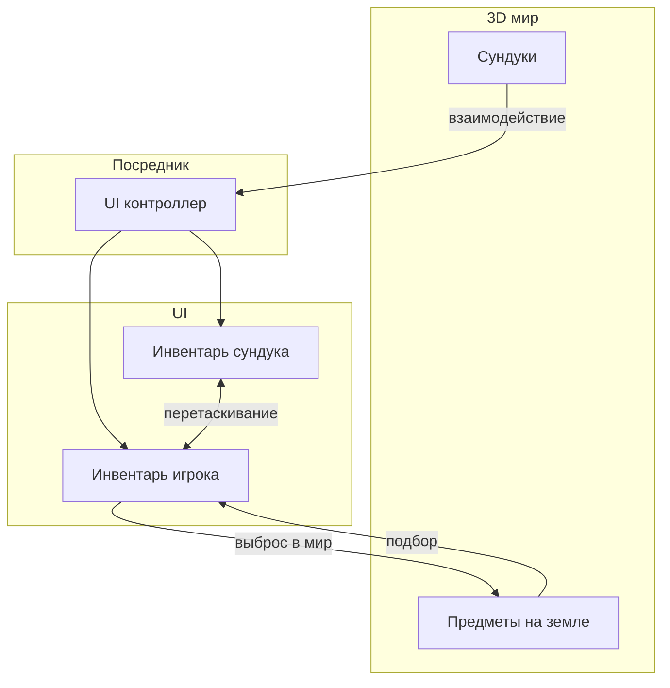
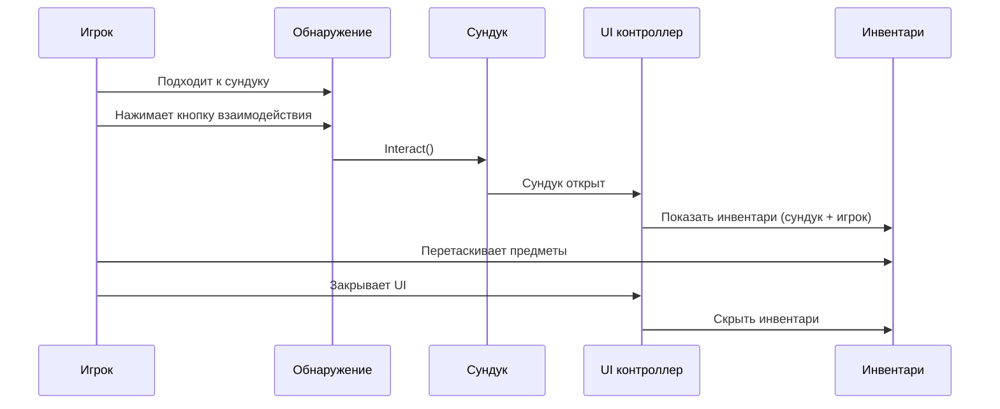
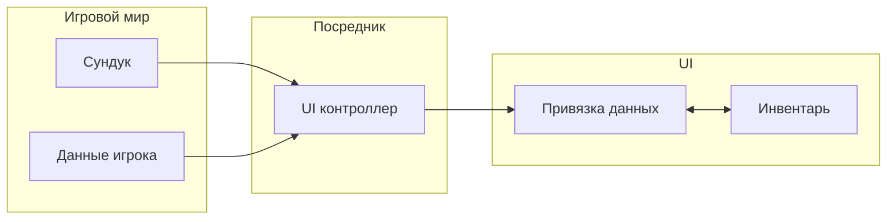
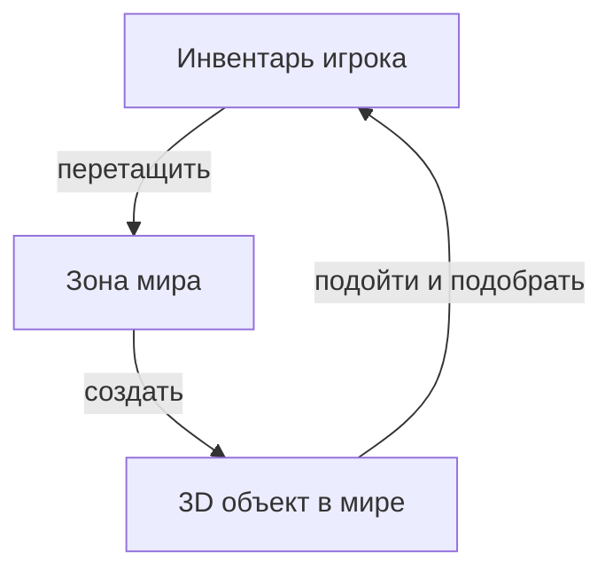

# Система лута и 3D-мир

Полноценная система лута: сундуки в 3D-мире, взаимодействие игрока, подбор и выброс предметов.

Реальная кодовая база примера находится в:
- `Examples/Demo2 Loot/*`

Это пример не про "особый тип инвентаря", а про интеграцию между игровым миром, UI и inventory pipeline.

---

## Общая схема

---

## Взаимодействие с сундуком

Последовательность действий:

1. Игрок подходит к сундуку --- система обнаружения определяет ближайший интерактивный объект.
2. По нажатию кнопки взаимодействия сундук переключает состояние (открыт/закрыт).
3. UI контроллер (посредник) реагирует на событие открытия и показывает панель инвентарей.
4. Игрок перетаскивает предметы между инвентарями обычным drag & drop.
5. При закрытии (кнопка или выход из зоны) UI скрывается, управление возвращается игроку.

---

## Архитектура: разделение ответственности

- **Игровой мир** управляет содержимым сундуков и данными игрока. Ничего не знает о UI.
- **Посредник** (UI контроллер) --- единственный компонент, который знает об обоих слоях. Открывает и закрывает UI, связывает данные с привязками.
- **UI** работает только с `UniversalInventory` и привязками данных. Ничего не знает об игровой логике.

Такое разделение позволяет менять UI или игровую логику независимо друг от друга.

---

## Как пример устроен

В этом сценарии есть четыре отдельных зоны ответственности:

1. **Мир**: сундуки, 3D-предметы, интерактивные объекты
2. **Посредник**: UI-контроллер, который связывает мир и UI
3. **UI и inventories**: `UniversalInventory`, drag/drop, world drop zone
4. **Bindings и данные**: содержимое сундука и игрока

Это важно, потому что:
- сундук не должен знать о конкретных UI-компонентах
- UI не должен знать о raycast, открытии сундука и логике игрока
- picker/drop logic мира должна подключаться через адаптеры и boundary-компоненты

---

## Сброс предметов в мир

Процесс:

1. Игрок перетаскивает предмет из инвентаря на зону мира (WorldDropZone).
2. Система проверяет, есть ли у предмета 3D-представление (реализует ли он IWorld3DAdapter).
3. Если есть --- предмет удаляется из инвентаря и появляется как 3D-объект в мире.
4. Этот объект можно подобрать обратно, подойдя к нему и нажав кнопку взаимодействия.

На уровне кода это обычно выглядит так:
- UI отдаёт `ItemStack` в `WorldDropZone`
- `WorldDropZone` проверяет representative adapter на `IWorld3DAdapter`
- при успехе создаётся world object и исходный stack уменьшается
- при pickup world object снова добавляет предмет в inventory data/UI

---

## Сравнение с другими примерами

| Аспект | Базовый setup | Торговля | Лут и 3D-мир |
|--------|-------------------|-------------------|---------------|
| Источник данных | Простой список | Экономика + адаптеры | Объекты мира |
| Тип переноса | Прямое перетаскивание | Покупка/продажа с золотом | Лут + подбор |
| Когда показывается UI | Всегда виден | Всегда виден | Открывается по событию |
| 3D интеграция | Нет | Нет | Да |

---

## Файлы

| Файл | Роль |
|------|------|
| `Chest.cs` | Сундук --- хранит предметы, вызывает события открытия/закрытия |
| `IInteractable.cs` | Интерфейс интерактивных объектов |
| `ItemController.cs` | Контроллер 3D-предмета на земле (подбор) |
| `PlayerController.cs` | Управление игроком (движение, блокировка ввода) |
| `PlayerInteraction.cs` | Обнаружение интерактивных объектов (raycast) |
| `PlayerInventoryData.cs` | Данные инвентаря игрока (игровой слой) |
| `LootUIController.cs` | Посредник между миром и UI |
| `ChestInventoryDataBinding.cs` | Привязка данных сундука к UI |
| `PlayerInventoryDataBinding.cs` | Привязка данных игрока к UI (сохраняет позиции в слотах) |
| `ItemExampleWith3DSO.cs` | ScriptableObject предмета с ссылкой на 3D-префаб |
| `ItemSOWith3DAdapter.cs` | Адаптер, связывающий предмет с IWorld3DAdapter |

---

## Как читать этот пример

Если вы хотите повторить только часть сценария:

- нужны сундуки и открытие UI по событию: смотрите `LootUIController` и binding-и
- нужен выброс предметов в мир: смотрите `WorldDropZone` и `IWorld3DAdapter`
- нужен pickup объектов с земли: смотрите `ItemController`, `PlayerInteraction` и player data sync

---

## Куда идти дальше

- [World 3D](../systems/world-3d.md) — если нужен отдельный разбор world integration
- [Transfer Pipeline](../architecture/transfer-pipeline.md) — если нужно понять, как world drop встраивается в обычный перенос
- [Обзор раздела примеров](index.md) — если хотите выбрать другой сценарий
