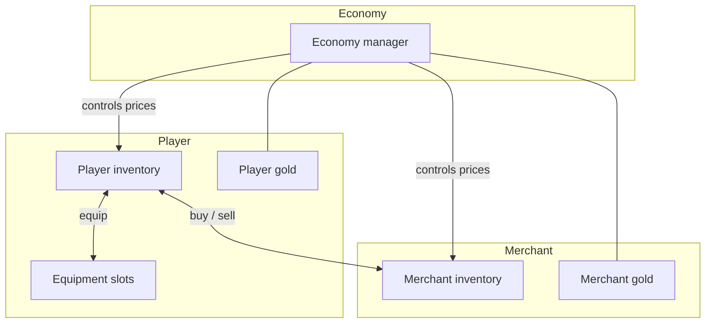
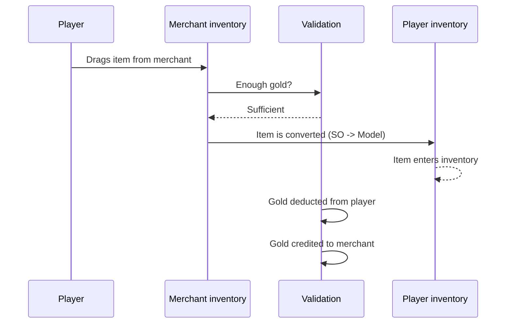
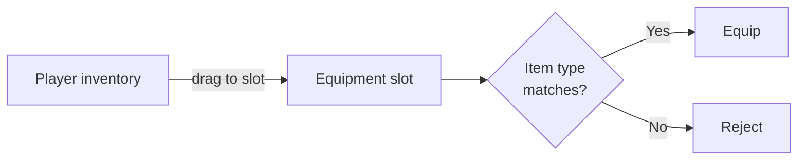
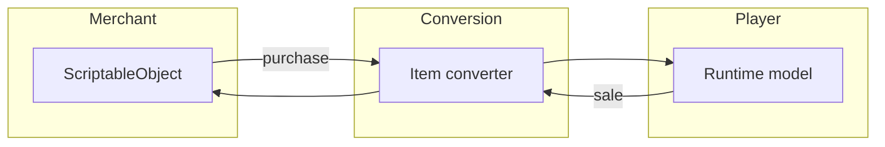

# Trading (Demo 2)

A full-featured buying, selling, and equipping system with two inventory types and economic rules.

---

## Overview

---

## Buying

Validation pipeline:

1. The player drags an item from the merchant's inventory.
2. The system checks whether the player has enough gold for the purchase.
3. The item is automatically converted from the merchant's format (ScriptableObject) to the player's format (runtime model).
4. The item appears in the player's inventory; gold is deducted.

---

## Selling

The reverse process: the player drags an item from their inventory into the merchant's inventory.

- The item is converted back (Model -> SO).
- Gold is credited to the player and deducted from the merchant.
- If the merchant does not have enough gold, the sale is rejected.

---

## Equipping

Each equipment slot accepts only a specific item type:

| Slot | Allowed type |
|------|--------------|
| Weapon | Weapon |
| Armor | Armor |
| Artifact 1 | Artifact |
| Artifact 2 | Artifact |

If the type does not match, the transfer is rejected with an error message.

---

## Item Conversion

The merchant stores items as ScriptableObjects (immutable assets). The player works with runtime models (mutable data). When crossing inventory boundaries, the pipeline automatically converts the item to the required format via the converter.

---

## Restrictions

| Restriction | What happens |
|-------------|--------------|
| Not enough gold | Purchase is rejected with a message |
| Cannot sell equipped items | Item cannot be dragged from the equipment slot |
| Slot checks item type | Only weapons in the weapon slot, armor in the armor slot, etc. |
| Merchant has no money | Sale is rejected |

---

## Files

| File | Role |
|------|------|
| `TradingEconomyManager.cs` | Centralized gold and price management |
| `TradingHelper.cs` | Trade operation validation (enough money? correct type?) |
| `PlayerInventoryDataBinding.cs` | Player inventory synchronization |
| `MerchantInventoryDataBinding.cs` | Merchant goods synchronization |
| `EquipmentInventoryDataBinding.cs` | Equipment slots with type restrictions |
| `TradableItemSO.cs` | ScriptableObject item definition |
| `TradableItemModel.cs` | Runtime item data |
| `TradableSoAdapter.cs` | ScriptableObject adapter for the inventory system |
| `TradableItemModelAdapter.cs` | Runtime model adapter for the inventory system |
| `ModelInventoryItemConverter.cs` | Converter: SO -> Model (on purchase) |
| `MerchantInventoryItemConverter.cs` | Converter: Model -> SO (on sale) |
| `ITradableItem.cs` | Common interface for tradable items |
