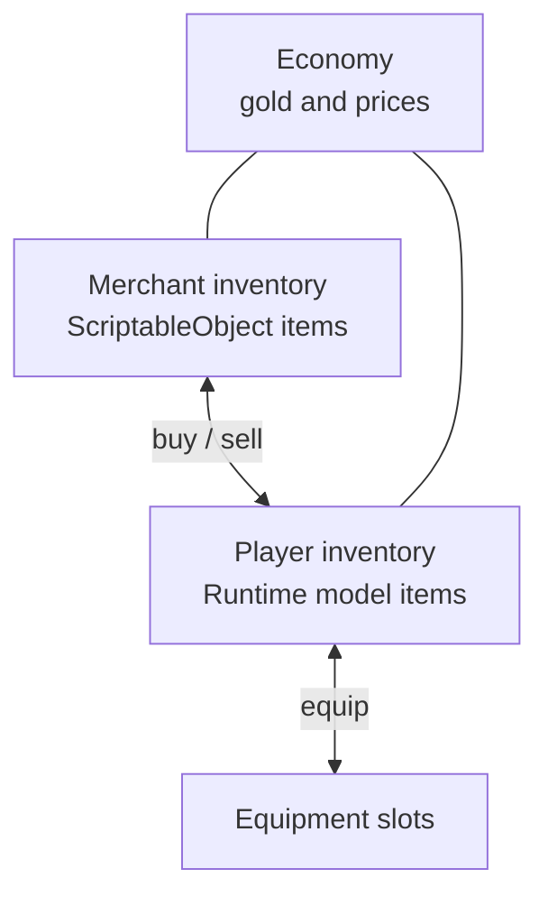
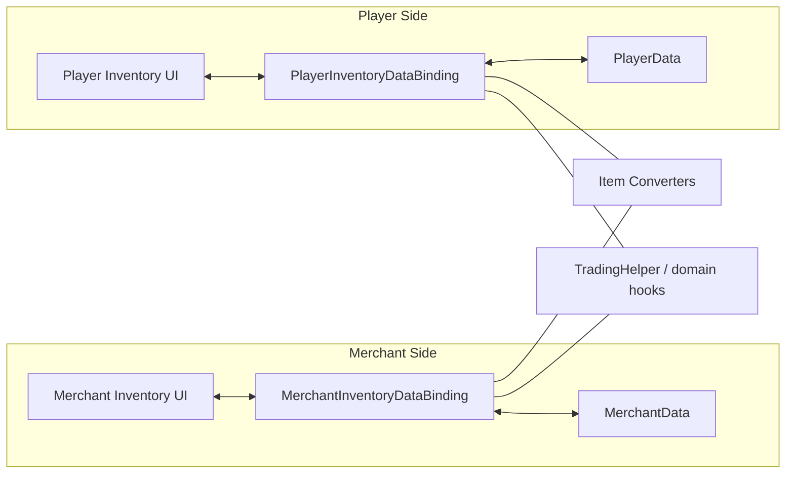
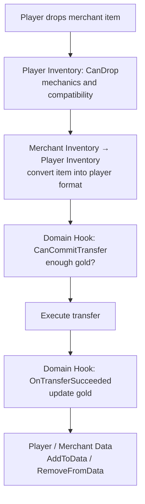

# Trading

This example shows a case where two inventories use different item models and a transfer also changes gold.

Real project location:
- `Examples/Demo4 Trading/*`

This is the main example for cases where:
- source and target use different domain models
- an item is converted while crossing the inventory boundary
- transfer success depends on business rules, not only slot mechanics

---

## What participates in the operation

---

## The important split

There are three separate concerns:

1. inventory and slot mechanics
2. item conversion between two data models
3. business logic for the operation: enough gold, what to do after purchase/sale

These should not be mixed together.

---

## How the example is structured

Responsibility split:
- inventory and strategies handle placement mechanics
- converters handle model transitions
- domain hooks handle gold, prices, and side effects
- bindings synchronize UI with domain data

---

## Purchase flow

---

## Where each piece belongs

| Task | Where it belongs |
|---|---|
| Only valid item type in equipment slot | `canDrop` or `CanDrop` |
| Check available gold | `CanCommitTransfer` |
| Apply gold changes | `OnTransferSucceeded` |
| Convert `SO <-> Model` | `CreateItemConverter()` |
| Sync lists and fields | `AddToData` / `RemoveFromData` |

---

## Conversion note

- merchant side stores a more static item representation
- player side stores a runtime model
- crossing the inventory boundary triggers conversion automatically
- runtime `ItemStack` may contain a list of concrete adapters, but rules/bindings/converters still use the representative adapter via `PrimaryAdapter`

---

## What to inspect in code

| File | Role |
|---|---|
| `TradingHelper.cs` | trading checks and side effects |
| `PlayerInventoryDataBinding.cs` | player sync and player-side domain hooks |
| `MerchantInventoryDataBinding.cs` | merchant sync and merchant-side domain hooks |
| `EquipmentInventoryDataBinding.cs` | fixed-slot equipment |
| `ModelInventoryItemConverter.cs` | converter into player format |
| `MerchantInventoryItemConverter.cs` | converter into merchant format |

---

## Successful purchase flow

1. The player starts a drag from merchant inventory.
2. The planner builds a target-side preview item through the converter.
3. Player-side rules validate mechanical compatibility.
4. A domain hook checks whether there is enough gold to commit.
5. The executor performs the transfer and only then triggers side effects.
6. DataBinding updates the player and merchant data lists.

---

## Where to go next

- [Data Binding](../architecture/data-binding.md) — full lifecycle hooks
- [Equipment](equipment.md) — if you only need fixed slots without trading
- [Examples Overview](index.md) — to compare other scenarios
