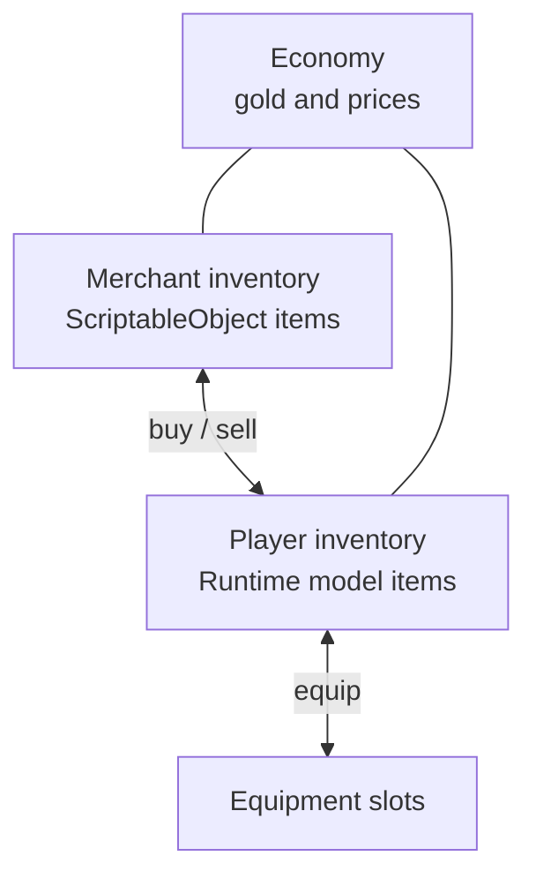
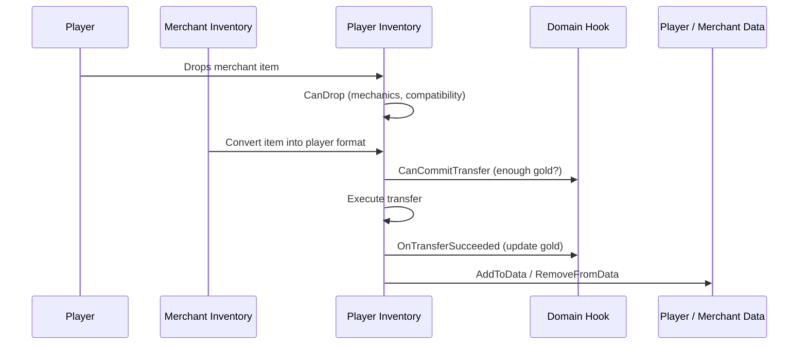

# Trading

This example shows a case where two inventories use different item models and a transfer also changes gold.

---

## What participates in the operation

---

## The important split

There are three separate concerns:

1. inventory and slot mechanics
2. item conversion between two data models
3. business logic for the operation: enough gold, what to do after purchase/sale

These should not be mixed together.

---

## Purchase flow

---

## Where each piece belongs

| Task | Where it belongs |
|---|---|
| Only valid item type in equipment slot | `canAccept` or `CanDrop` |
| Check available gold | `CanCommitTransfer` |
| Apply gold changes | `OnTransferSucceeded` |
| Convert `SO <-> Model` | `CreateItemConverter()` |
| Sync lists and fields | `AddToData` / `RemoveFromData` |
