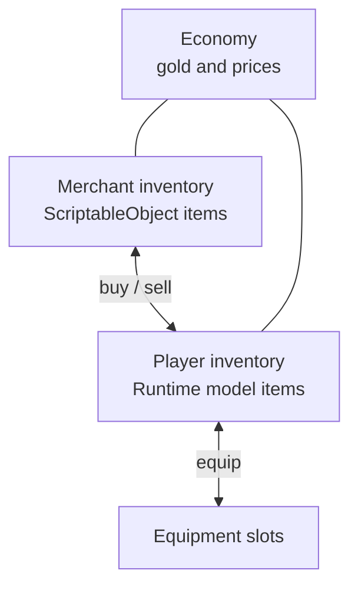
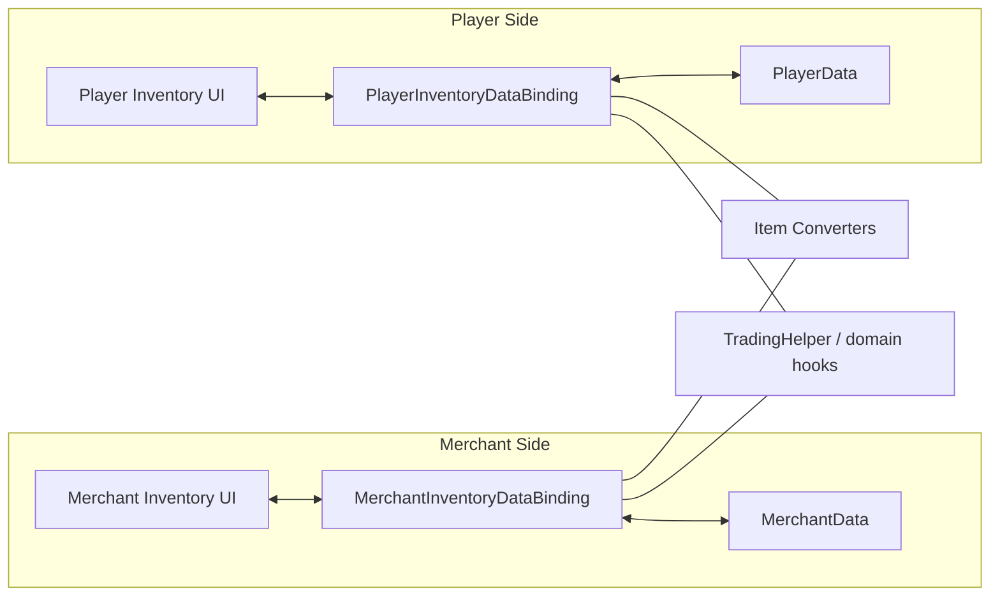
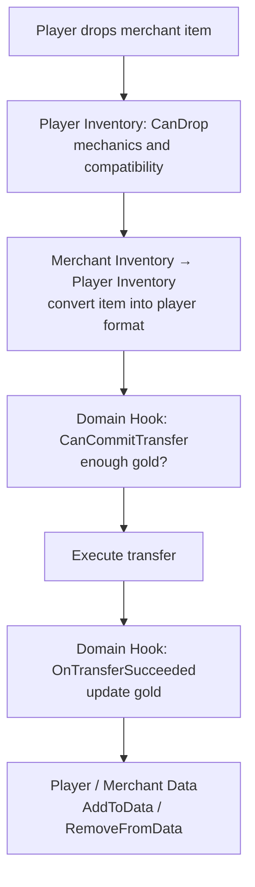

# Trading

Este ejemplo muestra un caso donde dos inventarios usan modelos de item distintos y una transferencia también cambia el oro.

Ubicación real en el proyecto:
- `Examples/Demo4 Trading/*`

Este es el ejemplo principal para casos donde:
- origen y destino usan modelos de dominio distintos
- un item se convierte al cruzar el límite entre inventarios
- el éxito de la transferencia depende de reglas de negocio, no solo de la mecánica del slot

---

## Qué participa en la operación

---

## La separación importante

Hay tres responsabilidades distintas:

1. mecánica de inventario y slots
2. conversión del item entre dos modelos de datos
3. lógica de negocio de la operación: suficiente oro, qué hacer después de comprar/vender

No deben mezclarse.

---

## Cómo está estructurado el ejemplo

Separación de responsabilidades:
- inventario y strategies manejan la mecánica de colocación
- los converters manejan la transición entre modelos
- los domain hooks manejan oro, precios y side effects
- los bindings sincronizan la UI con los datos del dominio

---

## Flujo de compra

---

## Dónde va cada pieza

| Tarea | Dónde corresponde |
|---|---|
| Solo un tipo de item válido en el slot de equipamiento | `canDrop` o `CanDrop` |
| Comprobar oro disponible | `CanCommitTransfer` |
| Aplicar cambios de oro | `OnTransferSucceeded` |
| Convertir `SO <-> Model` | `CreateItemConverter()` |
| Sincronizar listas y campos | `AddToData` / `RemoveFromData` |

---

## Nota sobre la conversión

- el lado del comerciante almacena una representación más estática del item
- el lado del jugador almacena un runtime model
- cruzar el límite entre inventarios dispara la conversión automáticamente
- `ItemStack` en runtime puede contener una lista de adapters concretos, pero rules/bindings/converters siguen usando el adapter representativo a través de `PrimaryAdapter`

---

## Qué inspeccionar en código

| Archivo | Rol |
|---|---|
| `TradingHelper.cs` | comprobaciones de comercio y side effects |
| `PlayerInventoryDataBinding.cs` | sync del jugador y player-side domain hooks |
| `MerchantInventoryDataBinding.cs` | sync del comerciante y merchant-side domain hooks |
| `EquipmentInventoryDataBinding.cs` | equipamiento con slots fijos |
| `ModelInventoryItemConverter.cs` | converter hacia el formato del jugador |
| `MerchantInventoryItemConverter.cs` | converter hacia el formato del comerciante |

---

## Flujo de compra exitosa

1. El jugador empieza un drag desde el inventario del comerciante.
2. El planner construye un target-side preview item a través del converter.
3. Las player-side rules validan la compatibilidad mecánica.
4. Un domain hook comprueba si hay suficiente oro para confirmar.
5. El executor realiza la transferencia y solo entonces dispara los side effects.
6. DataBinding actualiza las listas de datos del jugador y del comerciante.

---

## Dónde continuar

- [Data Binding](../architecture/data-binding.md) — lifecycle hooks completos
- [Equipment](equipment.md) — si solo necesitas slots fijos sin trading
- [Examples Overview](index.md) — para comparar otros escenarios

