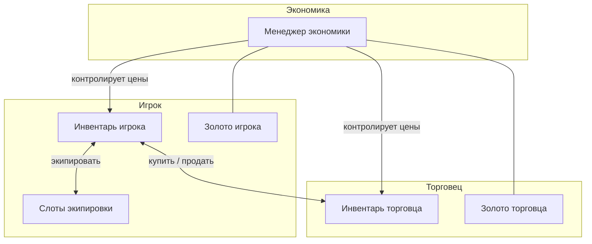
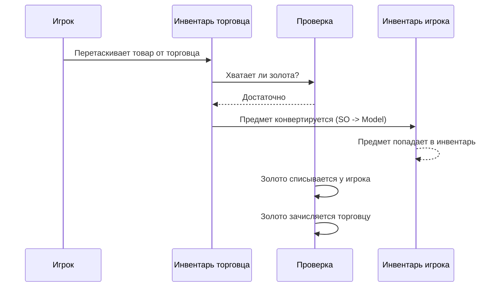
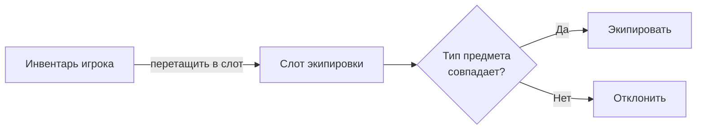
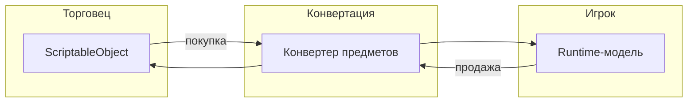

# Торговля (Demo 2)

Полноценная система покупки, продажи и экипировки с двумя типами инвентарей и экономическими правилами.

---

## Общая схема

---

## Покупка

Конвейер проверок:

1. Игрок перетаскивает товар из инвентаря торговца.
2. Система проверяет, хватает ли у игрока золота на покупку.
3. Предмет автоматически конвертируется из формата торговца (ScriptableObject) в формат игрока (runtime-модель).
4. Предмет появляется в инвентаре игрока, золото списывается.

---

## Продажа

Обратный процесс: игрок перетаскивает предмет из своего инвентаря в инвентарь торговца.

- Предмет конвертируется обратно (Model -> SO).
- Золото зачисляется игроку, списывается у торговца.
- Если у торговца недостаточно золота --- продажа отклоняется.

---

## Экипировка

Каждый слот экипировки принимает только определённый тип предмета:

| Слот | Допустимый тип |
|------|----------------|
| Оружие | Weapon |
| Броня | Armor |
| Артефакт 1 | Artifact |
| Артефакт 2 | Artifact |

Если тип не совпадает, перенос отклоняется с сообщением об ошибке.

---

## Конвертация предметов

Торговец хранит предметы как ScriptableObject (неизменяемые ассеты). Игрок работает с runtime-моделями (изменяемые данные). При пересечении границы инвентарей конвейер автоматически преобразует предмет в нужный формат через конвертер.

---

## Ограничения

| Ограничение | Что происходит |
|-------------|----------------|
| Недостаточно золота | Покупка отклоняется с сообщением |
| Нельзя продать экипированное | Предмет не перетаскивается из слота экипировки |
| Слот проверяет тип предмета | Только оружие в слот оружия, броня в слот брони и т.д. |
| У торговца нет денег | Продажа отклоняется |

---

## Файлы

| Файл | Роль |
|------|------|
| `TradingEconomyManager.cs` | Централизованное управление золотом и ценами |
| `TradingHelper.cs` | Валидация торговых операций (хватает ли денег? правильный тип?) |
| `PlayerInventoryDataBinding.cs` | Синхронизация инвентаря игрока |
| `MerchantInventoryDataBinding.cs` | Синхронизация товаров торговца |
| `EquipmentInventoryDataBinding.cs` | Слоты экипировки с ограничениями по типу |
| `TradableItemSO.cs` | ScriptableObject-определение предмета |
| `TradableItemModel.cs` | Runtime-данные предмета |
| `TradableSoAdapter.cs` | Адаптер ScriptableObject для системы инвентаря |
| `TradableItemModelAdapter.cs` | Адаптер runtime-модели для системы инвентаря |
| `ModelInventoryItemConverter.cs` | Конвертер: SO -> Model (при покупке) |
| `MerchantInventoryItemConverter.cs` | Конвертер: Model -> SO (при продаже) |
| `ITradableItem.cs` | Общий интерфейс для торговых предметов |
