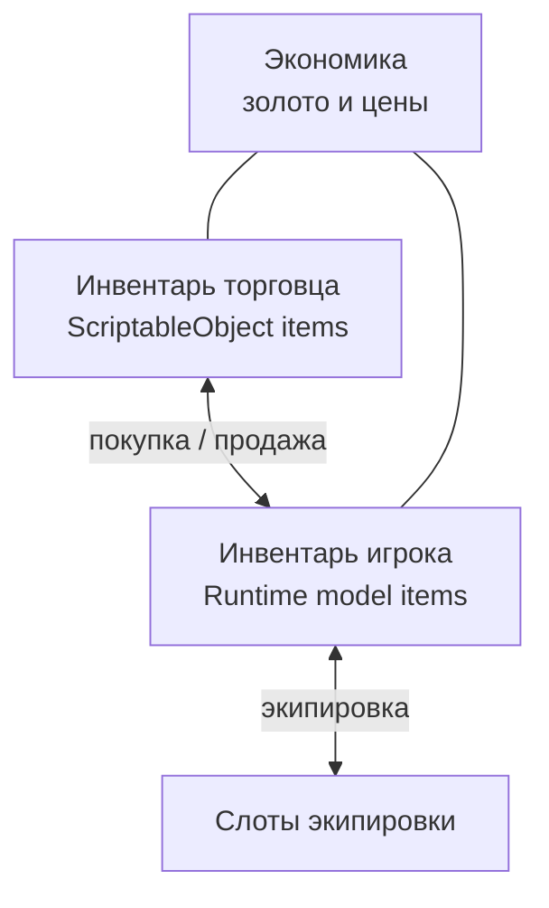
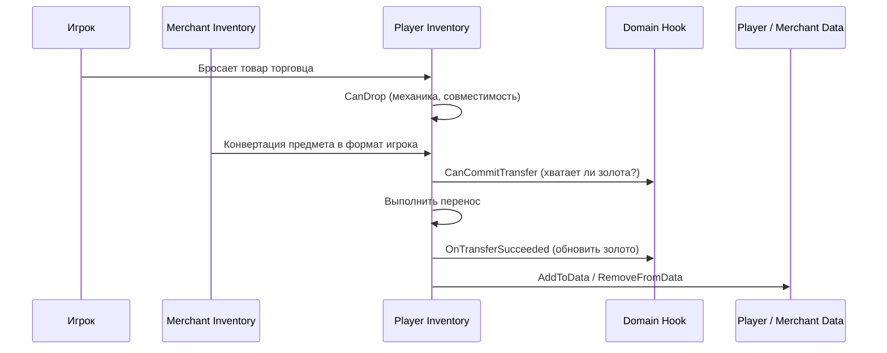
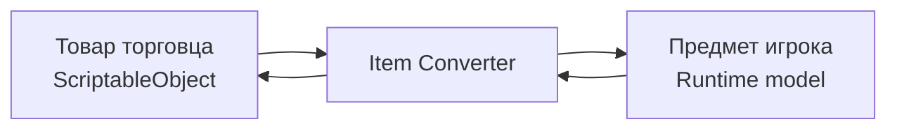

# Торговля

Этот пример показывает сценарий, где два инвентаря используют разные типы данных и одна операция переноса ещё и меняет золото.

---

## Что участвует в операции

---

## Что здесь важно понять

В торговом примере есть три разных слоя логики:

1. механика слота и инвентаря
2. конвертация предмета между двумя моделями данных
3. бизнес-логика операции: хватает ли золота и что делать после покупки/продажи

Их лучше не смешивать.

---

## Покупка: правильная последовательность

---

## Где писать какую логику

| Задача | Где писать |
|---|---|
| Только подходящий тип в слот экипировки | `canAccept` или `CanDrop` |
| Проверка, хватает ли денег | `CanCommitTransfer` |
| Списание и начисление золота | `OnTransferSucceeded` |
| Конвертация `SO <-> Model` | `CreateItemConverter()` |
| Синхронизация списков и полей данных | `AddToData` / `RemoveFromData` |

Это и есть главная идея примера.

---

## Почему это лучше, чем всё делать в CanDrop

Потому что `CanDrop` вызывается как часть preview/planning.

А денежная логика и другие доменные проверки часто должны:

- выполняться один раз перед commit
- видеть целую операцию, а не только hover-preview
- иметь post-success hook после реального успеха

Именно поэтому торговля опирается на `CanCommitTransfer` и `OnTransferSucceeded`.

---

## Конвертация предметов

- торговец хранит более статичное представление предметов
- игрок хранит runtime-модель
- при переносе через границу инвентаря предмет конвертируется автоматически

---

## Ограничения примера

| Ограничение | Где выражается |
|---|---|
| Недостаточно золота у игрока | `CanCommitTransfer` |
| Недостаточно золота у торговца | `CanCommitTransfer` |
| Нельзя положить броню в слот оружия | `canAccept` / `CanDrop` |
| Нельзя продать неподходящий предмет торговцу | target-side mechanical validation |

---

## Что смотреть в коде

| Файл | Роль |
|---|---|
| `TradingHelper.cs` | торговые проверки и side effects |
| `PlayerInventoryDataBinding.cs` | sync игрока и player-side domain hooks |
| `MerchantInventoryDataBinding.cs` | sync торговца и merchant-side domain hooks |
| `EquipmentInventoryDataBinding.cs` | fixed-slot экипировка |
| `ModelInventoryItemConverter.cs` | converter в формат игрока |
| `MerchantInventoryItemConverter.cs` | converter в формат торговца |

---

## Куда идти дальше

- [Привязка данных](../architecture/data-binding.md) — полный lifecycle hooks
- [Экипировка](equipment.md) — если нужны только fixed slots без торговли
