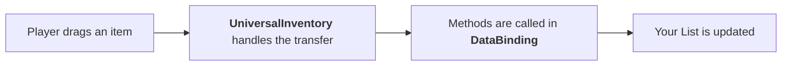

# Quick Start

This walkthrough creates two regular inventories that support drag & drop between each other.

This is already implemented in the first example, and you can see the final result there.

Even in the basic scenario, you usually need to write a small amount of integration code for your own data. In this guide that will be:

- `ItemSO` as your item data
- `ItemSOAdapter` as the representation for the inventory system
- `SimpleBinding` as the bridge between the UI and your data list

## Requirements

- Required package: `Unity.ugui`
- Optional package: `com.unity.inputsystem`

This quick start does **not** require the new Input System. Basic pointer-driven drag and drop works without it.
If you want `InputAction` bindings or `InputActionSelectionTrigger`, install `com.unity.inputsystem`.
Mixed setups are also valid: a project may include the new Input System while this particular scene still uses `StandaloneInputModule`.
In that case, `InputAction`-driven features may not work as expected unless that scene/workflow is configured around the new input pipeline.

## Step 1. Prepare the scene

1. Create a `Canvas` where the inventories will be placed, if you do not have one yet.
2. Add `DragAndDropManager` to the scene. You can drag the prefab from `Prefabs/DragCanvas.prefab` into the scene.
> The scene needs one `DragAndDropManager`. It manages all transfer operations and controls the dragged object.
3. Make sure there is an `EventSystem` in the scene.
   If you are using legacy input, the `EventSystem` should use `StandaloneInputModule`.


---

## Step 2. Create two inventories

1. Create an object named `Backpack` inside the `Canvas`.
2. Add `UniversalInventory` to it.
3. Set:

    | Field | Value |
    |---|---|
    | `Inventory Strategy` | `UniqueItemStrategy` for the simplest start, so each item is in a separate slot |
    | `Slot Management` | `FixedSlotManagementSettings` for a fixed number of slots |
    | `Initial Slot Count` | for example `10`. They will be created in `Slot Container` on startup. If you have already created them manually there, you can cache them by pressing the button |
    | `Slot Prefab` | `Prefabs/Slot.prefab` |
    | `Slot Container` | parent for the slots, preferably with `GridLayout` or another component that controls child layout |

4. Duplicate the object and create a second inventory, for example `Chest`.

---

## Step 3. Define an item type
Suppose you have an item type like this:
```csharp
[CreateAssetMenu(menuName = "Game/Item")]
public class ItemSO : ScriptableObject
{
    [field: SerializeField] public string ItemName { get; private set; }
    [field: SerializeField] public Sprite Icon { get; private set; }
}
```
To display such a type in slots, you need to create an adapter for it that implements `IItemAdapter`, for example:

```csharp
using UDND.Core;
using UnityEngine;

public class ItemSOAdapter : IItemAdapter
{
    // Reference to the data for your type
    public readonly ItemSO Data;

    // Constructor
    public ItemSOAdapter(ItemSO data) => Data = data;

    // Required fields from the interface
    public string ItemId => Data.GetInstanceID().ToString();
    public Sprite Icon => Data.Icon;
    public string DisplayName => Data.ItemName;
}
```

Meaning of the required fields:

- `ItemId` is needed to determine whether items can be merged into one slot for `Stackable` and `SeparableStacks` modes.
- `Icon` is needed to display the item image in the slot.
- `DisplayName` is used in some additional systems. It can be an empty string.

---

## Step 4. Add a simple binding

```csharp
using UDND.Core;
using UDND.DataBinding;
using System.Collections.Generic;
using UnityEngine;

public class SimpleBinding : ListInventoryDataBinding<ItemSO, ItemSOAdapter>
{
    // Your data list
    [SerializeField] private List<ItemSO> _items;

    // Required functions to override
    protected override IReadOnlyList<ItemSO> GetItems() => _items;
    protected override ItemSOAdapter CreateAdapter(ItemSO item) => new(item);
    protected override void AddToData(ItemSOAdapter adapter) => _items.Add(adapter.Data);
    protected override void RemoveFromData(ItemSOAdapter adapter) => _items.Remove(adapter.Data);
}
```

Meaning of the required methods:

- `GetItems` is used for the initial data render.
- `CreateAdapter` is needed to create the adapter and pass it the required parameters from your data.
- `AddToData` is called when an item is transferred **into this** inventory.
- `RemoveFromData` is called when an item is transferred **out of this** inventory.

Attach this binding to both inventories or to other objects in the scene.
Assign references to the corresponding inventories.
Each one will have its own `_items` list.

!!! info Data
    In your projects, instead of a simple `_items` list, you will most likely interact with your own scripts that store your data. You can see how this is implemented in the examples.

---

## Step 5. Fill starting data

1. Create a few `ItemSO` assets.
2. Add them to the `_items` lists in your `SimpleBinding` components.
3. Run the scene.

If everything is configured correctly:

- both inventories show items
- items can be dragged between them
- your backing list updates automatically

---

## What happens behind the scenes



## Common first-project mistakes

- `ItemId` does not match your stacking semantics, so items merge or fail to merge unexpectedly
- there is no `DragAndDropManager` in the scene, or there are multiple managers
- there is no `EventSystem` in the scene
- the scene uses legacy input but `EventSystem` has no `StandaloneInputModule`
- the binding points to the wrong `UniversalInventory`
- `InventoryDataBinding` has no assigned inventory reference
- data changes outside the pipeline, but `ReloadUI()` is never called. Add a ReloadUI call to your DataBinding on data change event.

## What Next

- [Examples](../examples/index.md) — if you want to choose from all 5 demos
- [Data Binding](../architecture/data-binding.md) — if you need to understand the lifecycle and extension points
- [Placement Strategies](../architecture/strategies.md) — if you want to add your own strategy or slot management mode
- [Troubleshooting](../reference/troubleshooting.md) — if the basic scene does not work on the first try
