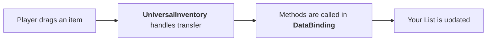

# Quick Start

This guide creates two regular inventories that support dragging items between each other.

The same setup is already implemented in the first example, where you can see the final
result.

Even in a basic scenario, you usually need a little integration code for your own data.
In this guide that means:

- `ItemSO` as your item data
- `ItemSOAdapter` as the representation for the inventory system
- `SimpleBinding` as the bridge between UI and your data list

## Step 1. Prepare The Scene

Inventories are plain uGUI, so they live on a UI canvas.

1. **Create a `Canvas` for the inventories** if the scene does not have one yet.

    In the `Hierarchy` window, right-click empty space and choose `UI → Canvas`.

    Unity creates an `EventSystem` object along with the `Canvas`.
    For a quick start, leave the `Canvas` at `Render Mode` = `Screen Space - Overlay`.

2. **Add `DragAndDropManager` to the scene.**

    Find `Prefabs/DragCanvas.prefab` in the `Project` window and drag it into empty space in
    the `Hierarchy` — it should become a root object of the scene, next to your `Canvas`.

    `DragCanvas` has its own `Canvas` with `Sorting Order = 100`, which is what keeps the
    dragged item rendered above the rest of the interface.
    Besides `DragAndDropManager`, the prefab carries `InputEventRouter` and
    `DragVisualPresenter`. The scene needs exactly one such object: it manages all transfer
    operations and owns the visual of the item "in hand".

3. **Check the `EventSystem`.**

    If the `Hierarchy` has none, right-click empty space and choose `UI → Event System`.

    Select `EventSystem` and check in the `Inspector` which input module it carries:

    - legacy input project — it needs `StandaloneInputModule`;
    - New Input System project — it needs `InputSystemUIInputModule`.

    The asset supports both. `DragAndDropManager` has a minimal working action config by
    default. You can edit it or create your own copy, then assign it in the scene.

---

## Step 2. Create Two Inventories

1. In the `Hierarchy`, right-click the `Canvas` object and choose `Create Empty`.
   Name the new object `Backpack`.

    Because the parent is a `Canvas`, Unity gives the object a `RectTransform`.
    If you want a background right away, choose `UI → Panel` instead of `Create Empty`.

2. Give `Backpack` a size and a position.

    A UI object has a `RectTransform` instead of a `Transform`, and after `Create Empty` its
    `Width` and `Height` are zero. Size is set here, not through scale:

    - select `Backpack` and in the `Inspector`, in the `RectTransform` component, set
      `Width` = `540`, `Height` = `240`;
    - position is easiest to set with the anchor presets button — the square with a cross in
      the top-left corner of `RectTransform`. Press it and pick `middle center` for a quick
      start, then move the object with the `Pos X` and `Pos Y` fields.

    If you used `UI → Panel`, it already stretches to the full screen — just set the
    `Width` and `Height` you want the same way.

3. Right-click `Backpack`, choose `Create Empty` and name the object `SlotContainer`.

    Stretch it over the whole `Backpack`: press the anchor presets button and, holding
    `Alt` and `Shift`, pick the bottom-right `stretch / stretch` option.

    Then press `Add Component → Layout → Grid Layout Group` and fill in its fields:

    | `Grid Layout Group` field | Value |
    |---|---|
    | `Cell Size` | `100` × `100` — the slot size from `Prefabs/Slot.prefab` |
    | `Spacing` | `5` on X and Y |
    | `Constraint` | `Fixed Column Count` |
    | `Constraint Count` | `5`, so 10 slots form a 5 × 2 grid |

    This component is what arranges the slots into a grid.

4. Add the `UniversalInventory` component to `Backpack` and fill in the fields.

    In the Inspector they are split into collapsible groups:

    **`Slot Setup` group:**

    | Field | Value |
    |---|---|
    | `Slot Container` | The `SlotContainer` object from step 3 — the parent the slots are created under |
    | `Slot Prefab` | Slot prefab you want to use; `Prefabs/Slot.prefab` works for a start |
    | `Initial Slot Count` | For example `10`. That many slots are created in `Slot Container` on startup. If you created them yourself, cache them with the `Cache Slots` button |

    **`Strategy` group** — two unlabeled fields, each picked from a dropdown:

    | What to pick | Value |
    |---|---|
    | top dropdown (inventory strategy) | `UniqueItemStrategy` for the simplest start, so each item occupies its own slot |
    | bottom dropdown (slot management) | `FixedSlotManagementSettings` for a fixed number of slots |

    The remaining groups (`Rules`, `Drop Policy`, `Placement`) can stay untouched for a quick start.

5. Duplicate `Backpack` and create a second inventory, for example `Chest`.
   Move them apart with the `Pos X` field so both are visible at the same time.

!!! info Initialization
    On startup, the inventory tries to find already created slots under `Slot Container`
    and cache them. If there are not enough slots, it creates slots from `Slot Prefab`
    up to `Initial Slot Count`. You can also create all slots manually in edit mode and
    cache them with `Cache Slots`, so this operation does not happen during play.

---

## Step 3. Define An Item Type

Suppose you have an item type:

```csharp
[CreateAssetMenu(menuName = "Game/Item")]
public class ItemSO : ScriptableObject
{
    [field: SerializeField] public string ItemName { get; private set; }
    [field: SerializeField] public Sprite Icon { get; private set; }
}
```

To display this type in slots, create an adapter that implements `IItemAdapter`:

```csharp
using UDND.Core;
using UnityEngine;

public class ItemSOAdapter : IItemAdapter
{
    // Reference to your data type.
    public readonly ItemSO Data;

    // Constructor.
    public ItemSOAdapter(ItemSO data) => Data = data;

    // Required interface fields.
    public string ItemId => Data.GetInstanceID().ToString();
    public Sprite Icon => Data.Icon;
    public string DisplayName => Data.ItemName;
}
```

Required field meanings:

- `ItemId` — used to decide whether items can be merged into one slot for `Stackable`
  and `SeparableStacks` strategies.
- `Icon` — used to display the item image in the slot.
- `DisplayName` — used mainly in logs and some optional systems, such as the tooltip
  example. It can be an empty string.

---

## Step 4. Add A Simple Binding

To show your data in slots, you need to give the system access to that data and define
how it can interact with it. In real projects, these data sets usually live in player,
character, or world-object scripts. In this example, the list is stored directly in the
component.

```csharp
using UDND.Core;
using UDND.DataBinding;
using System.Collections.Generic;
using UnityEngine;

public class SimpleBinding : ListInventoryDataBinding<ItemSO, ItemSOAdapter>
{
    // Your data list.
    [SerializeField] private List<ItemSO> _items;

    // Required overrides.
    protected override IReadOnlyList<ItemSO> GetItems() => _items;
    protected override ItemSOAdapter CreateAdapter(ItemSO item) => new(item);
    protected override void AddToData(ItemSOAdapter adapter) => _items.Add(adapter.Data);
    protected override void RemoveFromData(ItemSOAdapter adapter) => _items.Remove(adapter.Data);
}
```

`ListInventoryDataBinding` is a DataBinding template for data stored as a list. When
inheriting from it, you specify your item type and its adapter type.

Required method meanings:

- `GetItems` — used for initial data rendering.
- `CreateAdapter` — creates an adapter and passes it the required data.
- `AddToData` — called when an item is transferred **into this** inventory.
- `RemoveFromData` — called when an item is transferred **out of this** inventory.

Add this binding to both inventories or other objects in the scene.
Assign references to the corresponding inventories.
Each binding has its own `_items` list.

!!! info Data
    In real projects, instead of a simple `_items` list, you will most likely interact
    with your own scripts that store data. See examples for implementations of this pattern.

---

## Step 5. Fill Starting Data

1. Create a few `ItemSO` assets.
2. Add them to `_items` in your `SimpleBinding` components.
3. Run the scene.

If everything is configured correctly:

- both inventories show items
- an item can be dragged from one inventory to another
- backing data lists update automatically during transfer

---

## What Happens Under The Hood



## Common First-Project Mistakes

- the inventory was created as a 2D or plain scene object instead of UI inside a `Canvas`: the Inspector shows a `Transform` instead of a `RectTransform`
- `Backpack` or `SlotContainer` still has `Width` and `Height` of zero in its `RectTransform`, so the inventory is invisible or sits somewhere unexpected
- size was set through `Scale` instead of `Width` and `Height`
- `DragCanvas` was placed inside your own `Canvas`, so the dragged item disappears behind the interface
- `Slot Container` points at the inventory itself instead of a child object with a `Grid Layout Group`
- `ItemId` does not match your stacking logic, so items unexpectedly merge or do not merge
- there is no `DragAndDropManager` in the scene
- there is no `EventSystem` in the scene
- the project uses legacy input, but `EventSystem` has no `StandaloneInputModule`
- binding is connected to the wrong `UniversalInventory`
- `InventoryDataBinding` has no assigned inventory reference
- data changes outside the pipeline, but `ReloadUI()` is not called. Add a `ReloadUI`
  call in your DataBinding when data changes

See also:

- [Examples](../examples/index.md) — if you want to choose from all 6 demos
- [Data Binding](../architecture/data-binding.md) — if you need to understand lifecycle and extension points
- [Placement Strategies](../architecture/strategies.md) — if you want to add your own strategy or slot management mode
- [Troubleshooting](../reference/troubleshooting.md) — if the basic scene does not work on the first try
