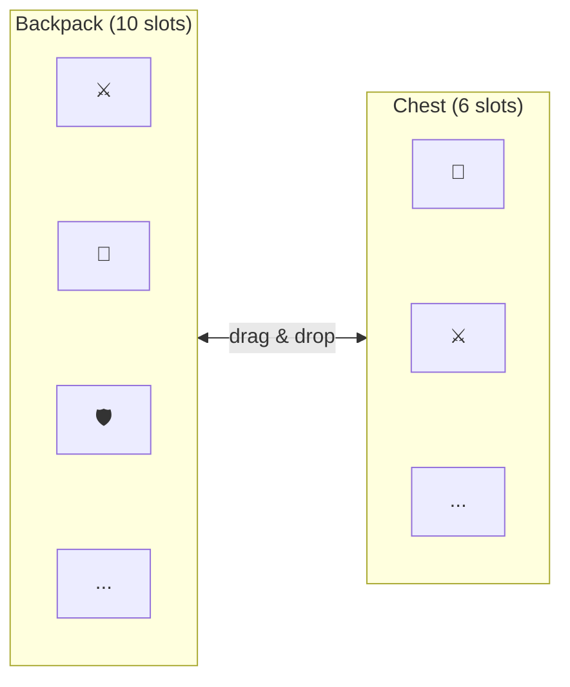
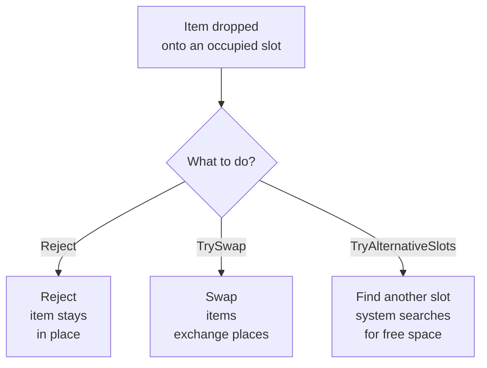

# Quick Start

This guide will walk you through creating two inventories linked by drag & drop in 5 minutes.

---

## What we will build



Two inventories with items. The player drags items from one to the other.

---

## Step 1. Scene setup

1. Add the **DragAndDropManager** prefab to the scene (located in `Prefabs/DragingObj`).
2. Make sure the scene has an **EventSystem** (Unity creates one automatically when adding a Canvas).
3. Create a **Canvas** if one does not exist yet.

> DragAndDropManager --- a singleton. One per scene is enough. It manages all drag operations.

---

## Step 2. Creating an inventory

1. Create an empty GameObject inside the Canvas, name it `Inventory`.
2. Add the **UniversalInventory** component.
3. Configure in the Inspector:

| Setting | Options | Description |
|---------|---------|-------------|
| **Item Behavior** | `Unique` / `Stackable` / `SeparableStacks` | How items are placed in slots |
| **Slot Management** | `Fixed` / `Dynamic` | Fixed number of slots or automatic creation |
| **Initial Slot Count** | number | How many slots to create on start |
| **Slot Prefab** | prefab reference | Slot prefab (use `Prefabs/Slot`) |
| **Slot Container** | Transform reference | Where to create slots (usually the GameObject itself) |

4. Repeat for the second inventory.

> **Tip:** add a `GridLayoutGroup` to the inventory GameObject for automatic slot layout.

---

## Step 3. Creating an item

Create a ScriptableObject to store item data:

```csharp
[CreateAssetMenu(menuName = "Game/Item")]
public class ItemSO : ScriptableObject
{
    [field: SerializeField] public string ItemName { get; private set; }
    [field: SerializeField] public Sprite Icon { get; private set; }
    [field: SerializeField] public string ItemType { get; private set; }
}
```

Then create an **adapter** --- a wrapper implementing the `IInventoryItem` interface:

```csharp
using DragAndDropSystem.Core;

public class ItemSOAdapter : IInventoryItem
{
    public readonly ItemSO Data;

    public ItemSOAdapter(ItemSO data) => Data = data;

    public string ItemId => Data.GetInstanceID().ToString();
    public Sprite Icon => Data.Icon;
    public string DisplayName => Data.ItemName;
}
```

> **Why an adapter?** The system works with the `IInventoryItem` interface, not concrete types. This allows you to use any data --- ScriptableObjects, plain classes, server data --- without modifying your model.

---

## Step 4. Data binding

Data binding (DataBinding) --- the bridge between the UI inventory and your game data. When the player drags an item, the DataBinding automatically updates your list/dictionary/model.

Choose the appropriate option:

=== "Item list"

    Use `ListInventoryDataBinding` for inventories where slot order does not matter:

    ```csharp
    using DragAndDropSystem.Core;
    using DragAndDropSystem.DataBinding;

    public class BackpackBinding : ListInventoryDataBinding<ItemSO, ItemSOAdapter>
    {
        [SerializeField] private List<ItemSO> _items;

        protected override IReadOnlyList<ItemSO> GetItems() => _items;
        protected override ItemSOAdapter CreateAdapter(ItemSO item) => new(item);
        protected override ItemSO ExtractData(ItemSOAdapter a) => a.Data;
        protected override void AddToData(InventoryItemEventContext ctx, ItemSO item)
            => _items.Add(item);
        protected override void RemoveFromData(InventoryItemEventContext ctx, ItemSO item)
            => _items.Remove(item);
    }
    ```

    Add this component to the same GameObject as UniversalInventory. Drag initial items into the `_items` list via the Inspector.

=== "Equipment slots"

    Use `MappedSlotInventoryDataBinding` for slots with a fixed purpose (helmet, weapon, armor):

    ```csharp
    using DragAndDropSystem.Core;
    using DragAndDropSystem.DataBinding;
    using DragAndDropSystem.Rules;
    using DragAndDropSystem.Slots;

    public class EquipmentBinding
        : MappedSlotInventoryDataBinding<ItemSO, ItemSOAdapter>
    {
        [SerializeField] private UniversalSlot _weaponSlot;
        [SerializeField] private UniversalSlot _armorSlot;

        private ItemSO _equippedWeapon;
        private ItemSO _equippedArmor;

        protected override Dictionary<ISlot, SlotBinding<ItemSO>> CreateBindingMap() => new()
        {
            [_weaponSlot] = new(
                get:   () => _equippedWeapon,
                set:   item => _equippedWeapon = item,
                clear: () => _equippedWeapon = null,
                canAccept: item => item.ItemType == "Weapon"
                    ? RuleResult.Success()
                    : RuleResult.Failure("Weapons only")),

            [_armorSlot] = new(
                get:   () => _equippedArmor,
                set:   item => _equippedArmor = item,
                clear: () => _equippedArmor = null,
                canAccept: item => item.ItemType == "Armor"
                    ? RuleResult.Success()
                    : RuleResult.Failure("Armor only")),
        };

        protected override ItemSOAdapter CreateAdapter(ItemSO item) => new(item);
        protected override ItemSO ExtractData(ItemSOAdapter a) => a.Data;
    }
    ```

    Each slot is bound to a specific data field. `canAccept` --- optional validation right in the binding.

---

## Step 5. Adding items at runtime

If you need to add items from code (e.g., after a purchase or crafting):

```csharp
// Option 1: via data (update the list, then refresh the UI)
_items.Add(newItemSO);
_dataBinding.ForceSyncToUI();

// Option 2: directly via the inventory
_inventory.TryAddItem(new ItemSOAdapter(newItemSO), count: 1);
```

> **Important:** when adding via `TryAddItem`, the DataBinding will automatically receive the `OnItemAddedToUI` event and update your data. No double-adding is needed.

---

## Optional: Drop Policy

What happens when an item is dropped onto an occupied slot?



Configure the policy in the Inspector on the UniversalInventory component (**Drop Policy** section):

| Policy | Value | Behavior |
|--------|-------|----------|
| **Occupied Target** | `Reject` | Reject the transfer |
| | `TrySwap` | Swap the items |
| | `TryAlternativeSlots` | Find a free slot |
| **Capacity** | `RejectAll` | If it does not fit --- reject everything |
| | `Partial` | Transfer as much as will fit |

---

## Optional: Rules

Rules --- ScriptableObject assets that restrict which items can enter an inventory. For example: "weapons only", "only items level 5+".

1. Create a rule class implementing `IInventoryRule`.
2. Create a ScriptableObject asset from the menu `Create > DragAndDrop`.
3. Drag the asset into the Rules list on the UniversalInventory or DataBinding component.

Rules are checked automatically on every drag operation. If at least one rule rejects --- the transfer will not happen.

---

## Next steps

- [Architecture: Data Binding](../architecture/data-binding.md) --- DataBinding lifecycle and sync scope
- [Architecture: Transfer Pipeline](../architecture/transfer-pipeline.md) --- how item transfer works
- [Architecture: Strategies](../architecture/strategies.md) --- Unique, Stackable, and SeparableStacks
- [Example: Trading](../examples/trading.md) --- buying and selling with item conversion
