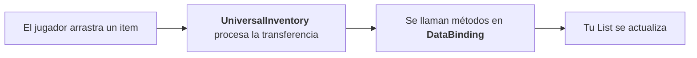

# Quick Start

Esta guía crea dos inventarios normales entre los que se pueden arrastrar objetos.

Esto ya está implementado en el primer ejemplo, donde puedes ver el resultado final.

Incluso en un escenario básico, normalmente necesitas algo de código de integración para
tus datos. En esta guía será:

- `ItemSO` como datos del item
- `ItemSOAdapter` como representación para el sistema de inventario
- `SimpleBinding` como puente entre la UI y tu lista de datos

## Paso 1. Preparar la escena

Los inventarios son uGUI normal, así que viven en un canvas de UI.

1. **Crea un `Canvas` para los inventarios** si la escena aún no tiene uno.

    En la ventana `Hierarchy`, haz clic derecho en un espacio vacío y elige `UI → Canvas`.

    Unity crea un objeto `EventSystem` junto con el `Canvas`.
    Para empezar rápido, deja el `Canvas` con `Render Mode` = `Screen Space - Overlay`.

2. **Añade `DragAndDropManager` a la escena.**

    Busca `Prefabs/DragCanvas.prefab` en la ventana `Project` y arrástralo a un espacio vacío
    de la `Hierarchy` — debe quedar como objeto raíz de la escena, junto a tu `Canvas`.

    `DragCanvas` tiene su propio `Canvas` con `Sorting Order = 100`, que es lo que hace que el
    objeto arrastrado se dibuje por encima del resto de la interfaz.
    Además de `DragAndDropManager`, el prefab lleva `InputEventRouter` y `DragVisualPresenter`.
    La escena necesita exactamente uno de estos objetos: gestiona todas las operaciones de
    transferencia y controla el visual del item "en la mano".

3. **Comprueba el `EventSystem`.**

    Si no está en la `Hierarchy`, haz clic derecho en un espacio vacío y elige
    `UI → Event System`.

    Selecciona `EventSystem` y mira en el `Inspector` qué módulo de entrada tiene:

    - proyecto con input legacy — necesita `StandaloneInputModule`;
    - proyecto con New Input System — necesita `InputSystemUIInputModule`.

    El asset soporta ambos. `DragAndDropManager` trae por defecto una configuración mínima
    funcional de acciones. Puedes ajustarla o crear tu propia copia y asignarla en la escena.

---

## Paso 2. Crear dos inventarios

1. En la `Hierarchy`, haz clic derecho sobre el objeto `Canvas` y elige `Create Empty`.
   Llama al nuevo objeto `Backpack`.

    Como el padre es un `Canvas`, Unity le da al objeto un `RectTransform`.
    Si quieres un fondo desde el principio, elige `UI → Panel` en lugar de `Create Empty`.

2. Dale a `Backpack` tamaño y posición.

    Un objeto de UI tiene `RectTransform` en lugar de `Transform`, y después de `Create Empty`
    su `Width` y `Height` valen cero. El tamaño se define aquí, no con la escala:

    - selecciona `Backpack` y en el `Inspector`, en el componente `RectTransform`, pon
      `Width` = `540`, `Height` = `240`;
    - la posición se ajusta cómodamente con el botón de presets de anclaje: el cuadrado con
      una cruz en la esquina superior izquierda del `RectTransform`. Púlsalo y elige
      `middle center` para empezar rápido, y luego mueve el objeto con los campos
      `Pos X` y `Pos Y`.

    Si usaste `UI → Panel`, ya está estirado a toda la pantalla — simplemente pon el
    `Width` y el `Height` que quieras del mismo modo.

3. Haz clic derecho sobre `Backpack`, elige `Create Empty` y llama al objeto `SlotContainer`.

    Estíralo sobre todo el `Backpack`: pulsa el botón de presets de anclaje y, manteniendo
    `Alt` y `Shift`, elige la opción inferior derecha `stretch / stretch`.

    Después pulsa `Add Component → Layout → Grid Layout Group` y rellena sus campos:

    | Campo de `Grid Layout Group` | Valor |
    |---|---|
    | `Cell Size` | `100` × `100` — el tamaño del slot de `Prefabs/Slot.prefab` |
    | `Spacing` | `5` en X e Y |
    | `Constraint` | `Fixed Column Count` |
    | `Constraint Count` | `5`, así 10 slots forman una cuadrícula de 5 × 2 |

    Este componente es el que coloca los slots en cuadrícula.

4. Añade el componente `UniversalInventory` a `Backpack` y rellena los campos.

    En el Inspector están repartidos en grupos plegables:

    **Grupo `Slot Setup`:**

    | Campo | Valor |
    |---|---|
    | `Slot Container` | El objeto `SlotContainer` del paso 3 — el padre bajo el que se crean los slots |
    | `Slot Prefab` | Prefab de slot que quieras usar; `Prefabs/Slot.prefab` sirve para empezar |
    | `Initial Slot Count` | Por ejemplo `10`. Se crearán tantos slots en `Slot Container` al iniciar. Si los creaste tú, cachéalos con el botón `Cache Slots` |

    **Grupo `Strategy`** — dos campos sin etiqueta, cada uno se elige en un desplegable:

    | Qué elegir | Valor |
    |---|---|
    | desplegable superior (estrategia del inventario) | `UniqueItemStrategy` para el inicio más simple, donde cada item ocupa su propio slot |
    | desplegable inferior (gestión de slots) | `FixedSlotManagementSettings` para un número fijo de slots |

    Los demás grupos (`Rules`, `Drop Policy`, `Placement`) puedes dejarlos como están.

5. Duplica `Backpack` y crea un segundo inventario, por ejemplo `Chest`.
   Sepáralos con el campo `Pos X` para que ambos se vean a la vez.

!!! info Inicialización
    Al iniciar, el inventario intenta encontrar slots ya creados debajo de `Slot Container`
    y cachearlos. Si no hay suficientes, crea slots desde `Slot Prefab` hasta
    `Initial Slot Count`. También puedes crear todos los slots manualmente en modo edición
    y cachearlos con `Cache Slots`, para que esta operación no ocurra durante el juego.

---

## Paso 3. Definir el tipo de item

Supongamos que tienes un tipo de item:

```csharp
[CreateAssetMenu(menuName = "Game/Item")]
public class ItemSO : ScriptableObject
{
    [field: SerializeField] public string ItemName { get; private set; }
    [field: SerializeField] public Sprite Icon { get; private set; }
}
```

Para mostrar este tipo en slots, crea un adapter que implemente `IItemAdapter`:

```csharp
using UDND.Core;
using UnityEngine;

public class ItemSOAdapter : IItemAdapter
{
    // Referencia a los datos de tu tipo.
    public readonly ItemSO Data;

    // Constructor.
    public ItemSOAdapter(ItemSO data) => Data = data;

    // Campos obligatorios de la interfaz.
    public string ItemId => Data.GetInstanceID().ToString();
    public Sprite Icon => Data.Icon;
    public string DisplayName => Data.ItemName;
}
```

Significado de los campos obligatorios:

- `ItemId` — sirve para decidir si los items pueden unirse en un slot para las
  estrategias `Stackable` y `SeparableStacks`.
- `Icon` — sirve para mostrar la imagen del item en el slot.
- `DisplayName` — se usa principalmente en logs y algunos sistemas opcionales, como el
  ejemplo de tooltips. Puede ser una cadena vacía.

---

## Paso 4. Añadir un binding simple

Para mostrar tus datos en slots, debes dar acceso al sistema a esos datos y definir cómo
puede interactuar con ellos. En proyectos reales, estos conjuntos de datos normalmente
viven en scripts de jugador, personajes u objetos del mundo. En este ejemplo, la lista se
guarda directamente en el componente.

```csharp
using UDND.Core;
using UDND.DataBinding;
using System.Collections.Generic;
using UnityEngine;

public class SimpleBinding : ListInventoryDataBinding<ItemSO, ItemSOAdapter>
{
    // Tu lista de datos.
    [SerializeField] private List<ItemSO> _items;

    // Overrides obligatorios.
    protected override IReadOnlyList<ItemSO> GetItems() => _items;
    protected override ItemSOAdapter CreateAdapter(ItemSO item) => new(item);
    protected override void AddToData(ItemSOAdapter adapter) => _items.Add(adapter.Data);
    protected override void RemoveFromData(ItemSOAdapter adapter) => _items.Remove(adapter.Data);
}
```

`ListInventoryDataBinding` es una plantilla de DataBinding para trabajar con datos
guardados como lista. Al heredar de ella, indicas tu tipo de item y el tipo de adapter.

Significado de los métodos obligatorios:

- `GetItems` — se usa para el render inicial de datos.
- `CreateAdapter` — crea el adapter y le pasa los datos necesarios.
- `AddToData` — se llama cuando un item se transfiere **a este** inventario.
- `RemoveFromData` — se llama cuando un item se transfiere **fuera de este** inventario.

Añade este binding a ambos inventarios o a otros objetos de la escena.
Asigna referencias a los inventarios correspondientes.
Cada binding tendrá su propia lista `_items`.

!!! info Datos
    En proyectos reales, en lugar de una lista simple `_items`, normalmente interactuarás
    con tus propios scripts donde se almacenan los datos. Mira los ejemplos para ver cómo
    se implementa este patrón.

---

## Paso 5. Rellenar datos iniciales

1. Crea varios assets `ItemSO`.
2. Añádelos a `_items` en tus componentes `SimpleBinding`.
3. Ejecuta la escena.

Si todo está configurado correctamente:

- ambos inventarios muestran objetos
- un objeto se puede arrastrar de un inventario a otro
- las listas de datos se actualizan automáticamente durante la transferencia

---

## Qué ocurre internamente



## Errores comunes del primer proyecto

- el inventario se creó como objeto 2D o de escena normal en lugar de UI dentro de un `Canvas`: el Inspector muestra un `Transform` en vez de un `RectTransform`
- `Backpack` o `SlotContainer` siguen con `Width` y `Height` a cero en su `RectTransform`, así que el inventario no se ve o aparece donde no esperabas
- el tamaño se intentó ajustar con `Scale` en lugar de `Width` y `Height`
- `DragCanvas` se colocó dentro de tu propio `Canvas`, y el item arrastrado desaparece detrás de la interfaz
- `Slot Container` apunta al propio inventario en lugar de a un objeto hijo con `Grid Layout Group`
- `ItemId` no coincide con tu lógica de stacking, y los items se unen o no se unen de forma inesperada
- no hay `DragAndDropManager` en la escena
- no hay `EventSystem` en la escena
- el proyecto usa input legacy, pero `EventSystem` no tiene `StandaloneInputModule`
- el binding está conectado al `UniversalInventory` equivocado
- `InventoryDataBinding` no tiene asignada una referencia de inventory
- los datos cambian fuera del pipeline, pero no se llama a `ReloadUI()`. Añade una llamada
  a `ReloadUI` en tu DataBinding cuando cambien los datos

Ver también:

- [Ejemplos](../examples/index.md) — si quieres elegir entre las 6 demos
- [Data Binding](../architecture/data-binding.md) — si necesitas entender lifecycle y puntos de extensión
- [Estrategias de colocación](../architecture/strategies.md) — si quieres añadir tu propia estrategia o modo de slot management
- [Troubleshooting](../reference/troubleshooting.md) — si la escena básica no funciona al primer intento
