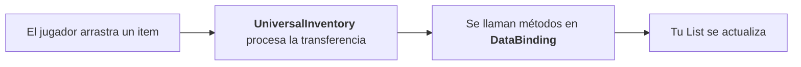

# Quick Start

Esta guía crea dos inventarios normales entre los que se pueden arrastrar objetos.

Esto ya está implementado en el primer ejemplo, donde puedes ver el resultado final.

Incluso en un escenario básico, normalmente necesitas algo de código de integración para
tus datos. En esta guía será:

- `ItemSO` como datos del item
- `ItemSOAdapter` como representación para el sistema de inventario
- `SimpleBinding` como puente entre la UI y tu lista de datos

## Paso 1. Preparar la escena

1. Crea un `Canvas` para los inventarios si la escena aún no tiene uno.
2. Añade `DragAndDropManager` a la escena. Puedes arrastrar el prefab desde
   `Prefabs/DragCanvas.prefab`.
> La escena necesita un `DragAndDropManager`. Gestiona todas las operaciones de
> transferencia y controla el objeto arrastrado.
3. Asegúrate de que la escena tenga un `EventSystem`.
   Si el proyecto usa input legacy, el `EventSystem` debe tener `StandaloneInputModule`.
   El asset también soporta New Input System. `DragAndDropManager` trae por defecto una
   configuración mínima funcional de acciones. Puedes ajustarla o crear tu propia copia y
   asignarla en la escena.

---

## Paso 2. Crear dos inventarios

1. Crea un objeto `Backpack` dentro de `Canvas`.
2. Añade `UniversalInventory`.
3. Configura:

    | Campo | Valor |
    |---|---|
    | `Slot Container` | Padre de los slots, preferiblemente con `GridLayout` u otro componente que controle el layout de hijos |
    | `Slot Prefab` | Prefab de slot que quieras usar, por ejemplo `Prefabs/Slot.prefab` |
    | `Initial Slot Count` | Por ejemplo `10`. Al iniciar, los slots se crean en `Slot Container`. Si ya los creaste manualmente, puedes cachearlos con el botón |
    | `Inventory Strategy` | `UniqueItemStrategy` para el inicio más simple, donde cada item ocupa su propio slot |
    | `Slot Management` | `FixedSlotManagementSettings` para un número fijo de slots |

4. Duplica el objeto y crea un segundo inventario, por ejemplo `Chest`.

!!! info Inicialización
    Al iniciar, el inventario intenta encontrar slots ya creados debajo de `Slot Container`
    y cachearlos. Si no hay suficientes, crea slots desde `Slot Prefab` hasta
    `Initial Slot Count`. También puedes crear todos los slots manualmente en modo edición
    y cachearlos con `Cache Slots`, para que esta operación no ocurra durante el juego.

---

## Paso 3. Definir el tipo de item

Supongamos que tienes un tipo de item:

```csharp
[CreateAssetMenu(menuName = "Game/Item")]
public class ItemSO : ScriptableObject
{
    [field: SerializeField] public string ItemName { get; private set; }
    [field: SerializeField] public Sprite Icon { get; private set; }
}
```

Para mostrar este tipo en slots, crea un adapter que implemente `IItemAdapter`:

```csharp
using UDND.Core;
using UnityEngine;

public class ItemSOAdapter : IItemAdapter
{
    // Referencia a los datos de tu tipo.
    public readonly ItemSO Data;

    // Constructor.
    public ItemSOAdapter(ItemSO data) => Data = data;

    // Campos obligatorios de la interfaz.
    public string ItemId => Data.GetInstanceID().ToString();
    public Sprite Icon => Data.Icon;
    public string DisplayName => Data.ItemName;
}
```

Significado de los campos obligatorios:

- `ItemId` — sirve para decidir si los items pueden unirse en un slot para las
  estrategias `Stackable` y `SeparableStacks`.
- `Icon` — sirve para mostrar la imagen del item en el slot.
- `DisplayName` — se usa principalmente en logs y algunos sistemas opcionales, como el
  ejemplo de tooltips. Puede ser una cadena vacía.

---

## Paso 4. Añadir un binding simple

Para mostrar tus datos en slots, debes dar acceso al sistema a esos datos y definir cómo
puede interactuar con ellos. En proyectos reales, estos conjuntos de datos normalmente
viven en scripts de jugador, personajes u objetos del mundo. En este ejemplo, la lista se
guarda directamente en el componente.

```csharp
using UDND.Core;
using UDND.DataBinding;
using System.Collections.Generic;
using UnityEngine;

public class SimpleBinding : ListInventoryDataBinding<ItemSO, ItemSOAdapter>
{
    // Tu lista de datos.
    [SerializeField] private List<ItemSO> _items;

    // Overrides obligatorios.
    protected override IReadOnlyList<ItemSO> GetItems() => _items;
    protected override ItemSOAdapter CreateAdapter(ItemSO item) => new(item);
    protected override void AddToData(ItemSOAdapter adapter) => _items.Add(adapter.Data);
    protected override void RemoveFromData(ItemSOAdapter adapter) => _items.Remove(adapter.Data);
}
```

`ListInventoryDataBinding` es una plantilla de DataBinding para trabajar con datos
guardados como lista. Al heredar de ella, indicas tu tipo de item y el tipo de adapter.

Significado de los métodos obligatorios:

- `GetItems` — se usa para el render inicial de datos.
- `CreateAdapter` — crea el adapter y le pasa los datos necesarios.
- `AddToData` — se llama cuando un item se transfiere **a este** inventario.
- `RemoveFromData` — se llama cuando un item se transfiere **fuera de este** inventario.

Añade este binding a ambos inventarios o a otros objetos de la escena.
Asigna referencias a los inventarios correspondientes.
Cada binding tendrá su propia lista `_items`.

!!! info Datos
    En proyectos reales, en lugar de una lista simple `_items`, normalmente interactuarás
    con tus propios scripts donde se almacenan los datos. Mira los ejemplos para ver cómo
    se implementa este patrón.

---

## Paso 5. Rellenar datos iniciales

1. Crea varios assets `ItemSO`.
2. Añádelos a `_items` en tus componentes `SimpleBinding`.
3. Ejecuta la escena.

Si todo está configurado correctamente:

- ambos inventarios muestran objetos
- un objeto se puede arrastrar de un inventario a otro
- las listas de datos se actualizan automáticamente durante la transferencia

---

## Qué ocurre internamente



## Errores comunes del primer proyecto

- `ItemId` no coincide con tu lógica de stacking, y los items se unen o no se unen de forma inesperada
- no hay `DragAndDropManager` en la escena
- no hay `EventSystem` en la escena
- el proyecto usa input legacy, pero `EventSystem` no tiene `StandaloneInputModule`
- el binding está conectado al `UniversalInventory` equivocado
- `InventoryDataBinding` no tiene asignada una referencia de inventory
- los datos cambian fuera del pipeline, pero no se llama a `ReloadUI()`. Añade una llamada
  a `ReloadUI` en tu DataBinding cuando cambien los datos

Ver también:

- [Ejemplos](../examples/index.md) — si quieres elegir entre las 6 demos
- [Data Binding](../architecture/data-binding.md) — si necesitas entender lifecycle y puntos de extensión
- [Estrategias de colocación](../architecture/strategies.md) — si quieres añadir tu propia estrategia o modo de slot management
- [Troubleshooting](../reference/troubleshooting.md) — si la escena básica no funciona al primer intento
