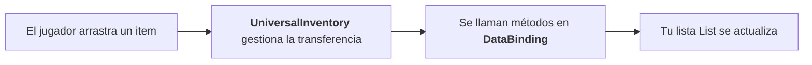

# Quick Start

Este recorrido crea dos inventarios normales que soportan drag & drop entre sí.

Esto ya está implementado en el primer ejemplo, y allí puedes ver el resultado final.

Incluso en el caso más básico, normalmente tendrás que escribir una pequeña cantidad de código de integración para tus propios datos. En esta guía eso será:

- `ItemSO` como tus datos de item
- `ItemSOAdapter` como representación para el sistema de inventario
- `SimpleBinding` como puente entre la UI y tu lista de datos

## Requisitos

- Paquete obligatorio: `Unity.ugui`
- Paquete opcional: `com.unity.inputsystem`

Este quick start **no** requiere el nuevo Input System. El drag and drop básico con puntero funciona sin él.
Si quieres `InputAction` bindings o `InputActionSelectionTrigger`, instala `com.unity.inputsystem`.

## Paso 1. Preparar la escena

1. Crea un `Canvas` donde se colocarán los inventarios, si aún no lo tienes.
2. Añade `DragAndDropManager` a la escena. Puedes arrastrar el prefab desde `Prefabs/DragCanvas.prefab` a la escena.
> La escena necesita un único `DragAndDropManager`. Gestiona todas las operaciones de transferencia y controla el objeto arrastrado.
3. Asegúrate de que existe un `EventSystem` en la escena.
   Si usas input legacy, el `EventSystem` debe tener `StandaloneInputModule`.


---

## Paso 2. Crear dos inventarios

1. Crea un objeto llamado `Backpack` dentro del `Canvas`.
2. Añade `UniversalInventory`.
3. Configura:

    | Campo | Valor |
    |---|---|
    | `Item Behavior` | `Unique` para empezar de la forma más simple, de modo que cada item esté en un slot separado |
    | `Slot Management` | `Fixed` para un número fijo de slots |
    | `Initial Slot Count` | por ejemplo `10`. Se crearán en `Slot Container` al iniciar. Si ya los has creado manualmente allí, puedes almacenarlos en caché pulsando el botón |
    | `Slot Prefab` | `Prefabs/Slot.prefab` |
    | `Slot Container` | contenedor padre de los slots, preferiblemente con `GridLayout` u otro componente que controle el layout de los hijos |

4. Duplica el objeto y crea un segundo inventario, por ejemplo `Chest`.

---

## Paso 3. Definir un tipo de item
Supongamos que tienes un tipo de item como este:
```csharp
[CreateAssetMenu(menuName = "Game/Item")]
public class ItemSO : ScriptableObject
{
    [field: SerializeField] public string ItemName { get; private set; }
    [field: SerializeField] public Sprite Icon { get; private set; }
}
```
Para mostrar este tipo en los slots, necesitas crear un adapter que implemente `IItemAdapter`, por ejemplo:

```csharp
using UniversalDragAndDrop.Core;
using UnityEngine;

public class ItemSOAdapter : IItemAdapter
{
    // Referencia a los datos de tu tipo
    public readonly ItemSO Data;

    // Constructor
    public ItemSOAdapter(ItemSO data) => Data = data;

    // Campos requeridos por la interfaz
    public string ItemId => Data.GetInstanceID().ToString();
    public Sprite Icon => Data.Icon;
    public string DisplayName => Data.ItemName;
}
```

Significado de los campos requeridos:

- `ItemId` sirve para determinar si los items pueden fusionarse en un mismo slot en los modos `Stackable` y `SeparableStacks`.
- `Icon` se usa para mostrar la imagen del item en el slot.
- `DisplayName` se usa en algunos sistemas adicionales. Puede ser una cadena vacía.

---

## Paso 4. Añadir un binding simple

```csharp
using UniversalDragAndDrop.Core;
using UniversalDragAndDrop.DataBinding;
using System.Collections.Generic;
using UnityEngine;

public class SimpleBinding : ListInventoryDataBinding<ItemSO, ItemSOAdapter>
{
    // Tu lista de datos
    [SerializeField] private List<ItemSO> _items;

    // Funciones obligatorias a sobreescribir
    protected override IReadOnlyList<ItemSO> GetItems() => _items;
    protected override ItemSOAdapter CreateAdapter(ItemSO item) => new(item);
    protected override void AddToData(ItemSOAdapter adapter) => _items.Add(adapter.Data);
    protected override void RemoveFromData(ItemSOAdapter adapter) => _items.Remove(adapter.Data);
}
```

Significado de los métodos requeridos:

- `GetItems` se usa para el renderizado inicial de los datos.
- `CreateAdapter` sirve para crear el adapter y pasarle los parámetros necesarios desde tus datos.
- `AddToData` se llama cuando un item se transfiere **a este** inventario.
- `RemoveFromData` se llama cuando un item se transfiere **fuera de este** inventario.

Adjunta este binding a ambos inventarios o a otros objetos de la escena.
Asigna referencias a los inventarios correspondientes.
Cada uno tendrá su propia lista `_items`.

!!! info Data
    En tus proyectos, en lugar de una simple lista `_items`, lo más probable es que interactúes con tus propios scripts que almacenan los datos. Puedes ver cómo se implementa esto en los ejemplos.

---

## Paso 5. Rellenar los datos iniciales

1. Crea algunos assets `ItemSO`.
2. Añádelos a las listas `_items` de tus componentes `SimpleBinding`.
3. Ejecuta la escena.

Si todo está configurado correctamente:

- ambos inventarios muestran items
- los items pueden arrastrarse entre ellos
- tu lista subyacente se actualiza automáticamente

---

## Qué ocurre internamente



## Errores comunes del primer proyecto

- `ItemId` no coincide con tu semántica de stacking, así que los items se fusionan o dejan de fusionarse inesperadamente
- no hay `DragAndDropManager` en la escena, o hay varios managers
- no hay `EventSystem` en la escena
- la escena usa input legacy pero el `EventSystem` no tiene `StandaloneInputModule`
- el binding apunta al `UniversalInventory` equivocado
- `InventoryDataBinding` no tiene asignada la referencia al inventario
- los datos cambian fuera del pipeline, pero nunca se llama a `ReloadUI()`. Añade una llamada a ReloadUI en tu DataBinding cuando cambien los datos.

## Qué sigue

- [Examples](../examples/index.md) — si quieres elegir entre las 5 demos
- [Data Binding](../architecture/data-binding.md) — si necesitas entender el lifecycle y los puntos de extensión
- [Troubleshooting](../reference/troubleshooting.md) — si la escena básica no funciona a la primera

