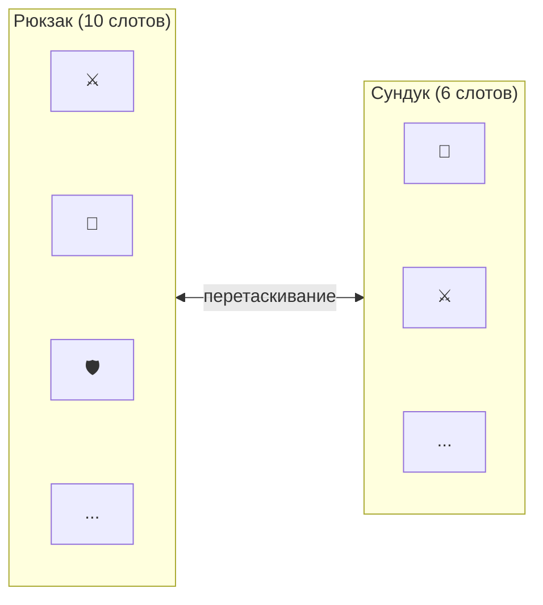
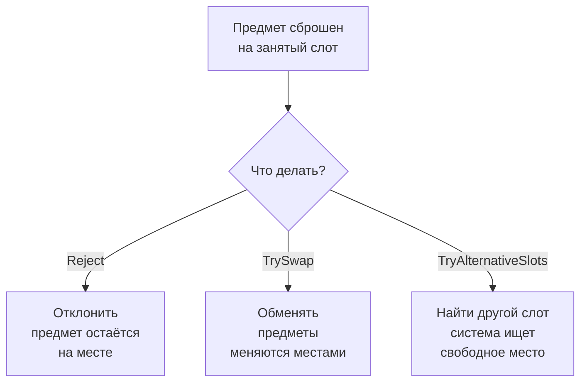

# Быстрый старт

Это руководство проведёт вас через создание двух инвентарей, связанных drag & drop, за 5 минут.

---

## Что мы создадим



Два инвентаря с предметами. Игрок перетаскивает предметы из одного в другой.

---

## Шаг 1. Подготовка сцены

1. Добавьте на сцену префаб **DragAndDropManager** (находится в `Prefabs/DragingObj`).
2. Убедитесь, что на сцене есть **EventSystem** (Unity создаёт его автоматически при добавлении Canvas).
3. Создайте **Canvas** если его ещё нет.

> DragAndDropManager --- синглтон. Достаточно одного на сцену. Он управляет всеми перетаскиваниями.

---

## Шаг 2. Создание инвентаря

1. Создайте пустой GameObject внутри Canvas, назовите его `Inventory`.
2. Добавьте компонент **UniversalInventory**.
3. Настройте в Inspector:

| Настройка | Варианты | Описание |
|-----------|----------|----------|
| **Item Behavior** | `Unique` / `Stackable` / `SeparableStacks` | Как предметы размещаются в слотах |
| **Slot Management** | `Fixed` / `Dynamic` | Фиксированное количество слотов или автоматическое создание |
| **Initial Slot Count** | число | Сколько слотов создать при старте |
| **Slot Prefab** | ссылка на префаб | Префаб слота (используйте `Prefabs/Slot`) |
| **Slot Container** | ссылка на Transform | Куда создавать слоты (обычно сам GameObject) |

4. Повторите для второго инвентаря.

> **Подсказка:** добавьте на GameObject с инвентарём `GridLayoutGroup` для автоматической раскладки слотов.

---

## Шаг 3. Создание предмета

Создайте ScriptableObject для хранения данных предмета:

```csharp
[CreateAssetMenu(menuName = "Game/Item")]
public class ItemSO : ScriptableObject
{
    [field: SerializeField] public string ItemName { get; private set; }
    [field: SerializeField] public Sprite Icon { get; private set; }
    [field: SerializeField] public string ItemType { get; private set; }
}
```

Затем создайте **адаптер** --- обёртку, реализующую интерфейс `IInventoryItem`:

```csharp
using DragAndDropSystem.Core;

public class ItemSOAdapter : IInventoryItem
{
    public readonly ItemSO Data;

    public ItemSOAdapter(ItemSO data) => Data = data;

    public string ItemId => Data.GetInstanceID().ToString();
    public Sprite Icon => Data.Icon;
    public string DisplayName => Data.ItemName;
}
```

> **Зачем адаптер?** Система работает с интерфейсом `IInventoryItem`, не с конкретными типами. Это позволяет использовать любые данные --- ScriptableObject, обычные классы, данные с сервера --- без изменения вашей модели.

---

## Шаг 4. Привязка данных

Привязка данных (DataBinding) --- мост между UI-инвентарём и вашими игровыми данными. Когда игрок перетаскивает предмет, DataBinding автоматически обновляет ваш список/словарь/модель.

Выберите подходящий вариант:

=== "Список предметов"

    Используйте `ListInventoryDataBinding` для инвентарей, где порядок слотов не важен:

    ```csharp
    using DragAndDropSystem.Core;
    using DragAndDropSystem.DataBinding;

    public class BackpackBinding : ListInventoryDataBinding<ItemSO, ItemSOAdapter>
    {
        [SerializeField] private List<ItemSO> _items;

        protected override IReadOnlyList<ItemSO> GetItems() => _items;
        protected override ItemSOAdapter CreateAdapter(ItemSO item) => new(item);
        protected override ItemSO ExtractData(ItemSOAdapter a) => a.Data;
        protected override void AddToData(InventoryItemEventContext ctx, ItemSO item)
            => _items.Add(item);
        protected override void RemoveFromData(InventoryItemEventContext ctx, ItemSO item)
            => _items.Remove(item);
    }
    ```

    Добавьте этот компонент на тот же GameObject, что и UniversalInventory. Перетащите начальные предметы в список `_items` через Inspector.

=== "Слоты экипировки"

    Используйте `MappedSlotInventoryDataBinding` для слотов с фиксированным назначением (шлем, оружие, броня):

    ```csharp
    using DragAndDropSystem.Core;
    using DragAndDropSystem.DataBinding;
    using DragAndDropSystem.Rules;
    using DragAndDropSystem.Slots;

    public class EquipmentBinding
        : MappedSlotInventoryDataBinding<ItemSO, ItemSOAdapter>
    {
        [SerializeField] private UniversalSlot _weaponSlot;
        [SerializeField] private UniversalSlot _armorSlot;

        private ItemSO _equippedWeapon;
        private ItemSO _equippedArmor;

        protected override Dictionary<ISlot, SlotBinding<ItemSO>> CreateBindingMap() => new()
        {
            [_weaponSlot] = new(
                get:   () => _equippedWeapon,
                set:   item => _equippedWeapon = item,
                clear: () => _equippedWeapon = null,
                canAccept: item => item.ItemType == "Weapon"
                    ? RuleResult.Success()
                    : RuleResult.Failure("Только оружие")),

            [_armorSlot] = new(
                get:   () => _equippedArmor,
                set:   item => _equippedArmor = item,
                clear: () => _equippedArmor = null,
                canAccept: item => item.ItemType == "Armor"
                    ? RuleResult.Success()
                    : RuleResult.Failure("Только броня")),
        };

        protected override ItemSOAdapter CreateAdapter(ItemSO item) => new(item);
        protected override ItemSO ExtractData(ItemSOAdapter a) => a.Data;
    }
    ```

    Каждый слот привязан к конкретному полю данных. `canAccept` --- опциональная валидация прямо в привязке.

---

## Шаг 5. Добавление предметов в рантайме

Если нужно добавить предметы из кода (например, после покупки или крафта):

```csharp
// Вариант 1: через данные (обновите список, затем обновите UI)
_items.Add(newItemSO);
_dataBinding.ForceSyncToUI();

// Вариант 2: напрямую через инвентарь
_inventory.TryAddItem(new ItemSOAdapter(newItemSO), count: 1);
```

> **Важно:** при добавлении через `TryAddItem` DataBinding автоматически получит событие `OnItemAddedToUI` и обновит ваши данные. Двойное добавление не нужно.

---

## Опционально: Политика дропа

Что происходит, когда предмет сброшен на занятый слот?



Настройте политику в Inspector на компоненте UniversalInventory (раздел **Drop Policy**):

| Политика | Значение | Поведение |
|----------|----------|-----------|
| **Occupied Target** | `Reject` | Отклонить перенос |
| | `TrySwap` | Обменять предметы местами |
| | `TryAlternativeSlots` | Найти свободный слот |
| **Capacity** | `RejectAll` | Если не влезает --- отклонить всё |
| | `Partial` | Перенести сколько влезет |

---

## Опционально: Правила

Правила --- ScriptableObject-ассеты, ограничивающие, какие предметы могут попасть в инвентарь. Например: "только оружие", "только предметы уровня 5+".

1. Создайте класс правила, реализующий `IInventoryRule`.
2. Создайте ScriptableObject-ассет из меню `Create > DragAndDrop`.
3. Перетащите ассет в список Rules на компоненте UniversalInventory или DataBinding.

Правила проверяются автоматически при каждом перетаскивании. Если хотя бы одно правило отклоняет --- перенос не произойдёт.

---

## Следующие шаги

- [Архитектура: привязка данных](../architecture/data-binding.md) --- жизненный цикл DataBinding и sync scope
- [Архитектура: конвейер переноса](../architecture/transfer-pipeline.md) --- как работает перенос предметов
- [Архитектура: стратегии](../architecture/strategies.md) --- Unique, Stackable и SeparableStacks
- [Пример: торговля](../examples/trading.md) --- покупка и продажа с конвертацией предметов
