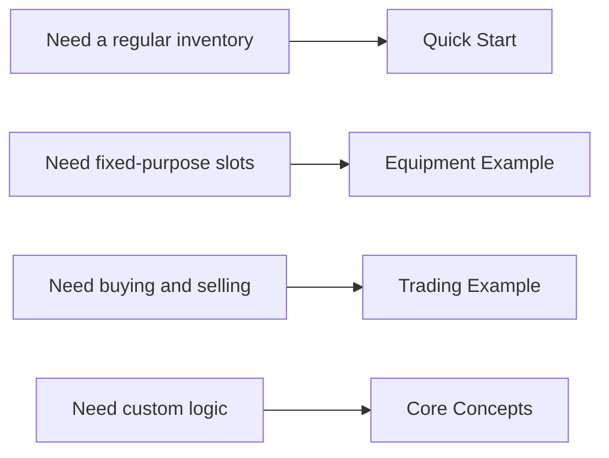
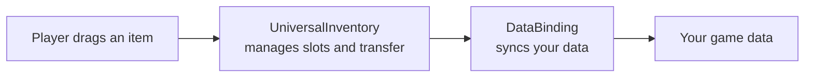

# Intro

A Unity asset for three core jobs:

- moving items between inventories
- stacking, swapping, and quick transfer
- syncing UI with your game data

It works for simple inventory UIs and for more specific flows such as equipment, trading, and world loot.

---

## What this asset is for

This is not just a set of UI slots. It is a system for visualizing almost any kind of game data inside inventories and drag & drop flows:

- `ScriptableObject`
- runtime models
- lists, dictionaries, and fixed fields
- different representations of the same item in different inventories

The main idea is that the visual inventory is separated from your game model. That makes it possible to scale the system gradually:

- start with a simple backpack and chest
- add fixed-purpose equipment slots
- add conversion between inventories
- add trading, server checks, or domain hooks

So the asset is meant both for fast initial setup and for growing into more complex inventory workflows without rewriting everything.

It is also worth stating the tradeoff clearly: for your own data types, you will usually write a small amount of integration code so the system knows:

- how to represent your data as `IItemAdapter`
- how to load it into the visual inventory
- how to write changes back into your own models

In practice this is usually a small adapter plus one `DataBinding`. The more custom your data model is, the more of this integration layer you will need, but drag & drop, swapping, stacking, planning, and event flow are still handled by the asset itself.

---

## Where to start

---

## What the asset gives you

| Scenario | What you get |
|---|---|
| Basic inventory | drag & drop between slots and inventories |
| Stacks | stack merging and partial transfer |
| Equipment | fixed slots with type restrictions |
| Trading | item conversion and pre-commit checks |
| 3D world | pickup and drop back into the world |

---

## Core mental model

For most projects, this is enough:

- `UniversalInventory` handles UI state and transfer behavior
- `DataBinding` connects that UI state to your data
- your actual data stays in your own models

---

## Recommended reading path

- [Quick Start](getting-started/quick-start.md)
- [Equipment Example](examples/equipment.md)
- [Trading Example](examples/trading.md)
- [Data Binding](architecture/data-binding.md)
- [Feedback](feedback.md)
