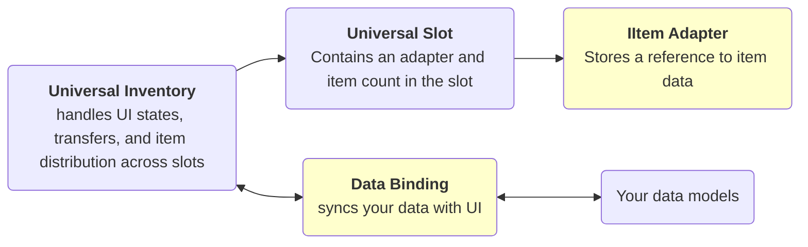

# Introduction

A Unity asset for adding inventory and drag-and-drop systems to any project with any
kind of data.

It solves tasks such as:

- displaying data in inventory UI
- moving items between inventories
- stacking, swap, and quick transfer
- synchronizing UI changes with your game data
- adding checks and rules for whether transfer is allowed
- creating custom inventory actions
- context menu
- multi-selection and multi-transfer
- working with complex-shaped items

It works for simple UI inventories and equipment scenarios, as well as more complex
logic such as trading and server-side validation.

## What This Asset Is

This is not just a set of UI slots. Unlike many alternatives that require your data to
match a specific type, it lets you visualize almost any data in an inventory:

- `ScriptableObject`
- runtime models
- lists, dictionaries, and fixed fields
- different representations of the same item in different inventories

The key idea is that the visual inventory is separated from your game model.

The system has many extension points, so it can grow gradually:

- start with a simple backpack and chest
- reserve some slots for equipment
- add rules that block dragging from or dropping into a slot under certain conditions
- convert item types between inventories
- implement trading, crafting, server checks, and similar logic

The asset is designed not only for quick start, but also for scaling without rewriting
the whole inventory logic.

!!! warning Price of flexibility
    For your own data types, you usually need to write a small amount of integration code.

It is important to understand this cost immediately: for your own data types, you
usually need to write a small amount of integration code.

This is needed so the system understands:

- how and which data to get from your classes
- how to represent your data in inventory slots
- how to write UI interaction changes back into your data models

For any type to appear in inventory slots, you need to write an adapter: a small bridge
from your data to the slot.

Usually this is a small adapter and one `DataBinding`. The more complex your data model
is, the thicker this integration layer will be, but drag and drop, swap, stacking,
transfers, and event flow are handled by the asset.

For several common cases, template `DataBinding` classes are already provided.

## Dependencies

- Required package: `Unity.ugui`
- Optional package: `com.unity.inputsystem`

The base asset compiles and works without `com.unity.inputsystem`.
The new Input System is required only for features built around `InputAction`.
Pointer/navigation modality tracking also works in legacy-input projects.

## Basic Model

For most projects, keep this model in mind:

- define `IItemAdapter` so a slot can store your data correctly
- define `DataBinding` so data is edited according to UI changes

## Subsystems

| Subsystem | Where to read |
|---|---|
| Displaying data in inventory | [Data Binding](architecture/data-binding.md), [Binding Templates](architecture/binding-templates.md) |
| Transfer between inventories | [Transfer Pipeline](architecture/transfer-pipeline.md) |
| Drop areas | [Drop Areas](architecture/drop-areas.md) |
| Rule system | [Rules](architecture/rules.md) |
| Configurable actions and input bindings | [Input and Interaction](systems/interaction.md) |
| Auto-transfer | [Transfer Pipeline](architecture/transfer-pipeline.md) |
| Multi-selection and multi-transfer | [Selection](systems/selection.md) |
| Context menu | [Context Menu](systems/context-menu.md) |
| Filtering and sorting | [Filter and Sort](systems/filter-sort.md) |
| Tooltip example | [Tooltips](systems/tooltips.md) |
| Type conversion during transfer | [Item Conversion](architecture/item-conversion-cookbook.md) |
| Nested inventory example | [Demo5 Containers](examples/demo5-containers.md) |
| Complex-shaped item example | [Demo6 Shaped Items](examples/demo6-shaped-items.md) |

See also:

- [Quick Start](getting-started/quick-start.md) — first working inventory
- [Examples](examples/index.md) — overview of all 6 demos and their architecture
- [Data Binding](architecture/data-binding.md) — where to write sync, rules, and business hooks
- [Feedback](more/feedback.md) — where to report bugs, ideas, and integration issues
