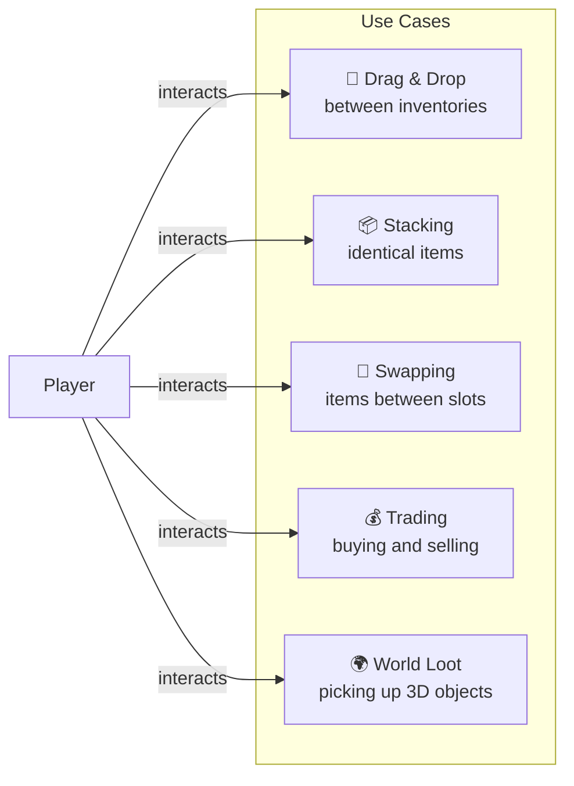
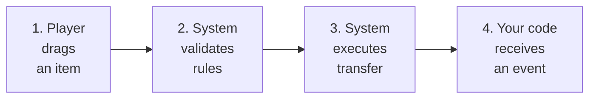
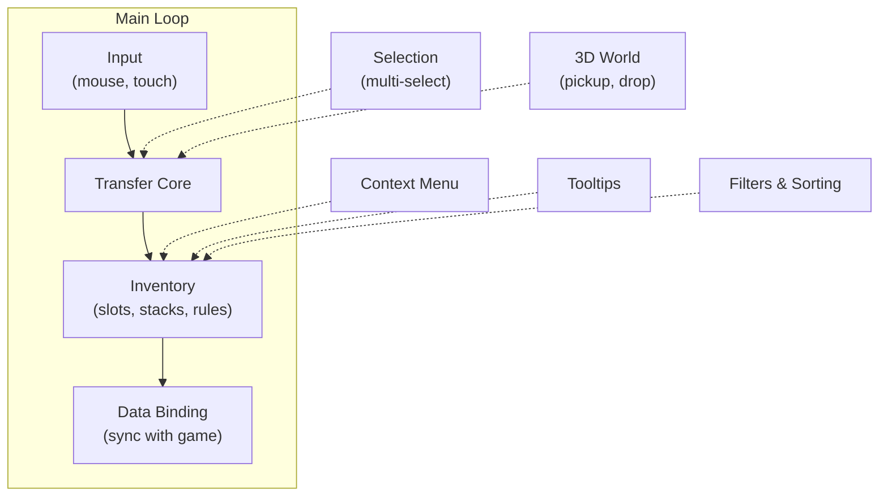

# Drag & Drop Inventory System

A full-featured inventory system for Unity with support for drag-and-drop, stacking, swapping, and trading.
Configurable via the Inspector without writing code for basic scenarios, yet easily extensible through rules, strategies, and data binding.

---

## What the system can do

---

## How it works

The entire system is built around a simple four-step cycle:

| Step | What happens |
|------|--------------|
| **Dragging** | The player picks up an item from a slot and drags it onto another slot or inventory |
| **Rule validation** | The system checks: can the item be picked up? Can it be placed in the target? Does the type match? |
| **Transfer execution** | The item is moved, stacked, or swapped depending on the settings |
| **Event to your code** | Your data binding (DataBinding) receives a notification and updates the game data |

---

## Features

| Feature | Description |
|---------|-------------|
| **Drag & Drop** | Drag & drop between any inventories. Mouse and touch support |
| **Stacking** | Combining identical items into stacks with a configurable limit |
| **Swapping** | Automatic swap when dragging onto an occupied slot |
| **Rules** | ScriptableObject rules for restrictions: only weapons in the weapon slot, etc. |
| **Auto-transfer** | Quick click for instant transfer between linked inventories |
| **Filters & Sorting** | Filtering and sorting inventory contents via presets |
| **Selection** | Multi-select with Shift/Ctrl, group dragging |
| **Context Menu** | Customizable right-click menu on an item |
| **Tooltips** | Pop-up hints when hovering over an item |
| **3D World** | Picking up items from the 3D world and dropping them back |
| **Trading** | Buying/selling with balance checking and item conversion |

---

## System Map

Dashed lines --- optional subsystems that are connected as needed.

---

## Next steps

- [Quick Start](getting-started/quick-start.md) --- create your first inventory in 5 minutes
- [Architecture: Transfer Pipeline](architecture/transfer-pipeline.md) --- how transfer works under the hood
- [Architecture: Strategies](architecture/strategies.md) --- unique items, stacks, and separable stacks
- [Example: Trading](examples/trading.md) --- buying, selling, and item conversion
