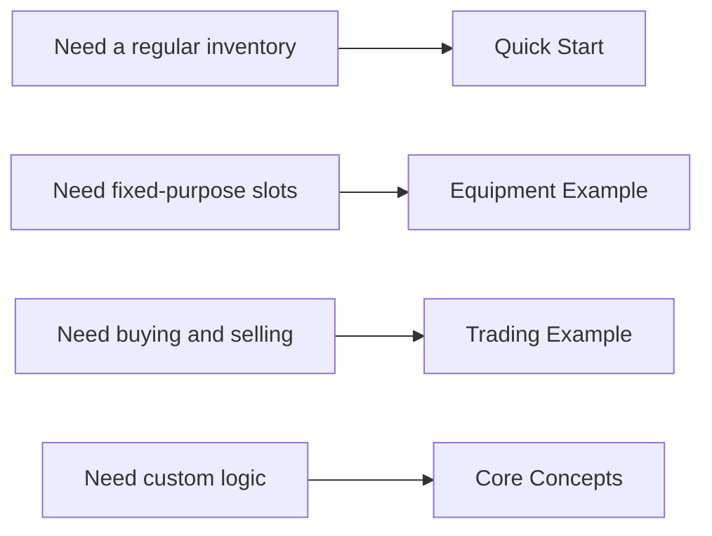
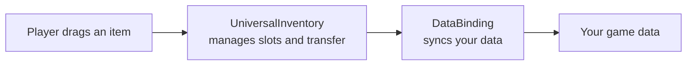

# Drag & Drop Inventory System

A Unity asset for three core jobs:

- moving items between inventories
- stacking, swapping, and quick transfer
- syncing UI with your game data

It works for simple inventory UIs and for more specific flows such as equipment, trading, and world loot.

---

## Where to start

---

## What the asset gives you

| Scenario | What you get |
|---|---|
| Basic inventory | drag & drop between slots and inventories |
| Stacks | stack merging and partial transfer |
| Equipment | fixed slots with type restrictions |
| Trading | item conversion and pre-commit checks |
| 3D world | pickup and drop back into the world |

---

## Core mental model

For most projects, this is enough:

- `UniversalInventory` handles UI state and transfer behavior
- `DataBinding` connects that UI state to your data
- your actual data stays in your own models

---

## Recommended reading path

- [Quick Start](getting-started/quick-start.md)
- [Equipment Example](examples/equipment.md)
- [Trading Example](examples/trading.md)
- [Data Binding](architecture/data-binding.md)
