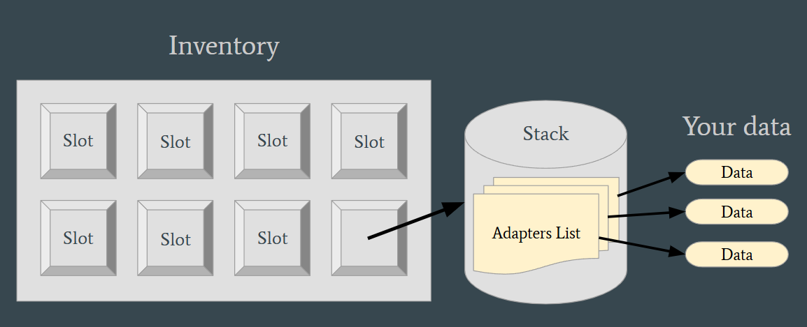
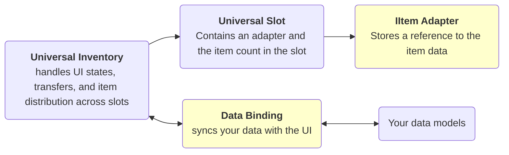

# Introduction

A Unity asset that lets you integrate an inventory and drag-and-drop system into any project with any kind of data.
It solves tasks such as:

- displaying data in inventory UI
- moving items between inventories
- stacking, swapping, and quick transfer
- syncing UI changes with your game data
- adding checks and rules for whether a transfer is allowed
- creating custom actions for inventories
- context menu
- multi-selection and transfer

It works both for simple inventory UIs and scenarios like equipment, and for more complex logic such as trading and server-side validation.

## What This Asset Is

This is not just a set of UI slots, but a system that, unlike many alternative solutions that require your data to match a specific type, allows you to visualize almost any of your data in an inventory:

- `ScriptableObject`
- runtime models
- lists, dictionaries, and fixed fields
- different representations of the same item in different inventories

The key idea is that the visual inventory is separated from your game model. Because of this, the system can be expanded gradually:

- start with a simple backpack and chest
- add fixed slots for equipment
- add conversion between inventories
- add trading, server checks, or domain hooks

So the asset is designed not only for a quick start, but also for further scaling without having to rewrite the entire inventory logic.

!!! warning Price of flexibility
    For your own data types, you usually need to write a small amount of integration code.

It is important to understand this tradeoff immediately: for your own data types, you usually need to write a small amount of integration code.

This is needed so the system understands:

- how and which data to get from your classes
- how to represent your data in inventory slots
- how to write changes from UI interactions back into your data models

For any type to be displayed in slots, you need to write a special adapter that bridges the data to the slot.

Usually this is a small adapter and one `DataBinding`. The more complex your data model is, the thicker this integration layer will be, but drag and drop, swapping, stacking, planning, and event flow are already handled by the asset.

For some common cases, template `DataBinding` classes are already provided, which makes most setups easier.

## Dependencies

- Required package: `Unity.ugui`
- Optional package: `com.unity.inputsystem`

The core asset compiles and works without `com.unity.inputsystem`.
New Input System is only required for features built around `InputAction` and input-modality tracking.

## Basic Model

    

For most projects, it is useful to keep exactly this diagram in mind:

- `IItemAdapter` needs to be defined so it stores data correctly
- `DataBinding` needs to be defined so it edits data correctly

## Subsystems
- Displaying data in the inventory
- Transfer between inventories
- Drop zones
- Rules system
- Configurable actions
- Auto-transfer
- Multi-selection
- Multi-transfer
- Context menu
- Tooltip example
- Example of type conversions during transfer
- Example of nested inventories
## Read Next

- [Quick Start](getting-started/quick-start.md) — your first working inventory
- [Examples](examples/index.md) — overview of all 5 demos and their architecture
- [Data Binding](architecture/data-binding.md) — where to write sync, rules, and business hooks
- [Feedback](more/feedback.md) — where to write about bugs, ideas, and integration issues
