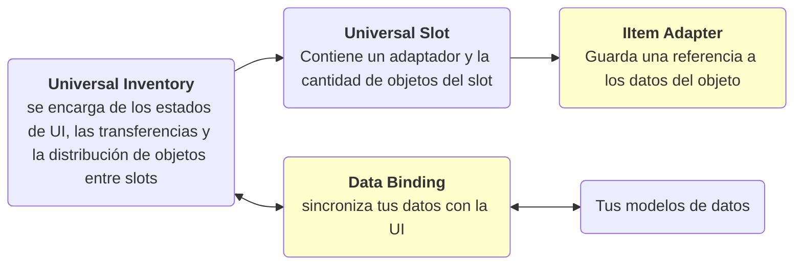

# Introducción

Un asset para Unity que te permite integrar un sistema de inventario y drag and drop en cualquier proyecto con cualquier tipo de datos.
Resuelve tareas como:

- mostrar datos en la UI del inventario
- mover objetos entre inventarios
- stacking, swapping y transferencia rápida
- sincronizar los cambios de la UI con los datos de tu juego
- añadir comprobaciones y reglas para decidir si una transferencia está permitida
- crear acciones personalizadas para inventarios
- menú contextual
- selección múltiple y transferencia múltiple

Funciona tanto para interfaces de inventario sencillas y escenarios como equipamiento, como para lógicas más complejas como comercio y validación del lado del servidor.

## Qué es este asset

No es simplemente un conjunto de slots de UI, sino un sistema que, a diferencia de muchas soluciones alternativas que exigen que tus datos encajen en un tipo específico, te permite visualizar casi cualquier dato dentro de un inventario:

- `ScriptableObject`
- modelos runtime
- listas, diccionarios y campos fijos
- distintas representaciones del mismo objeto en inventarios diferentes

La idea clave es que el inventario visual está separado de tu modelo de juego. Gracias a eso, el sistema puede ampliarse gradualmente:

- empezar con una mochila y un cofre simples
- añadir slots fijos para equipamiento
- añadir conversión entre inventarios
- añadir comercio, comprobaciones de servidor o hooks de dominio

Por eso el asset está pensado no solo para un arranque rápido, sino también para escalar más adelante sin tener que reescribir toda la lógica del inventario.

!!! warning Precio de la flexibilidad
    Para tus propios tipos de datos normalmente tendrás que escribir una pequeña cantidad de código de integración.

Es importante entender este coste desde el principio: para tus propios tipos de datos, normalmente tendrás que escribir una pequeña cantidad de código de integración.

Esto es necesario para que el sistema entienda:

- cómo y qué datos obtener de tus clases
- cómo representar esos datos en los slots del inventario
- cómo escribir de vuelta en tus modelos de datos los cambios producidos por la interacción en la UI

Para que cualquier tipo pueda mostrarse en los slots, debes escribir un adaptador especial que actúe de puente entre los datos y el slot.

Normalmente esto se reduce a un pequeño adapter y un `DataBinding`. Cuanto más complejo sea tu modelo de datos, más gruesa será esa capa de integración, pero el drag and drop, el swapping, el stacking, el planning y el flujo de eventos ya los resuelve el asset.

Para algunos casos comunes ya se proporcionan clases plantilla de `DataBinding`, lo que simplifica la mayoría de configuraciones.

## Dependencias

- Paquete obligatorio: `Unity.ugui`
- Paquete opcional: `com.unity.inputsystem`

La parte principal del asset compila y funciona sin `com.unity.inputsystem`.
El nuevo Input System solo es necesario para funciones construidas alrededor de `InputAction` y del seguimiento de modalidad de entrada.

## Modelo básico

    

Para la mayoría de proyectos conviene tener exactamente este esquema en mente:

- `IItemAdapter` debe definirse para que almacene correctamente los datos
- `DataBinding` debe definirse para que edite correctamente los datos

## Subsistemas
- visualización de datos en el inventario
- transferencia entre inventarios
- zonas de drop
- sistema de reglas
- acciones configurables
- auto-transfer
- selección múltiple
- transferencia múltiple
- menú contextual
- ejemplo de tooltip
- ejemplo de conversión de tipos durante la transferencia
- ejemplo de inventarios anidados
## Sigue leyendo

- [Quick Start](getting-started/quick-start.md) — tu primer inventario funcional
- [Examples](examples/index.md) — visión general de las 5 demos y su arquitectura
- [Data Binding](architecture/data-binding.md) — dónde escribir sync, rules y business hooks
- [Feedback](more/feedback.md) — dónde escribir sobre bugs, ideas y problemas de integración

