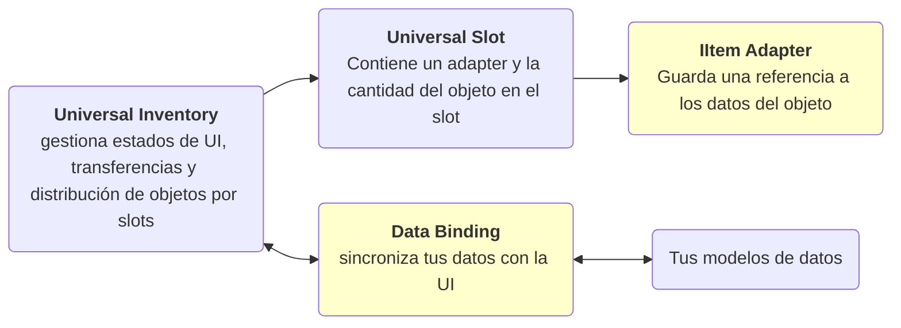

# Introducción

Asset para Unity que permite añadir un sistema de inventarios y drag and drop a
cualquier proyecto con cualquier tipo de datos.

Resuelve tareas como:

- mostrar datos en la UI del inventario
- mover objetos entre inventarios
- stacking, swap y transferencia rápida
- sincronizar cambios de UI con los datos del juego
- añadir comprobaciones y reglas para permitir o bloquear transferencias
- crear acciones especiales para inventarios
- menú contextual
- selección múltiple y transferencia múltiple
- trabajo con objetos de forma compleja

Sirve tanto para inventarios UI simples y escenarios como equipamiento, como para lógica
más compleja como comercio y comprobaciones de servidor.

## Qué es este asset

No es solo un conjunto de slots de UI. A diferencia de muchas alternativas que requieren
que tus datos tengan un tipo específico, permite visualizar casi cualquier dato en un
inventario:

- `ScriptableObject`
- modelos runtime
- listas, diccionarios y campos fijos
- distintas representaciones del mismo objeto en distintos inventarios

La idea clave es que el inventario visual está separado de tu modelo de juego.

El sistema tiene muchos puntos de extensión, por lo que puede crecer gradualmente:

- empezar con una mochila y un cofre simples
- reservar algunos slots para equipamiento
- añadir reglas que bloqueen el drag desde un slot o el drop en un slot bajo ciertas condiciones
- convertir tipos de objeto entre inventarios
- implementar comercio, crafting, comprobaciones de servidor y lógica similar

El asset está pensado no solo para empezar rápido, sino también para escalar sin
reescribir toda la lógica de inventario.

!!! warning Precio de la flexibilidad
    Para tus propios tipos de datos normalmente necesitas escribir algo de código de integración.

Conviene entender este coste desde el principio: para tus propios tipos de datos
normalmente necesitas escribir algo de código de integración.

Esto permite que el sistema entienda:

- cómo y qué datos obtener de tus clases
- cómo representar tus datos en slots de inventario
- cómo escribir de vuelta en tus modelos los cambios producidos por la UI

Para que cualquier tipo aparezca en slots de inventario, necesitas escribir un adapter:
un pequeño puente entre tus datos y el slot.

Normalmente es un adapter pequeño y un `DataBinding`. Cuanto más complejo sea tu modelo
de datos, más gruesa será esta capa de integración, pero drag and drop, swap, stacking,
transferencias y flujo de eventos ya los resuelve el asset.

Para varios casos comunes ya existen clases plantilla de `DataBinding`.

## Dependencias

- Paquete obligatorio: `Unity.ugui`
- Paquete opcional: `com.unity.inputsystem`

La parte base del asset compila y funciona sin `com.unity.inputsystem`.
El nuevo Input System solo es necesario para funciones construidas alrededor de
`InputAction`.
El seguimiento de modalidad pointer/navigation también funciona en proyectos con input
legacy.

## Modelo básico

Para la mayoría de proyectos conviene tener este modelo en mente:

- define `IItemAdapter` para que el slot pueda guardar tus datos correctamente
- define `DataBinding` para editar datos según los cambios de UI

## Subsistemas

| Subsistema | Dónde leer |
|---|---|
| Visualización de datos en inventario | [Data Binding](architecture/data-binding.md), [Plantillas de DataBinding](architecture/binding-templates.md) |
| Transferencia entre inventarios | [Pipeline de transferencia](architecture/transfer-pipeline.md) |
| Áreas de drop | [Áreas de drop](architecture/drop-areas.md) |
| Sistema de reglas | [Reglas](architecture/rules.md) |
| Acciones configurables y bindings de entrada | [Entrada e interacción](systems/interaction.md) |
| Auto-transfer | [Pipeline de transferencia](architecture/transfer-pipeline.md) |
| Selección múltiple y transferencia múltiple | [Selección](systems/selection.md) |
| Menú contextual | [Menú contextual](systems/context-menu.md) |
| Filtrado y ordenación | [Filtros y ordenación](systems/filter-sort.md) |
| Ejemplo de tooltip | [Tooltips](systems/tooltips.md) |
| Conversión de tipos durante la transferencia | [Conversión de items](architecture/item-conversion-cookbook.md) |
| Ejemplo de inventarios anidados | [Demo5 Containers](examples/demo5-containers.md) |
| Ejemplo de objetos de forma compleja | [Demo6 Shaped Items](examples/demo6-shaped-items.md) |

Ver también:

- [Quick Start](getting-started/quick-start.md) — primer inventario funcional
- [Ejemplos](examples/index.md) — resumen de las 6 demos y su arquitectura
- [Data Binding](architecture/data-binding.md) — dónde escribir sync, rules y business hooks
- [Feedback](more/feedback.md) — dónde enviar bugs, ideas y problemas de integración
