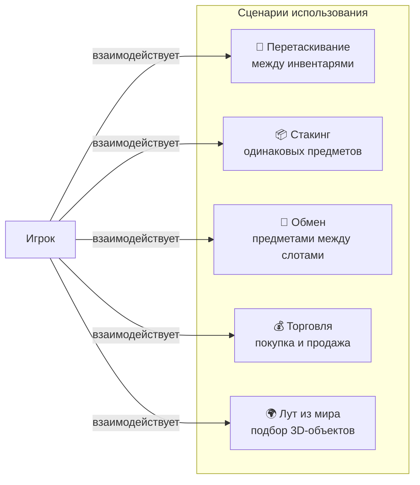
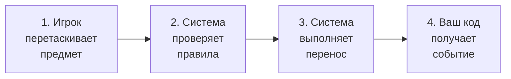
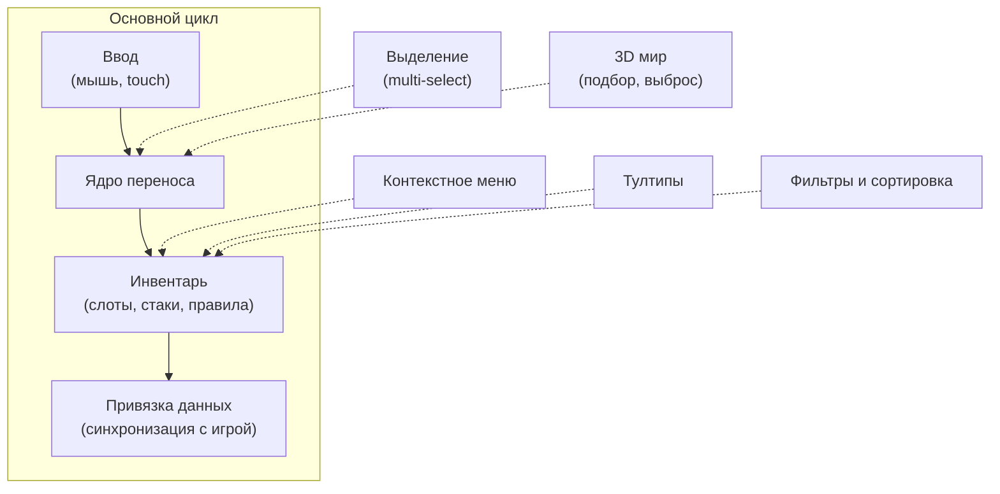

# Drag & Drop Inventory System

Полнофункциональная система инвентаря для Unity с поддержкой перетаскивания, стакинга, обмена и торговли.
Настраивается через Inspector без написания кода для базовых сценариев, но легко расширяется через правила, стратегии и привязку данных.

---

## Что умеет система

---

## Как это работает

Вся система построена вокруг простого цикла из четырёх шагов:

| Шаг | Что происходит |
|-----|----------------|
| **Перетаскивание** | Игрок берёт предмет из слота и тянет его на другой слот или инвентарь |
| **Проверка правил** | Система проверяет: можно ли взять предмет? Можно ли положить в цель? Подходит ли тип? |
| **Выполнение переноса** | Предмет перемещается, стакается или обменивается в зависимости от настроек |
| **Событие в ваш код** | Ваша привязка данных (DataBinding) получает уведомление и обновляет игровые данные |

---

## Возможности

| Возможность | Описание |
|-------------|----------|
| **Перетаскивание** | Drag & drop между любыми инвентарями. Поддержка мыши и touch |
| **Стакинг** | Объединение одинаковых предметов в стопки с настраиваемым лимитом |
| **Обмен** | Автоматический swap при перетаскивании на занятый слот |
| **Правила** | ScriptableObject-правила для ограничения: только оружие в слот оружия и т.д. |
| **Автоперенос** | Быстрый клик для мгновенного переноса между связанными инвентарями |
| **Фильтры и сортировка** | Фильтрация и сортировка содержимого инвентаря через пресеты |
| **Выделение** | Multi-select с Shift/Ctrl, групповое перетаскивание |
| **Контекстное меню** | Настраиваемое меню по правому клику на предмет |
| **Тултипы** | Всплывающие подсказки при наведении на предмет |
| **3D мир** | Подбор предметов из 3D-мира и выбрасывание обратно |
| **Торговля** | Покупка/продажа с проверкой баланса и конвертацией предметов |

---

## Карта системы

Пунктирные линии --- опциональные подсистемы, которые подключаются по необходимости.

---

## Следующие шаги

- [Быстрый старт](getting-started/quick-start.md) --- создайте первый инвентарь за 5 минут
- [Архитектура: конвейер переноса](architecture/transfer-pipeline.md) --- как работает перенос под капотом
- [Архитектура: стратегии](architecture/strategies.md) --- уникальные предметы, стаки и разделяемые стаки
- [Пример: торговля](examples/trading.md) --- покупка, продажа и конвертация предметов
