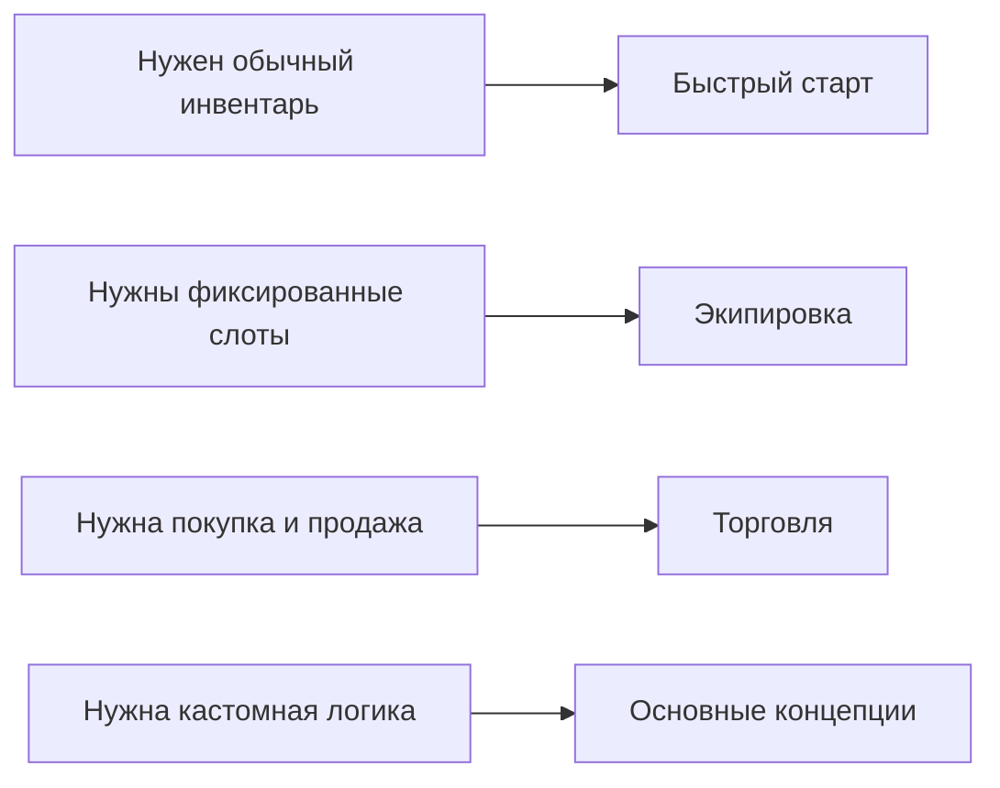

# Drag & Drop Inventory System

Ассет для Unity, который решает три базовые задачи:

- перенос предметов между инвентарями
- стакинг, swap и быстрый перенос
- синхронизация UI с вашими игровыми данными

Он подходит и для простых UI-инвентарей, и для сценариев вроде экипировки, торговли и лута из мира.

---

## С чего начать

---

## Что даёт система

| Сценарий | Что получаете |
|---|---|
| Обычный инвентарь | drag & drop между слотами и инвентарями |
| Стаки | объединение одинаковых предметов и partial transfer |
| Экипировка | фиксированные слоты с ограничениями по типу |
| Торговля | конвертация предметов и проверки перед коммитом |
| 3D мир | подбор и выброс предметов |

---

## Базовая модель

Для большинства проектов полезно держать в голове ровно эту схему:

- `UniversalInventory` отвечает за UI-состояние и перенос
- `DataBinding` связывает UI с вашими данными
- ваши модели данных остаются в вашем коде

---

## Как читать документацию

- [Быстрый старт](getting-started/quick-start.md) — первый рабочий инвентарь
- [Пример: экипировка](examples/equipment.md) — фиксированные слоты
- [Пример: торговля](examples/trading.md) — конвертация предметов и денежные проверки
- [Привязка данных](architecture/data-binding.md) — где писать sync, rules и business hooks

---

## Что не нужно знать сразу

На старте вам не нужно разбираться в:

- внутренних служебных классах планировщика
- полном пайплайне swap и rollback
- карте всех файлов проекта

Эти детали нужны только если вы расширяете систему на уровне кода ассета.
