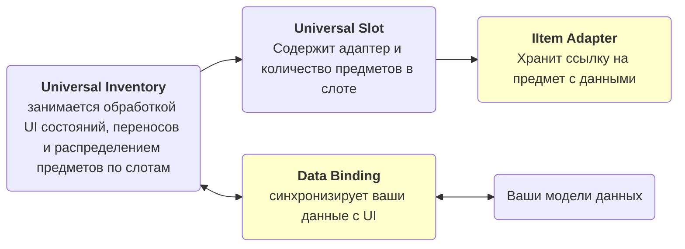

# Введение

Ассет для Unity, позволяющий внедрить систему инвентарей и перетаскивания между ними в любой проект с любыми данными.
Он решает задачи такие как:

- отображение данных в UI инвентаря
- перенос предметов между инвентарями
- стакинг, swap и быстрый перенос
- синхронизация изменений UI с вашими игровыми данными
- добавление проверок и правил для возможности переноса
- создание специальных действий для инвентарей
- контекстное меню
- множественное выделение и перенос
- работа с предметами сложной формы

Он подходит и как для простых UI-инвентарей и сценариев вроде экипировки, так и для реализации сложной логики вроде торговли и поддержки серверных проверок.

## Что это за ассет

Это не просто набор UI-слотов, а система, которая, в отличие от многих альтернативных решений, требующих чтобы ваши данные соответствовали определенному типу, позволяет визуализировать в инвентаре практически любые ваши данные:

- `ScriptableObject`
- runtime-модели
- списки, словари и фиксированные поля
- разные представления одного и того же предмета в разных инвентарях

Ключевая идея в том, что визуальный инвентарь отделён от вашей игровой модели. 

В системе предусмотрено множество точек расширения, благодаря этому систему можно постепенно наращивать:

- начать с простого рюкзака и сундука
- зарезервировать некоторые слоты для экипировки
- добавить правила, запрещающие перетаскивание из или в слот при определенных условиях
- сделать конвертацию типов между инвентарями
- реализовать торговлю, крафт, серверные проверки и тд.

То есть ассет рассчитан не только на быстрый старт, но и на дальнейшее масштабирование без полного переписывания инвентарной логики.

!!! warning Цена гибкости
    Для своих типов данных обычно нужно написать немного интеграционного кода.

Важно сразу понимать и цену этой гибкости: для своих типов данных обычно нужно написать немного интеграционного кода.

Это нужно чтобы система поняла:

- как и какие данные получить из ваших классов
- как представить ваши данные в слотах инвентаря
- как записать изменения от UI взаимодействий обратно в ваши модели данных

Чтобы любой тип мог отображаться в слотах инвентаря нужно написать специальный переходник для него от данных к слоту - адаптер.

Обычно это небольшой адаптер и один `DataBinding`. Чем более сложная у вас модель данных, тем толще будет этот слой интеграции, но сам drag & drop, swap, stacking, переносы и event flow уже берёт на себя ассет.

Для некоторых распространенных вариантов уже есть шаблонные классы `DataBinding` с которыми будет проще настроить большинство вариантов.

## Зависимости

- Обязательный пакет: `Unity.ugui`
- Опциональный пакет: `com.unity.inputsystem`

Базовая часть ассета компилируется и работает без `com.unity.inputsystem`.
Новый Input System нужен только для функций, построенных вокруг `InputAction`.
Отслеживание pointer/navigation-модальности тоже работает в проектах на legacy input.

## Базовая модель

Для большинства проектов полезно держать в голове ровно эту схему:

- `IItemAdapter` нужно определить чтобы слот корректно хранил данные
- `DataBinding` нужно определить чтобы корректно редактировал данные в соответствии с изменениями в UI

## Подсистемы

| Подсистема | Где почитать |
|---|---|
| Отображение данных в инвентаре | [Привязка данных](architecture/data-binding.md), [Шаблоны DataBinding](architecture/binding-templates.md) |
| Перенос между инвентарями | [Конвейер переноса](architecture/transfer-pipeline.md) |
| Области дропа | [Области дропа](architecture/drop-areas.md) |
| Система правил | [Правила](architecture/rules.md) |
| Настраиваемые действия и привязки ввода | [Ввод и взаимодействие](systems/interaction.md) |
| Автоперенос | [Конвейер переноса](architecture/transfer-pipeline.md) |
| Множественное выделение и множественный перенос | [Выделение](systems/selection.md) |
| Контекстное меню | [Контекстное меню](systems/context-menu.md) |
| Фильтрация и сортировка | [Фильтры и сортировка](systems/filter-sort.md) |
| Пример tooltip | [Подсказки](systems/tooltips.md) |
| Пример конвертаций типов при переносе | [Конвертация предметов](architecture/item-conversion-cookbook.md) |
| Пример вложенных инвентарей | [Demo5 Containers](examples/demo5-containers.md) |
| Пример предметов сложной формы | [Demo6 Shaped Items](examples/demo6-shaped-items.md) |

См. также:

- [Быстрый старт](getting-started/quick-start.md) — первый рабочий инвентарь
- [Примеры](examples/index.md) — обзор всех 6 демо и их архитектуры
- [Привязка данных](architecture/data-binding.md) — где писать sync, rules и business hooks
- [Обратная связь](more/feedback.md) — куда писать о багах, идеях и проблемах интеграции