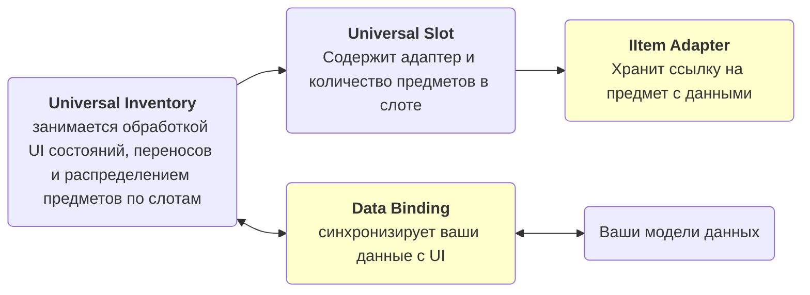

# Введение

Ассет для Unity, позволяющий внедрить систему инвентарей и перетаскивания между ними в любой проект с любыми данными.
Он решает задачи такие как:

- отображение данных в UI инвентаря
- перенос предметов между инвентарями
- стакинг, swap и быстрый перенос
- синхронизация изменений UI с вашими игровыми данными
- добавление проверок и правил для возможности переноса
- создание специальных действий для инвентарей
- контекстное меню
- множественное выделение и перенос

Он подходит и как для простых UI-инвентарей и сценариев вроде экипировки, так и для реализации сложной логики вроде торговли и поддержки серверных проверок.

## Что это за ассет

Это не просто набор UI-слотов, а система, которая, в отличие от многих альтернативных решений, требующих чтобы ваши данные соответствовали определенному типу, позволяет визуализировать в инвентаре практически любые ваши данные:

- `ScriptableObject`
- runtime-модели
- списки, словари и фиксированные поля
- разные представления одного и того же предмета в разных инвентарях

Ключевая идея в том, что визуальный инвентарь отделён от вашей игровой модели. Благодаря этому систему можно постепенно наращивать:

- начать с простого рюкзака и сундука
- добавить fixed slots для экипировки
- добавить конвертацию между инвентарями
- добавить торговлю, серверные проверки или доменные хуки

То есть ассет рассчитан не только на быстрый старт, но и на дальнейшее масштабирование без полного переписывания инвентарной логики.

!!! warning Цена гибкости
    Для своих типов данных обычно нужно написать немного интеграционного кода.

Важно сразу понимать и цену этой гибкости: для своих типов данных обычно нужно написать немного интеграционного кода.

Это нужно чтобы система поняла:

- как и какие данные получить из ваших классов
- как представить ваши данные в слотах инвентаря
- как записать изменения от UI взаимодействий обратно в ваши модели данных

Чтобы любой тип мог отображаться в слотах инвентаря нужно написать специальный переходник для него от данных к слоту - адаптер.

Обычно это небольшой адаптер и один `DataBinding`. Чем более сложная у вас модель данных, тем толще будет этот слой интеграции, но сам drag & drop, swap, stacking, planning и event flow уже берёт на себя ассет.

Для некоторых распространенных вариантов уже есть шаблонные классы `DataBinding` с которыми будет проще настроить большинство вариантов.

## Базовая модель

    

Для большинства проектов полезно держать в голове ровно эту схему:

- `IItemAdapter` нужно определить чтобы корректно хранил данные
- `DataBinding` нужно определить чтобы корректно редактировал данные

## Подсистемы
- Отображение данных в инвентаре
- Перенос между инвентарями
- Области дропа
- Система правил
- Настраиваемые действия
- автоперенос
- Множественное выделение
- Множественный перенос
- Контекстное меню
- Пример tooltip
- Пример конвертаций типов при переносе
- Пример вложенных инвентарей
## Читать далее

- [Быстрый старт](getting-started/quick-start.md) — первый рабочий инвентарь
- [Примеры](examples/index.md) — обзор всех 5 демо и их архитектуры
- [Привязка данных](architecture/data-binding.md) — где писать sync, rules и business hooks
- [Обратная связь](more/feedback.md) — куда писать о багах, идеях и проблемах интеграции
