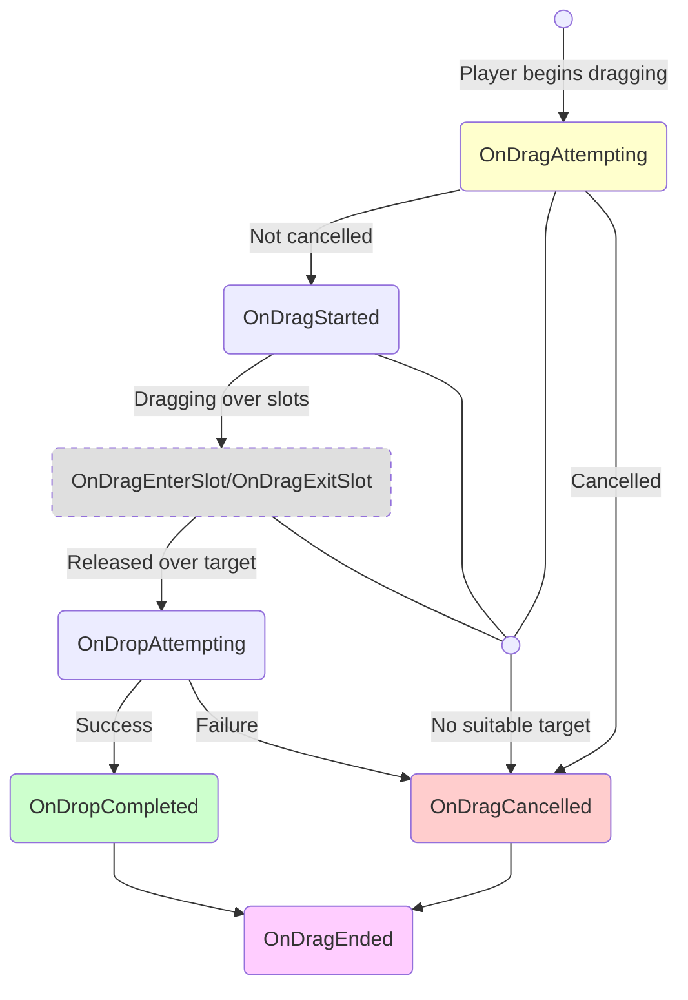
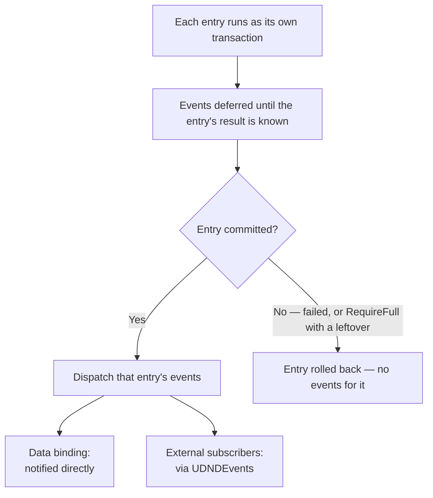

# Event Reference

Global drag / drop / auto-transfer / swap events live on `UDNDEvents`; per-inventory content events live on `UniversalInventory`.

---

## Drag Lifecycle Events

---

## Global Events (`UDNDEvents`)

These are `static` events. Subscribe via `UDNDEvents.OnX += handler` (and unsubscribe in your teardown); they are raised by `DragAndDropManager`. Subscribers from a previous session are cleared automatically on each Play session start (Fast Enter Play Mode safe).

### Dragging

| Event | When it fires | Note |
|-------|---------------|------|
| `OnDragAttempting` | Before dragging begins | Can be cancelled via rules |
| `OnDragStarted` | Dragging confirmed | `DragContext` is available |
| `OnDragEnterSlot` | Cursor enters a slot | Target slot information |
| `OnDragExitSlot` | Cursor leaves a slot | Previous slot information |
| `OnDropAttempting` | Before drop execution | Target determined |
| `OnDropCompleted` | Drop executed successfully | Result information |
| `OnDragCancelled` | Dragging cancelled or failed | Cancellation reason |
| `OnDragStackChanged` | Stack in drag context changed (split drop) | Use to update UI |
| `OnDragEnded` | Drag cycle finished | Always fires, at the end |

### Auto-transfer

| Event | When it fires |
|-------|---------------|
| `OnAutoTransferAttempting` | Before quick transfer on click |
| `OnAutoTransferCompleted` | Quick transfer completed |
| `OnAutoTransferFailed` | Quick transfer failed |

### Swap

| Event | When it fires | Note |
|-------|---------------|------|
| `OnSwapAttempting` | Before swap execution | Set `Cancel = true` to cancel |
| `OnSwapCompleted` | Swap executed | Slots already contain final target-side stacks |

---

## Inventory Events

`UniversalInventory` events that fire when contents change.

| Event | When it fires | Context |
|-------|---------------|---------|
| `OnItemAdded` | Item added to inventory | `InventoryItemEventContext` |
| `OnItemRemoved` | Item removed from inventory | `InventoryItemEventContext` |

### InventoryItemEventContext Fields

| Field | Type | Description |
|-------|------|-------------|
| `Stack` | `ItemStack` | Full event stack |
| `SlotIndex` | `int` | Target/source slot index |
| `SourceInventory` | `IInventory` | Where the item came from (null if not from another inventory) |
| `TargetInventory` | `IInventory` | Where the item was placed (null if not into another inventory) |
| `SourceSlot` | `BaseSlot` | Source slot (null if unknown) |
| `TargetSlot` | `BaseSlot` | Destination slot (null if unknown) |

In practice:

- `context.Stack.PrimaryAdapter` gives a representative adapter
- `context.Stack.Count` gives the amount
- for cross-inventory transfer, remove usually publishes the pre-conversion stack, while add publishes the post-conversion stack

---

## Swap Context

### InventorySwapContext Fields

| Field | Type | Description |
|-------|------|-------------|
| `SourceStack` | `ItemStack` | Pre-commit stack from the source slot |
| `TargetStack` | `ItemStack` | Pre-commit stack from the target slot |
| `SourceSlot` | `BaseSlot` | Source slot (where dragging started) |
| `TargetSlot` | `BaseSlot` | Target slot (where the drop is intended) |
| `SourceInventory` | `IInventory` | Source inventory |
| `TargetInventory` | `IInventory` | Target inventory |
| `Cancel` | `bool` | Set to `true` to cancel the swap |

Important:

- for cross-inventory swap, these are not necessarily the same adapter objects that remain in the slots after commit
- final slots already contain target-side converted stacks

---

## When Events Are Dispatched

The transfer service runs each entry as its own transaction (sequential, best-effort batch). Within an entry, events and data-binding notifications are deferred until the entry's outcome is known, then dispatched only if it commits.

!!! info "Safe by Default"
    Events fire only after an entry commits, when its mutations are already real. A failed entry restores its snapshots and emits nothing, so subscribers never react to changes that were undone. Entries are independent: a later failure does not roll back entries that already committed (best-effort batch).

See also:

- [Transfer Pipeline](../architecture/transfer-pipeline.md)
- [Logs and Debugging](logs-and-debugging.md)
