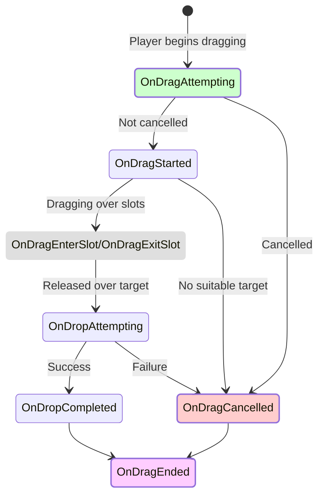
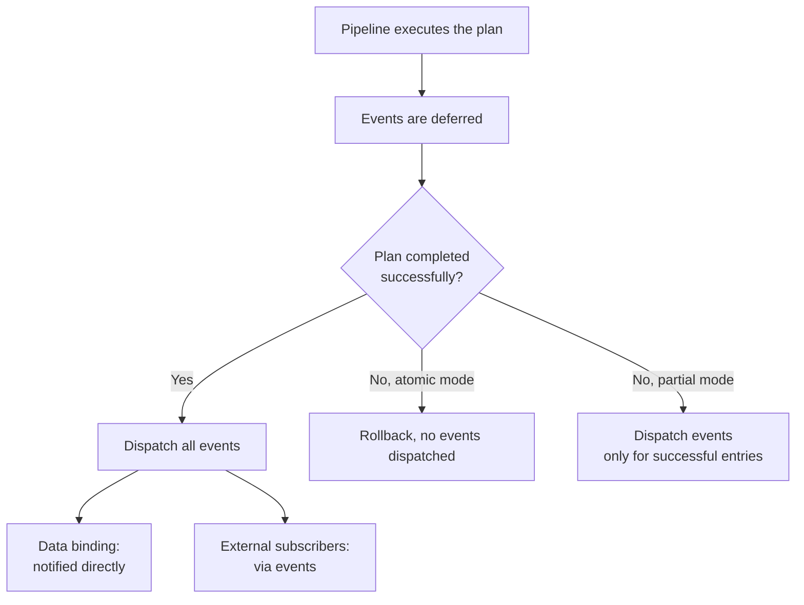

# Event Reference

All events provided by `DragAndDropManager` and `UniversalInventory`.

---

## Drag Lifecycle Events

---

## DragAndDropManager Events

### Dragging

| Event | When it fires | Note |
|-------|---------------|------|
| `OnDragAttempting` | Before dragging begins | Can be cancelled via rules |
| `OnDragStarted` | Dragging confirmed | `DragContext` is available |
| `OnDragEnterSlot` | Cursor enters a slot | Target slot information |
| `OnDragExitSlot` | Cursor leaves a slot | Previous slot information |
| `OnDropAttempting` | Before drop execution | Target determined |
| `OnDropCompleted` | Drop executed successfully | Result information |
| `OnDragCancelled` | Dragging cancelled or failed | Cancellation reason |
| `OnDragEnded` | Drag cycle finished | Always fires, at the end |

### Auto-transfer

| Event | When it fires |
|-------|---------------|
| `OnAutoTransferAttempting` | Before quick transfer on click |
| `OnAutoTransferCompleted` | Quick transfer completed |
| `OnAutoTransferFailed` | Quick transfer failed |

### Swap

| Event | When it fires | Note |
|-------|---------------|------|
| `OnSwapAttempting` | Before swap execution | Set `Cancel = true` to cancel |
| `OnSwapCompleted` | Swap executed | Both items swapped places |

---

## Inventory Events

`UniversalInventory` events that fire when contents change.

| Event | When it fires | Context |
|-------|---------------|---------|
| `OnItemAdded` | Item added to inventory | `InventoryItemEventContext` |
| `OnItemRemoved` | Item removed from inventory | `InventoryItemEventContext` |

### InventoryItemEventContext Fields

| Field | Type | Description |
|-------|------|-------------|
| `Item` | `IInventoryItem` | Affected item |
| `Count` | `int` | Number of items added/removed |
| `SlotIndex` | `int` | Target/source slot index |
| `SourceInventory` | `IInventory` | Where the item came from (null if not from another inventory) |
| `TargetInventory` | `IInventory` | Where the item was placed (null if not into another inventory) |
| `SourceSlot` | `ISlot` | Source slot (null if unknown) |
| `TargetSlot` | `ISlot` | Destination slot (null if unknown) |

---

## Swap Context

### InventorySwapContext Fields

| Field | Type | Description |
|-------|------|-------------|
| `SourceStack` | `ItemStack` | Stack from the source slot (will be moved to the target) |
| `TargetStack` | `ItemStack` | Stack from the target slot (will be moved to the source) |
| `SourceSlot` | `ISlot` | Source slot (where dragging started) |
| `TargetSlot` | `ISlot` | Target slot (where the drop is intended) |
| `SourceInventory` | `IInventory` | Source inventory |
| `TargetInventory` | `IInventory` | Target inventory |
| `Cancel` | `bool` | Set to `true` to cancel the swap |

---

## When Events Are Dispatched

!!! info "Safe by Default"
    In atomic mode, no events are dispatched until the entire operation completes successfully. This prevents subscribers from reacting to changes that may be rolled back.
