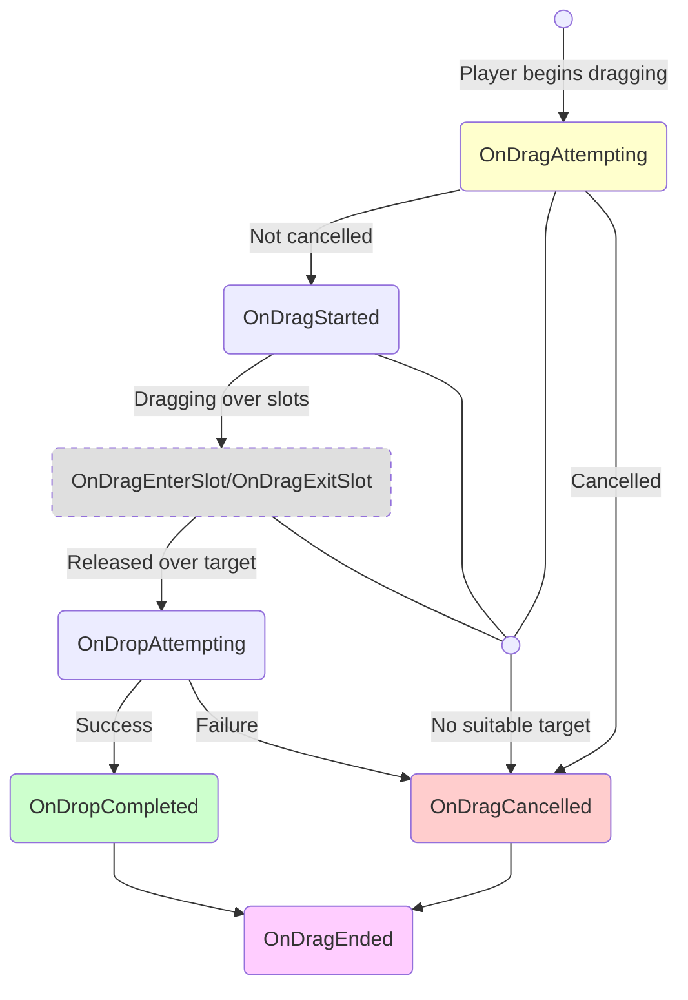
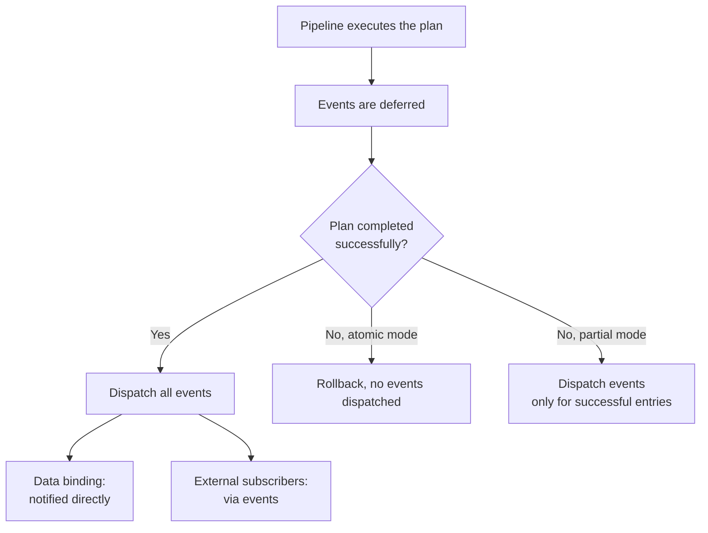

# Event Reference

Todos los eventos proporcionados por `DragAndDropManager` y `UniversalInventory`.

---

## Eventos del ciclo de vida del drag

---

## Eventos de DragAndDropManager

### Dragging

| Evento | Cuándo se dispara | Nota |
|-------|---------------|------|
| `OnDragAttempting` | Antes de que comience el drag | Puede cancelarse mediante rules |
| `OnDragStarted` | Drag confirmado | `DragContext` está disponible |
| `OnDragEnterSlot` | El cursor entra en un slot | Información del slot objetivo |
| `OnDragExitSlot` | El cursor sale de un slot | Información del slot previo |
| `OnDropAttempting` | Antes de ejecutar el drop | El target ya está determinado |
| `OnDropCompleted` | Drop ejecutado con éxito | Información del resultado |
| `OnDragCancelled` | Drag cancelado o fallido | Motivo de cancelación |
| `OnDragStackChanged` | El stack en el drag context cambió (split drop) | Usar para actualizar UI |
| `OnDragEnded` | El ciclo de drag ha terminado | Siempre se dispara al final |

### Auto-transfer

| Evento | Cuándo se dispara |
|-------|---------------|
| `OnAutoTransferAttempting` | Antes del quick transfer al hacer clic |
| `OnAutoTransferCompleted` | Quick transfer completado |
| `OnAutoTransferFailed` | Quick transfer fallido |

### Swap

| Evento | Cuándo se dispara | Nota |
|-------|---------------|------|
| `OnSwapAttempting` | Antes de ejecutar el swap | Pon `Cancel = true` para cancelarlo |
| `OnSwapCompleted` | Swap ejecutado | Los slots ya contienen los target-side stacks finales |

---

## Eventos del inventario

Eventos de `UniversalInventory` que se disparan cuando cambia el contenido.

| Evento | Cuándo se dispara | Contexto |
|-------|---------------|---------|
| `OnItemAdded` | Item añadido al inventario | `InventoryItemEventContext` |
| `OnItemRemoved` | Item eliminado del inventario | `InventoryItemEventContext` |

### Campos de InventoryItemEventContext

| Campo | Tipo | Descripción |
|-------|------|-------------|
| `Stack` | `ItemStack` | Stack completo del evento |
| `SlotIndex` | `int` | Índice del slot objetivo/origen |
| `SourceInventory` | `IInventory` | De dónde vino el item (null si no viene de otro inventario) |
| `TargetInventory` | `IInventory` | Dónde se colocó el item (null si no fue hacia otro inventario) |
| `SourceSlot` | `BaseSlot` | Slot de origen (null si es desconocido) |
| `TargetSlot` | `BaseSlot` | Slot de destino (null si es desconocido) |

En la práctica:

- `context.Stack.PrimaryAdapter` da un adapter representativo
- `context.Stack.Count` da la cantidad
- en una transferencia entre inventarios, remove suele publicar el stack previo a la conversión, mientras que add publica el stack posterior a la conversión

---

## Contexto de swap

### Campos de InventorySwapContext

| Campo | Tipo | Descripción |
|-------|------|-------------|
| `SourceStack` | `ItemStack` | Stack pre-commit del slot de origen |
| `TargetStack` | `ItemStack` | Stack pre-commit del slot objetivo |
| `SourceSlot` | `BaseSlot` | Slot de origen (donde empezó el drag) |
| `TargetSlot` | `BaseSlot` | Slot objetivo (donde se pretende soltar) |
| `SourceInventory` | `IInventory` | Inventario de origen |
| `TargetInventory` | `IInventory` | Inventario objetivo |
| `Cancel` | `bool` | Ponlo a `true` para cancelar el swap |

Importante:

- en un swap entre inventarios, estos no son necesariamente los mismos adapters que permanecen en los slots después del commit
- los slots finales ya contienen target-side converted stacks

---

## Cuándo se despachan los eventos

!!! info "Safe by Default"
    En modo atómico, no se despacha ningún evento hasta que toda la operación se completa con éxito. Esto evita que los subscribers reaccionen a cambios que luego puedan revertirse.

Consulta también:

- [Transfer Pipeline](../architecture/transfer-pipeline.md)
- [Logs and Debugging](logs-and-debugging.md)

